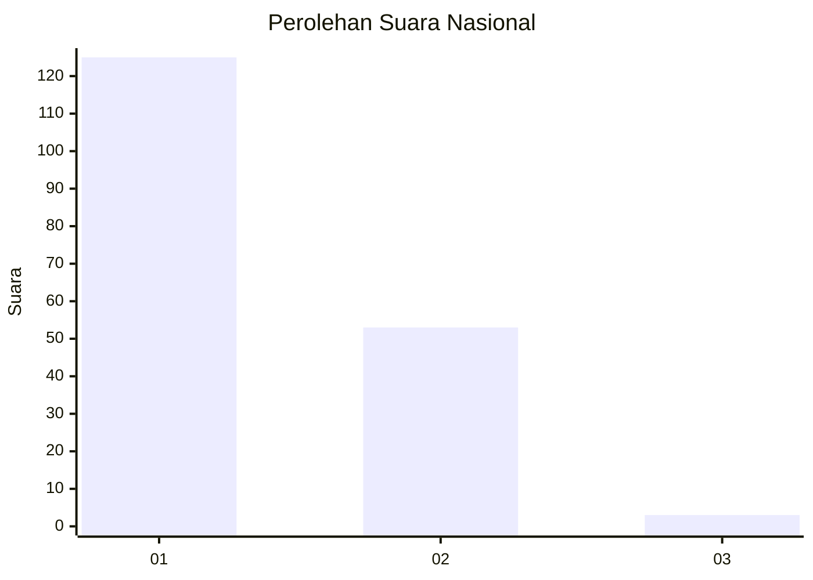
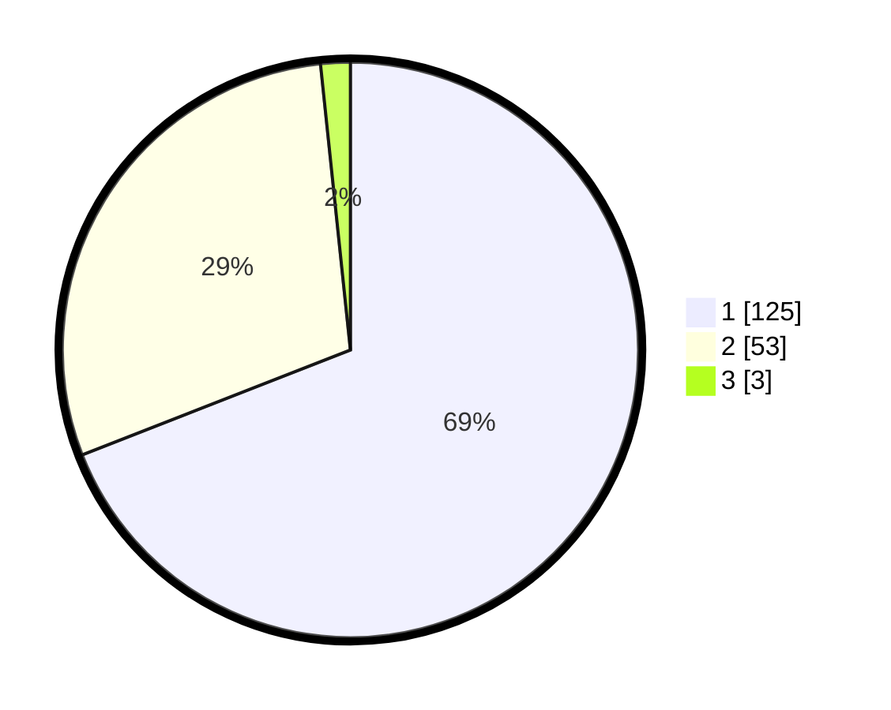

# Hasil

## Grafik

## Tabel

| No. | Nama Paslon    | Suara | Suara (raw) | Persentase |
|:--- |:-------------- | -----:| -----------:| ----------:|
| 1   | ANIES MUHAIMIN | 125   | [125][p-1]  | 69,06      |
| 2   | PRABOWO GIBRAN | 53    | [53][p-2]   | 29,28      |
| 3   | GANJAR MAHFUD  | 3     | [3][p-3]    | 1,66       |

[p-1]: https://github.com/gigit-pemilu/pemilu-2024/blob/main/pilpres/hitung-suara/sub/13-sumatera-barat/sub/71-kota-padang/sub/02-padang-timur/sub/1010-ganting-parak-gadang/sub/006-tps/sub/paslon-1.txt
[p-2]: https://github.com/gigit-pemilu/pemilu-2024/blob/main/pilpres/hitung-suara/sub/13-sumatera-barat/sub/71-kota-padang/sub/02-padang-timur/sub/1010-ganting-parak-gadang/sub/006-tps/sub/paslon-2.txt
[p-3]: https://github.com/gigit-pemilu/pemilu-2024/blob/main/pilpres/hitung-suara/sub/13-sumatera-barat/sub/71-kota-padang/sub/02-padang-timur/sub/1010-ganting-parak-gadang/sub/006-tps/sub/paslon-3.txt

## Foto C Plano

https://sirekap-obj-formc.kpu.go.id/90bc/pemilu/ppwp/13/71/02/10/10/1371021010006-20240215-012613--b42b65fd-ea50-4df1-bb24-543244893de2.jpg

https://sirekap-obj-formc.kpu.go.id/90bc/pemilu/ppwp/13/71/02/10/10/1371021010006-20240215-012510--a7afb71b-4791-4a90-8d0a-11040f0d3543.jpg

https://sirekap-obj-formc.kpu.go.id/90bc/pemilu/ppwp/13/71/02/10/10/1371021010006-20240215-012357--0a1b3b45-3a84-44cb-a325-dcb8e23b23f8.jpg

## Metadata

| Key        | Value               |
| ---------- | ------------------- |
| Time Stamp | 2024-02-15 23:29:50 |

