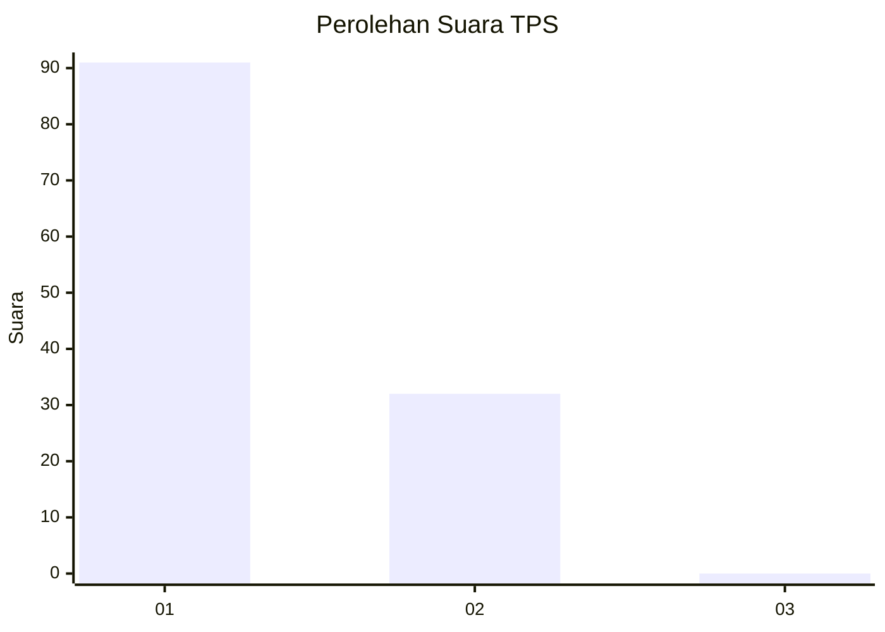
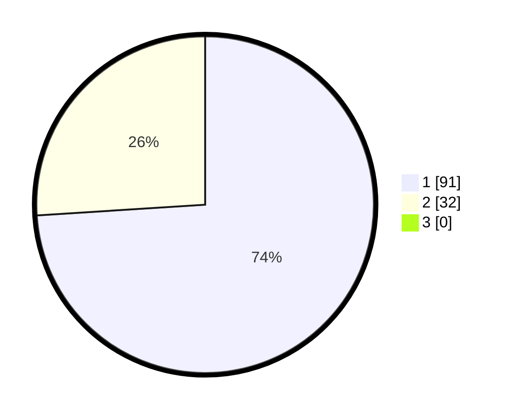

# Hasil

## Grafik

## Tabel

| No. | Nama Paslon    | Suara | Suara (raw) | Persentase |
|:--- |:-------------- | -----:| -----------:| ----------:|
| 1   | ANIES MUHAIMIN | 91    | [91][p-1]   | 73,98      |
| 2   | PRABOWO GIBRAN | 32    | [32][p-2]   | 26,02      |
| 3   | GANJAR MAHFUD  | 0     | [0][p-3]    | 0,00       |

[p-1]: https://github.com/gigit-pemilu/pemilu-2024-13-sumatera-barat/blob/main/pilpres/hitung-suara/sub/13-sumatera-barat/sub/71-kota-padang/sub/03-padang-barat/sub/1001-flamboyan-baru/sub/009-tps/sub/paslon-1.txt
[p-2]: https://github.com/gigit-pemilu/pemilu-2024-13-sumatera-barat/blob/main/pilpres/hitung-suara/sub/13-sumatera-barat/sub/71-kota-padang/sub/03-padang-barat/sub/1001-flamboyan-baru/sub/009-tps/sub/paslon-2.txt
[p-3]: https://github.com/gigit-pemilu/pemilu-2024-13-sumatera-barat/blob/main/pilpres/hitung-suara/sub/13-sumatera-barat/sub/71-kota-padang/sub/03-padang-barat/sub/1001-flamboyan-baru/sub/009-tps/sub/paslon-3.txt

## Foto C Plano

https://sirekap-obj-formc.kpu.go.id/646a/pemilu/ppwp/13/71/03/10/01/1371031001009-20240214-233915--5376e505-b51a-488e-a178-f2d8f6d8862a.jpg

https://sirekap-obj-formc.kpu.go.id/646a/pemilu/ppwp/13/71/03/10/01/1371031001009-20240214-193936--8d7a8f38-6add-4684-bec9-a038daf050a0.jpg

https://sirekap-obj-formc.kpu.go.id/646a/pemilu/ppwp/13/71/03/10/01/1371031001009-20240214-194027--c9907731-5653-464b-8f04-841fdecb8197.jpg

## Metadata

| Key        | Value               |
| ---------- | ------------------- |
| Time Stamp | 2024-02-15 20:00:44 |

