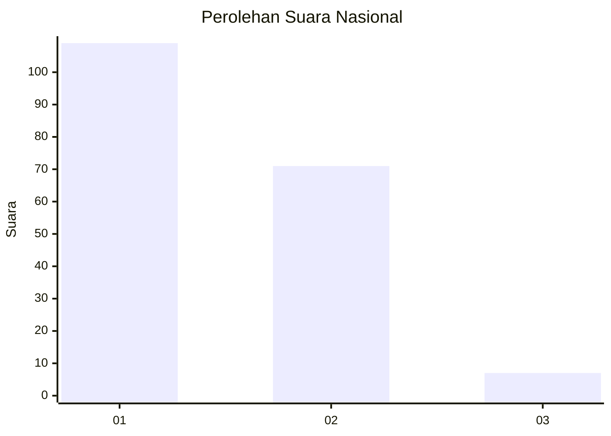
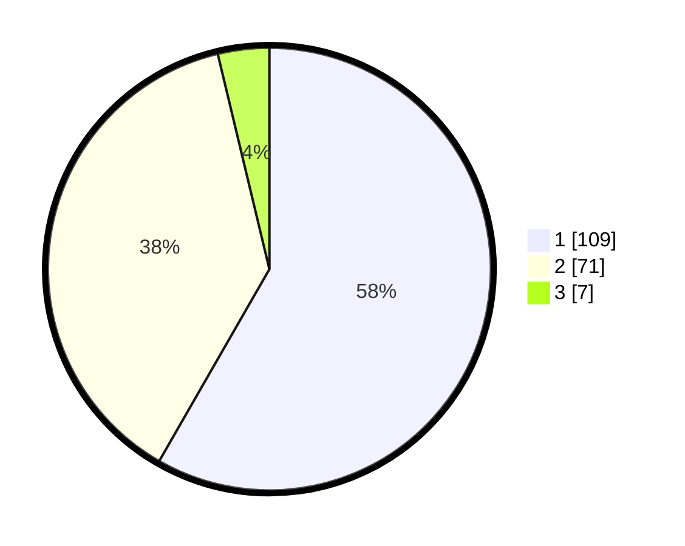

# Hasil

## Grafik

## Tabel

| No. | Nama Paslon    | Suara | Suara (raw) | Persentase |
|:--- |:-------------- | -----:| -----------:| ----------:|
| 1   | ANIES MUHAIMIN | 109   | [109][p-1]  | 58,29      |
| 2   | PRABOWO GIBRAN | 71    | [71][p-2]   | 37,97      |
| 3   | GANJAR MAHFUD  | 7     | [7][p-3]    | 3,74       |

[p-1]: https://github.com/gigit-pemilu/pemilu-2024/blob/main/pilpres/hitung-suara/sub/13-sumatera-barat/sub/71-kota-padang/sub/03-padang-barat/sub/1001-flamboyan-baru/sub/011-tps/sub/paslon-1.txt
[p-2]: https://github.com/gigit-pemilu/pemilu-2024/blob/main/pilpres/hitung-suara/sub/13-sumatera-barat/sub/71-kota-padang/sub/03-padang-barat/sub/1001-flamboyan-baru/sub/011-tps/sub/paslon-2.txt
[p-3]: https://github.com/gigit-pemilu/pemilu-2024/blob/main/pilpres/hitung-suara/sub/13-sumatera-barat/sub/71-kota-padang/sub/03-padang-barat/sub/1001-flamboyan-baru/sub/011-tps/sub/paslon-3.txt

## Foto C Plano

https://sirekap-obj-formc.kpu.go.id/814a/pemilu/ppwp/13/71/03/10/01/1371031001011-20240214-155722--e972936f-769e-446e-95b0-83801a620cde.jpg

https://sirekap-obj-formc.kpu.go.id/814a/pemilu/ppwp/13/71/03/10/01/1371031001011-20240214-160131--5fba07c2-eb57-4429-8bb0-b2932793a59b.jpg

https://sirekap-obj-formc.kpu.go.id/814a/pemilu/ppwp/13/71/03/10/01/1371031001011-20240215-020046--3ae11220-040d-452c-8abe-969effa9cdbc.jpg

## Metadata

| Key        | Value               |
| ---------- | ------------------- |
| Time Stamp | 2024-02-15 19:30:26 |

