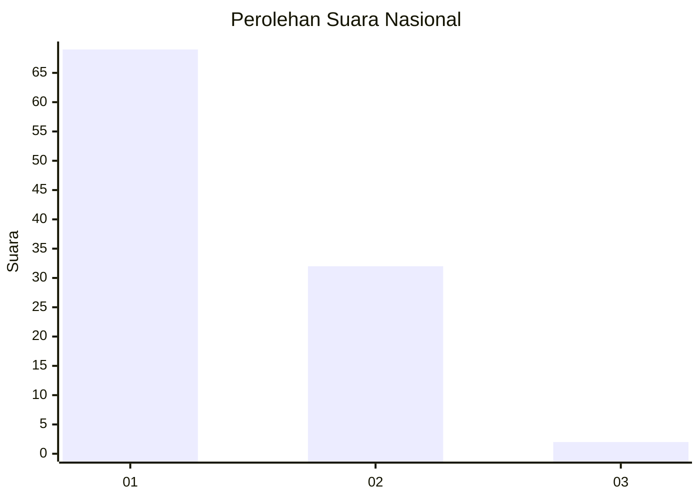
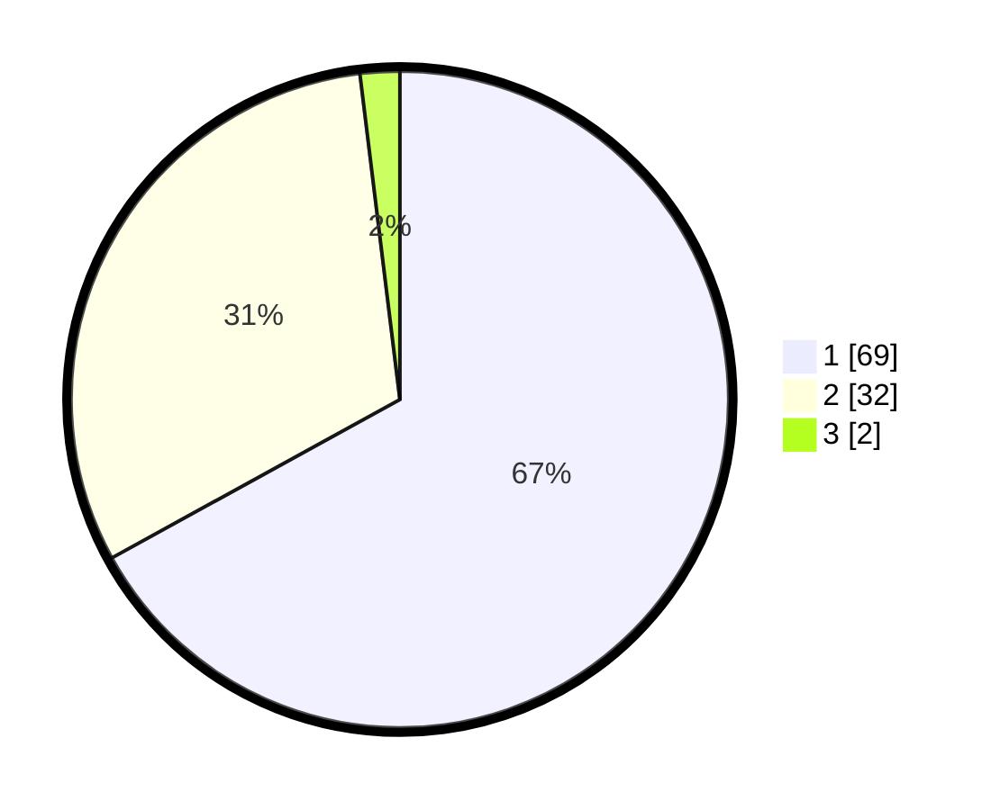

# Hasil

## Grafik

## Tabel

| No. | Nama Paslon    | Suara | Suara (raw) | Persentase |
|:--- |:-------------- | -----:| -----------:| ----------:|
| 1   | ANIES MUHAIMIN | 69    | [69][p-1]   | 66,99      |
| 2   | PRABOWO GIBRAN | 32    | [32][p-2]   | 31,07      |
| 3   | GANJAR MAHFUD  | 2     | [2][p-3]    | 1,94       |

[p-1]: https://github.com/gigit-pemilu/pemilu-2024/blob/main/pilpres/hitung-suara/sub/13-sumatera-barat/sub/71-kota-padang/sub/03-padang-barat/sub/1003-ujung-gurun/sub/014-tps/sub/paslon-1.txt
[p-2]: https://github.com/gigit-pemilu/pemilu-2024/blob/main/pilpres/hitung-suara/sub/13-sumatera-barat/sub/71-kota-padang/sub/03-padang-barat/sub/1003-ujung-gurun/sub/014-tps/sub/paslon-2.txt
[p-3]: https://github.com/gigit-pemilu/pemilu-2024/blob/main/pilpres/hitung-suara/sub/13-sumatera-barat/sub/71-kota-padang/sub/03-padang-barat/sub/1003-ujung-gurun/sub/014-tps/sub/paslon-3.txt

## Foto C Plano

https://sirekap-obj-formc.kpu.go.id/b14d/pemilu/ppwp/13/71/03/10/03/1371031003014-20240215-022242--592ff072-80ce-4932-ba56-648a7c5a8f9b.jpg

https://sirekap-obj-formc.kpu.go.id/b14d/pemilu/ppwp/13/71/03/10/03/1371031003014-20240215-005751--3423d307-2497-40bc-8c9b-b2997986f419.jpg

https://sirekap-obj-formc.kpu.go.id/b14d/pemilu/ppwp/13/71/03/10/03/1371031003014-20240215-010824--2069fd4c-c15e-4989-a7b1-f3840cdcf026.jpg

## Metadata

| Key        | Value               |
| ---------- | ------------------- |
| Time Stamp | 2024-02-15 20:00:44 |

