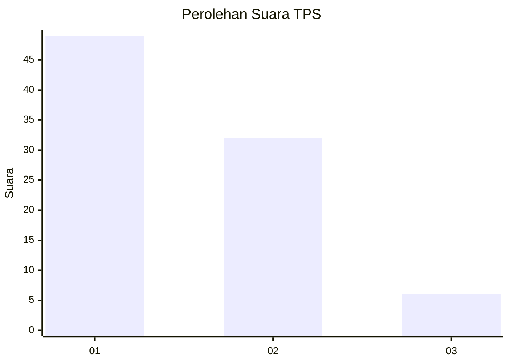
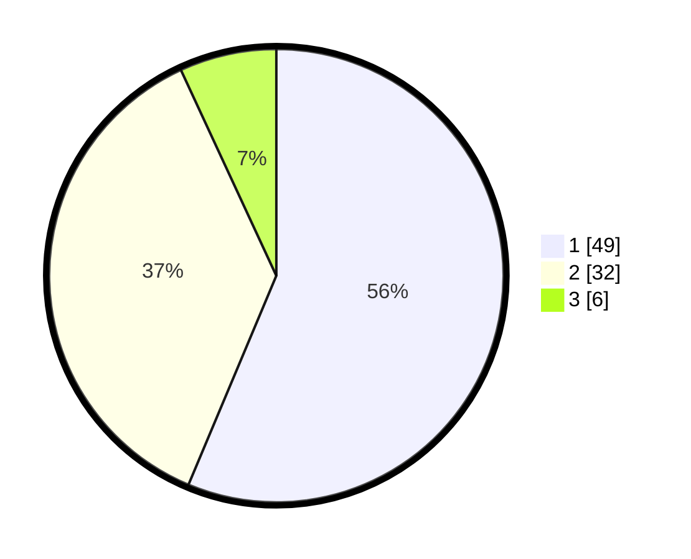

# Hasil

## Grafik

## Tabel

| No. | Nama Paslon    | Suara | Suara (raw) | Persentase |
|:--- |:-------------- | -----:| -----------:| ----------:|
| 1   | ANIES MUHAIMIN | 49    | [49][p-1]   | 56,32      |
| 2   | PRABOWO GIBRAN | 32    | [32][p-2]   | 36,78      |
| 3   | GANJAR MAHFUD  | 6     | [6][p-3]    | 6,90       |

[p-1]: https://github.com/gigit-pemilu/pemilu-2024-13-sumatera-barat/blob/main/pilpres/hitung-suara/sub/13-sumatera-barat/sub/71-kota-padang/sub/03-padang-barat/sub/1004-purus/sub/007-tps/sub/paslon-1.txt
[p-2]: https://github.com/gigit-pemilu/pemilu-2024-13-sumatera-barat/blob/main/pilpres/hitung-suara/sub/13-sumatera-barat/sub/71-kota-padang/sub/03-padang-barat/sub/1004-purus/sub/007-tps/sub/paslon-2.txt
[p-3]: https://github.com/gigit-pemilu/pemilu-2024-13-sumatera-barat/blob/main/pilpres/hitung-suara/sub/13-sumatera-barat/sub/71-kota-padang/sub/03-padang-barat/sub/1004-purus/sub/007-tps/sub/paslon-3.txt

## Foto C Plano

https://sirekap-obj-formc.kpu.go.id/6396/pemilu/ppwp/13/71/03/10/04/1371031004007-20240216-225913--29df93b5-36b1-4ce6-8a5b-7fb8e518563f.jpg

https://sirekap-obj-formc.kpu.go.id/6396/pemilu/ppwp/13/71/03/10/04/1371031004007-20240217-021745--0e341527-4f89-43e9-81af-6f9f2450fcca.jpg

https://sirekap-obj-formc.kpu.go.id/6396/pemilu/ppwp/13/71/03/10/04/1371031004007-20240216-232715--2756109c-bd5a-4644-bc57-e420dd492b53.jpg

## Metadata

| Key        | Value               |
| ---------- | ------------------- |
| Time Stamp | 2024-02-17 12:00:00 |

