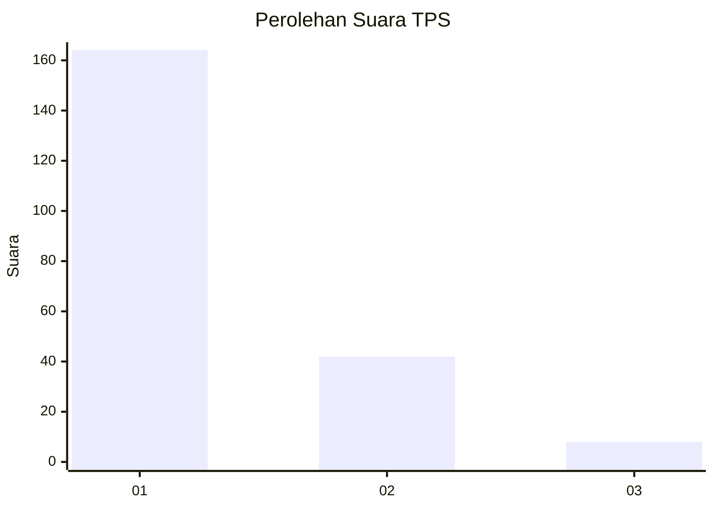
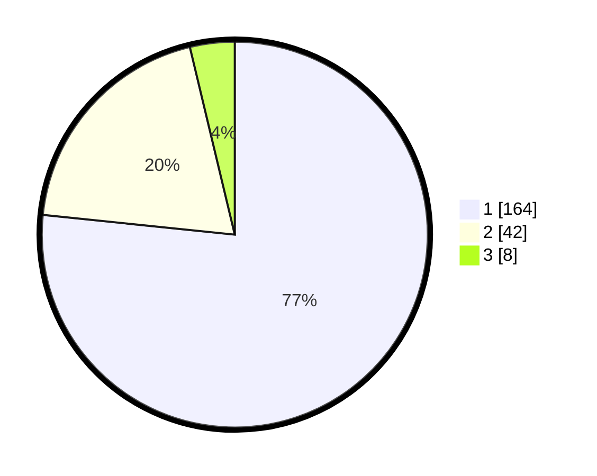

# Hasil

## Grafik

## Tabel

| No. | Nama Paslon    | Suara | Suara (raw) | Persentase |
|:--- |:-------------- | -----:| -----------:| ----------:|
| 1   | ANIES MUHAIMIN | 164   | [164][p-1]  | 76,64      |
| 2   | PRABOWO GIBRAN | 42    | [42][p-2]   | 19,63      |
| 3   | GANJAR MAHFUD  | 8     | [8][p-3]    | 3,74       |

[p-1]: https://github.com/gigit-pemilu/pemilu-2024-13-sumatera-barat/blob/main/pilpres/hitung-suara/sub/13-sumatera-barat/sub/71-kota-padang/sub/04-padang-utara/sub/1002-air-tawar-barat/sub/005-tps/sub/paslon-1.txt
[p-2]: https://github.com/gigit-pemilu/pemilu-2024-13-sumatera-barat/blob/main/pilpres/hitung-suara/sub/13-sumatera-barat/sub/71-kota-padang/sub/04-padang-utara/sub/1002-air-tawar-barat/sub/005-tps/sub/paslon-2.txt
[p-3]: https://github.com/gigit-pemilu/pemilu-2024-13-sumatera-barat/blob/main/pilpres/hitung-suara/sub/13-sumatera-barat/sub/71-kota-padang/sub/04-padang-utara/sub/1002-air-tawar-barat/sub/005-tps/sub/paslon-3.txt

## Foto C Plano

https://sirekap-obj-formc.kpu.go.id/ce3f/pemilu/ppwp/13/71/04/10/02/1371041002005-20240214-224840--9308fd56-1f0c-4e9b-87b4-8f790f8c7aed.jpg

https://sirekap-obj-formc.kpu.go.id/ce3f/pemilu/ppwp/13/71/04/10/02/1371041002005-20240214-224923--0f8b4708-17dc-4118-ad11-67679b2d6dbe.jpg

https://sirekap-obj-formc.kpu.go.id/ce3f/pemilu/ppwp/13/71/04/10/02/1371041002005-20240214-225008--9158fec2-6d68-449c-8c2c-c0cb27c6daf7.jpg

## Metadata

| Key        | Value               |
| ---------- | ------------------- |
| Time Stamp | 2024-02-15 21:30:27 |

