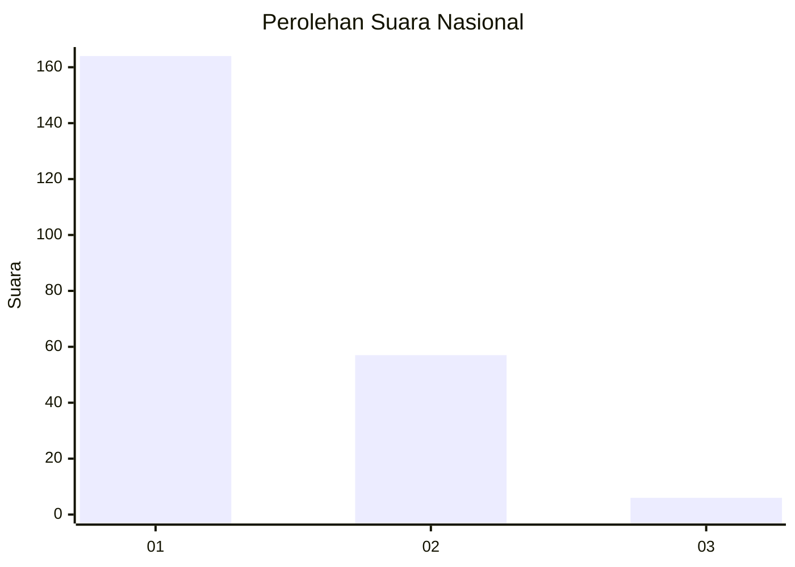
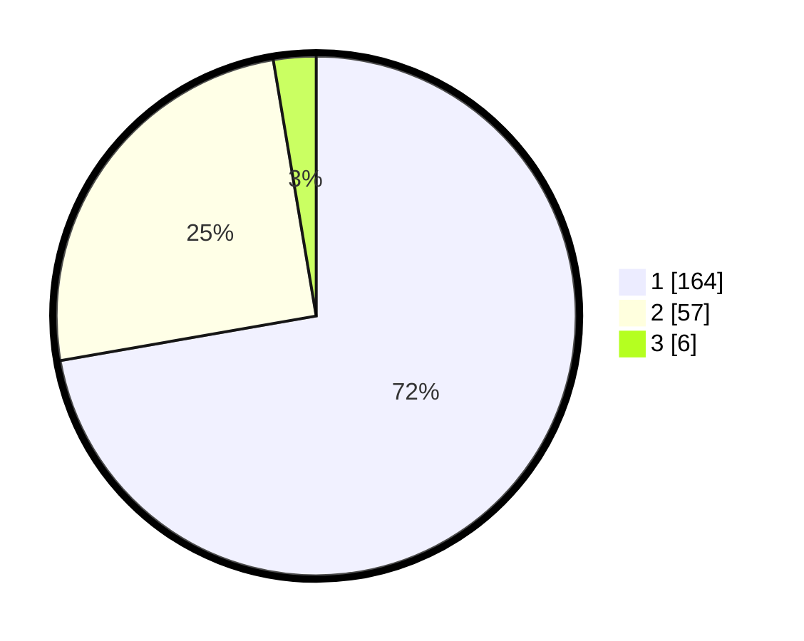

# Hasil

## Grafik

## Tabel

| No. | Nama Paslon    | Suara | Suara (raw) | Persentase |
|:--- |:-------------- | -----:| -----------:| ----------:|
| 1   | ANIES MUHAIMIN | 164   | [164][p-1]  | 72,25      |
| 2   | PRABOWO GIBRAN | 57    | [57][p-2]   | 25,11      |
| 3   | GANJAR MAHFUD  | 6     | [6][p-3]    | 2,64       |

[p-1]: https://github.com/gigit-pemilu/pemilu-2024/blob/main/pilpres/hitung-suara/sub/13-sumatera-barat/sub/71-kota-padang/sub/04-padang-utara/sub/1002-air-tawar-barat/sub/020-tps/sub/paslon-1.txt
[p-2]: https://github.com/gigit-pemilu/pemilu-2024/blob/main/pilpres/hitung-suara/sub/13-sumatera-barat/sub/71-kota-padang/sub/04-padang-utara/sub/1002-air-tawar-barat/sub/020-tps/sub/paslon-2.txt
[p-3]: https://github.com/gigit-pemilu/pemilu-2024/blob/main/pilpres/hitung-suara/sub/13-sumatera-barat/sub/71-kota-padang/sub/04-padang-utara/sub/1002-air-tawar-barat/sub/020-tps/sub/paslon-3.txt

## Foto C Plano

https://sirekap-obj-formc.kpu.go.id/ff95/pemilu/ppwp/13/71/04/10/02/1371041002020-20240214-155036--72dfa199-70b3-40bc-a498-f4c349ca52d4.jpg

https://sirekap-obj-formc.kpu.go.id/ff95/pemilu/ppwp/13/71/04/10/02/1371041002020-20240214-155533--4807c660-3fb5-49a6-b3c3-5daddaa44931.jpg

https://sirekap-obj-formc.kpu.go.id/ff95/pemilu/ppwp/13/71/04/10/02/1371041002020-20240215-021257--e1732b85-8f45-4383-a3a2-87094770f796.jpg

## Metadata

| Key        | Value               |
| ---------- | ------------------- |
| Time Stamp | 2024-02-15 18:30:25 |

