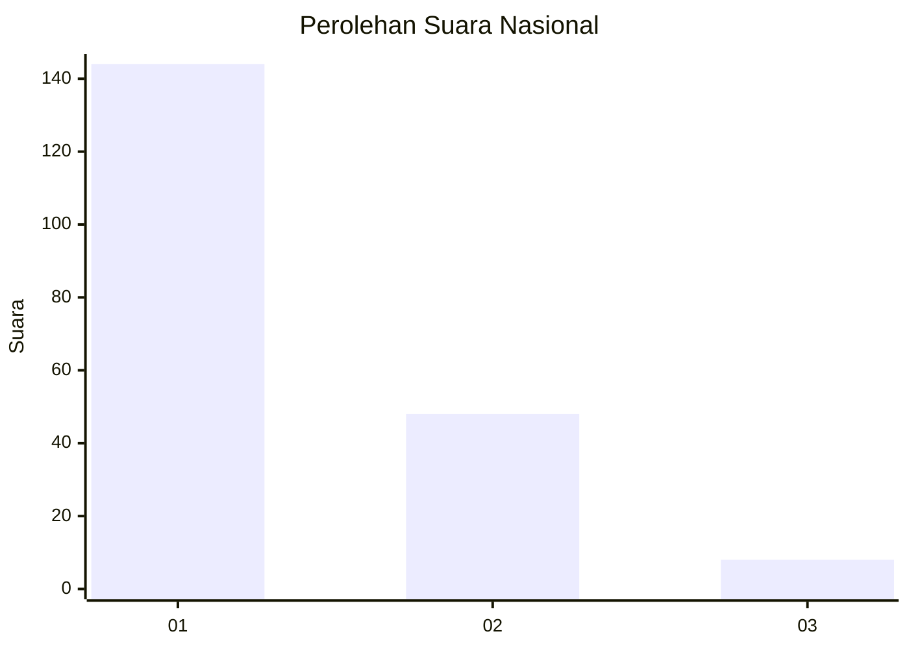
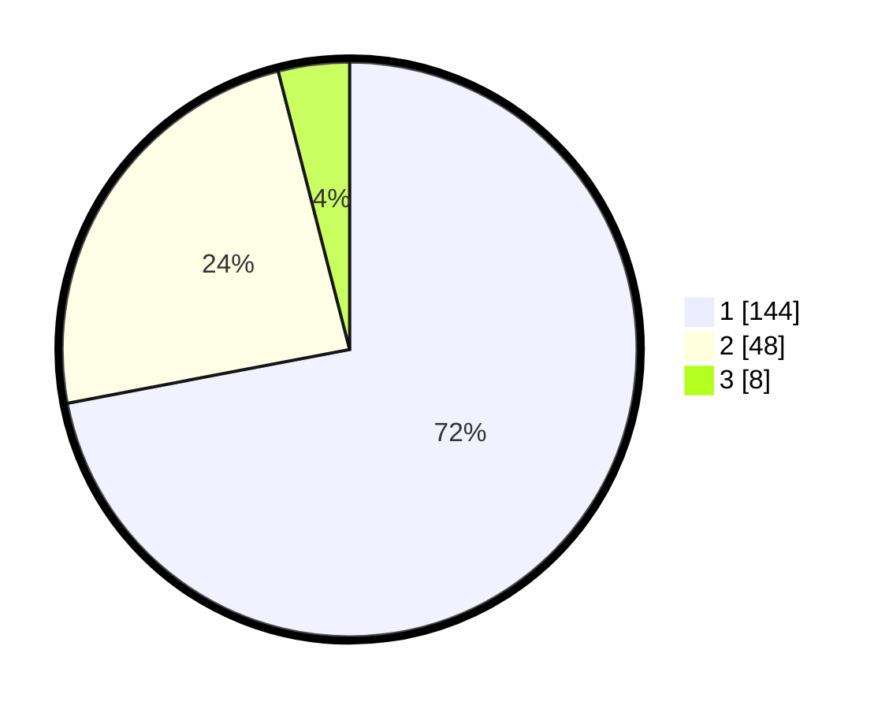

# Hasil

## Grafik

## Tabel

| No. | Nama Paslon    | Suara | Suara (raw) | Persentase |
|:--- |:-------------- | -----:| -----------:| ----------:|
| 1   | ANIES MUHAIMIN | 144   | [144][p-1]  | 72,00      |
| 2   | PRABOWO GIBRAN | 48    | [48][p-2]   | 24,00      |
| 3   | GANJAR MAHFUD  | 8     | [8][p-3]    | 4,00       |

[p-1]: https://github.com/gigit-pemilu/pemilu-2024/blob/main/pilpres/hitung-suara/sub/13-sumatera-barat/sub/71-kota-padang/sub/04-padang-utara/sub/1002-air-tawar-barat/sub/027-tps/sub/paslon-1.txt
[p-2]: https://github.com/gigit-pemilu/pemilu-2024/blob/main/pilpres/hitung-suara/sub/13-sumatera-barat/sub/71-kota-padang/sub/04-padang-utara/sub/1002-air-tawar-barat/sub/027-tps/sub/paslon-2.txt
[p-3]: https://github.com/gigit-pemilu/pemilu-2024/blob/main/pilpres/hitung-suara/sub/13-sumatera-barat/sub/71-kota-padang/sub/04-padang-utara/sub/1002-air-tawar-barat/sub/027-tps/sub/paslon-3.txt

## Foto C Plano

https://sirekap-obj-formc.kpu.go.id/f407/pemilu/ppwp/13/71/04/10/02/1371041002027-20240215-081729--5a3e3080-8c8d-4f91-9c6e-83dc049d10f0.jpg

https://sirekap-obj-formc.kpu.go.id/f407/pemilu/ppwp/13/71/04/10/02/1371041002027-20240215-081915--59e085af-8493-47e1-a25c-6f517921ba25.jpg

https://sirekap-obj-formc.kpu.go.id/f407/pemilu/ppwp/13/71/04/10/02/1371041002027-20240215-082016--a3b4d8a8-ee3c-43d1-b846-6c084e7d742b.jpg

## Metadata

| Key        | Value               |
| ---------- | ------------------- |
| Time Stamp | 2024-02-16 01:30:27 |

