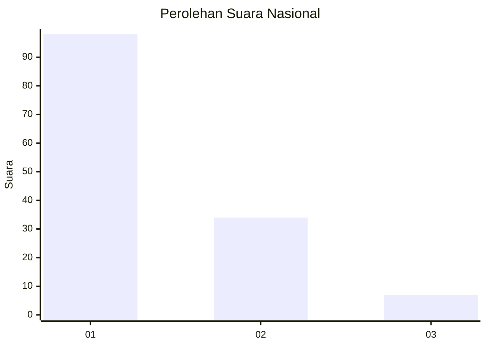
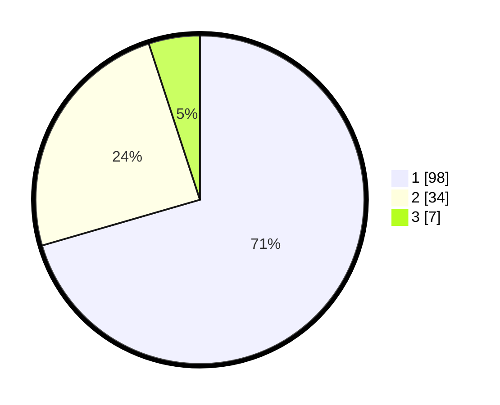

# Hasil

## Grafik

## Tabel

| No. | Nama Paslon    | Suara | Suara (raw) | Persentase |
|:--- |:-------------- | -----:| -----------:| ----------:|
| 1   | ANIES MUHAIMIN | 98    | [98][p-1]   | 70,50      |
| 2   | PRABOWO GIBRAN | 34    | [34][p-2]   | 24,46      |
| 3   | GANJAR MAHFUD  | 7     | [7][p-3]    | 5,04       |

[p-1]: https://github.com/gigit-pemilu/pemilu-2024/blob/main/pilpres/hitung-suara/sub/13-sumatera-barat/sub/71-kota-padang/sub/04-padang-utara/sub/1004-ulak-karang-selatan/sub/017-tps/sub/paslon-1.txt
[p-2]: https://github.com/gigit-pemilu/pemilu-2024/blob/main/pilpres/hitung-suara/sub/13-sumatera-barat/sub/71-kota-padang/sub/04-padang-utara/sub/1004-ulak-karang-selatan/sub/017-tps/sub/paslon-2.txt
[p-3]: https://github.com/gigit-pemilu/pemilu-2024/blob/main/pilpres/hitung-suara/sub/13-sumatera-barat/sub/71-kota-padang/sub/04-padang-utara/sub/1004-ulak-karang-selatan/sub/017-tps/sub/paslon-3.txt

## Foto C Plano

https://sirekap-obj-formc.kpu.go.id/21d8/pemilu/ppwp/13/71/04/10/04/1371041004017-20240214-210314--4258484e-d596-4d0e-8b5c-c8d30c924743.jpg

https://sirekap-obj-formc.kpu.go.id/21d8/pemilu/ppwp/13/71/04/10/04/1371041004017-20240214-210840--3ffd8c86-b4b8-47ab-bef3-11d88905137c.jpg

https://sirekap-obj-formc.kpu.go.id/21d8/pemilu/ppwp/13/71/04/10/04/1371041004017-20240214-211248--cd62cc69-1c31-4c48-984f-7c32927bcb98.jpg

## Metadata

| Key        | Value               |
| ---------- | ------------------- |
| Time Stamp | 2024-02-15 22:00:27 |

