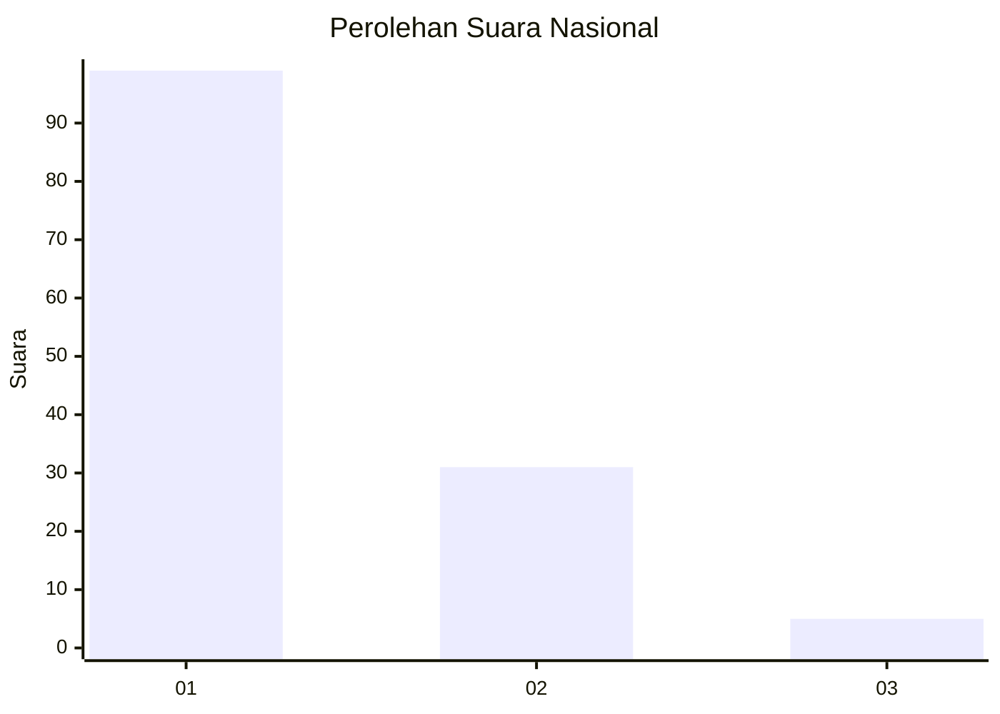
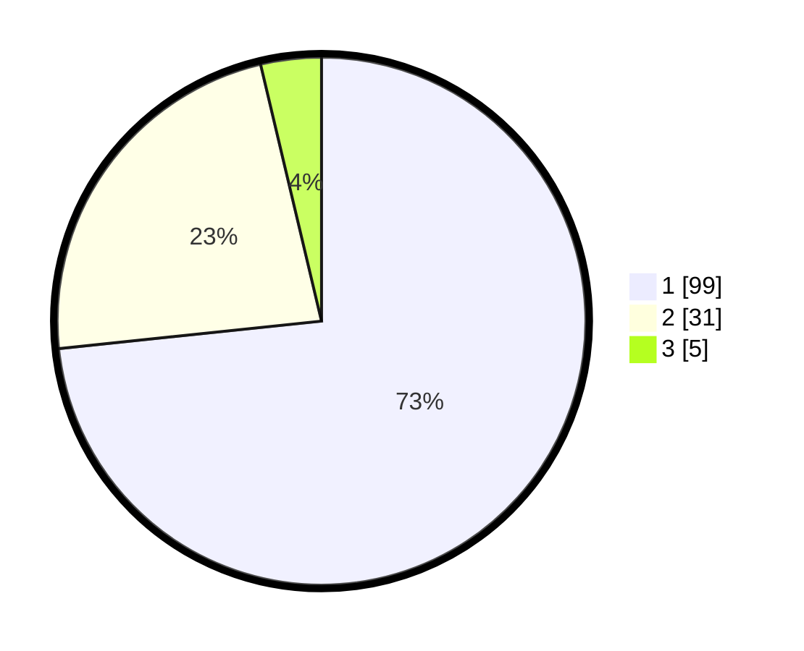

# Hasil

## Grafik

## Tabel

| No. | Nama Paslon    | Suara | Suara (raw) | Persentase |
|:--- |:-------------- | -----:| -----------:| ----------:|
| 1   | ANIES MUHAIMIN | 99    | [99][p-1]   | 73,33      |
| 2   | PRABOWO GIBRAN | 31    | [31][p-2]   | 22,96      |
| 3   | GANJAR MAHFUD  | 5     | [5][p-3]    | 3,70       |

[p-1]: https://github.com/gigit-pemilu/pemilu-2024/blob/main/pilpres/hitung-suara/sub/13-sumatera-barat/sub/71-kota-padang/sub/04-padang-utara/sub/1004-ulak-karang-selatan/sub/025-tps/sub/paslon-1.txt
[p-2]: https://github.com/gigit-pemilu/pemilu-2024/blob/main/pilpres/hitung-suara/sub/13-sumatera-barat/sub/71-kota-padang/sub/04-padang-utara/sub/1004-ulak-karang-selatan/sub/025-tps/sub/paslon-2.txt
[p-3]: https://github.com/gigit-pemilu/pemilu-2024/blob/main/pilpres/hitung-suara/sub/13-sumatera-barat/sub/71-kota-padang/sub/04-padang-utara/sub/1004-ulak-karang-selatan/sub/025-tps/sub/paslon-3.txt

## Foto C Plano

https://sirekap-obj-formc.kpu.go.id/7715/pemilu/ppwp/13/71/04/10/04/1371041004025-20240215-024607--bc818501-0973-4ebd-9163-3035ca46edf6.jpg

https://sirekap-obj-formc.kpu.go.id/7715/pemilu/ppwp/13/71/04/10/04/1371041004025-20240215-024717--f3c6f38f-6ebd-486d-bf6e-66e9751566cd.jpg

https://sirekap-obj-formc.kpu.go.id/7715/pemilu/ppwp/13/71/04/10/04/1371041004025-20240215-024831--8b6b8a13-849a-4788-9768-09c39f565e64.jpg

## Metadata

| Key        | Value               |
| ---------- | ------------------- |
| Time Stamp | 2024-02-15 22:00:27 |

