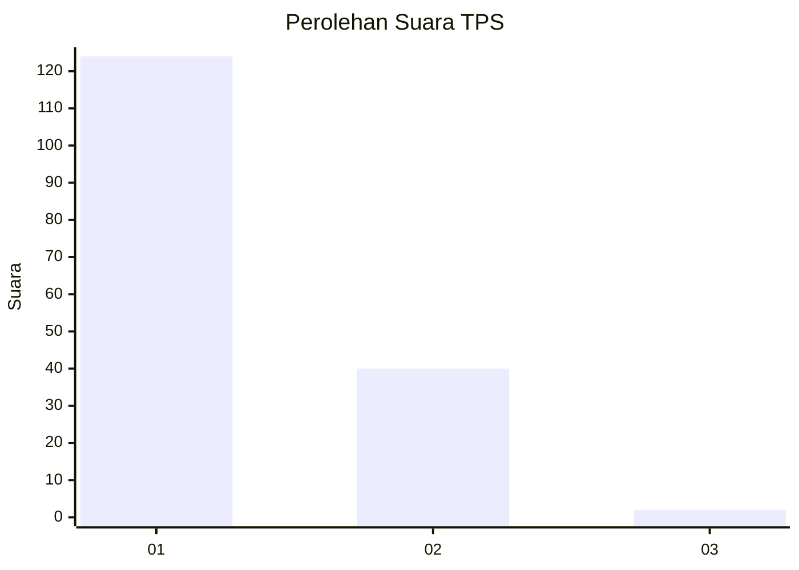
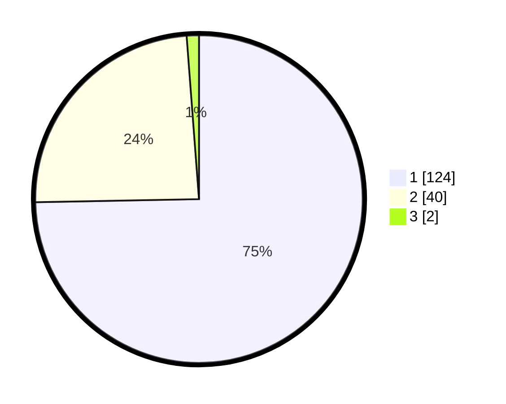

# Hasil

## Grafik

## Tabel

| No. | Nama Paslon    | Suara | Suara (raw) | Persentase |
|:--- |:-------------- | -----:| -----------:| ----------:|
| 1   | ANIES MUHAIMIN | 124   | [124][p-1]  | 74,70      |
| 2   | PRABOWO GIBRAN | 40    | [40][p-2]   | 24,10      |
| 3   | GANJAR MAHFUD  | 2     | [2][p-3]    | 1,20       |

[p-1]: https://github.com/gigit-pemilu/pemilu-2024-13-sumatera-barat/blob/main/pilpres/hitung-suara/sub/13-sumatera-barat/sub/71-kota-padang/sub/04-padang-utara/sub/1005-lolong-belanti/sub/021-tps/sub/paslon-1.txt
[p-2]: https://github.com/gigit-pemilu/pemilu-2024-13-sumatera-barat/blob/main/pilpres/hitung-suara/sub/13-sumatera-barat/sub/71-kota-padang/sub/04-padang-utara/sub/1005-lolong-belanti/sub/021-tps/sub/paslon-2.txt
[p-3]: https://github.com/gigit-pemilu/pemilu-2024-13-sumatera-barat/blob/main/pilpres/hitung-suara/sub/13-sumatera-barat/sub/71-kota-padang/sub/04-padang-utara/sub/1005-lolong-belanti/sub/021-tps/sub/paslon-3.txt

## Foto C Plano

https://sirekap-obj-formc.kpu.go.id/0f09/pemilu/ppwp/13/71/04/10/05/1371041005021-20240215-020237--2e65c11e-6df1-4798-aa27-2d87d440e20b.jpg

https://sirekap-obj-formc.kpu.go.id/0f09/pemilu/ppwp/13/71/04/10/05/1371041005021-20240215-021546--f04fcd99-68da-43b4-84e7-1588d40f6622.jpg

https://sirekap-obj-formc.kpu.go.id/0f09/pemilu/ppwp/13/71/04/10/05/1371041005021-20240215-020542--f38aa9f7-9c33-4c65-a4fd-5214b57fdf18.jpg

## Metadata

| Key        | Value               |
| ---------- | ------------------- |
| Time Stamp | 2024-02-15 15:00:29 |

