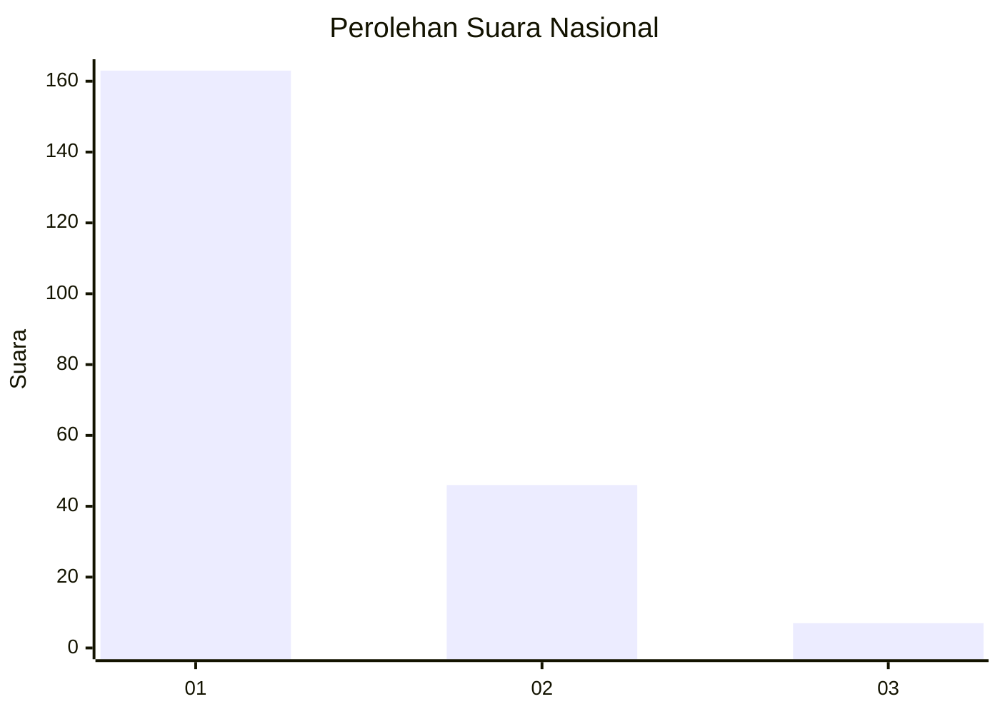
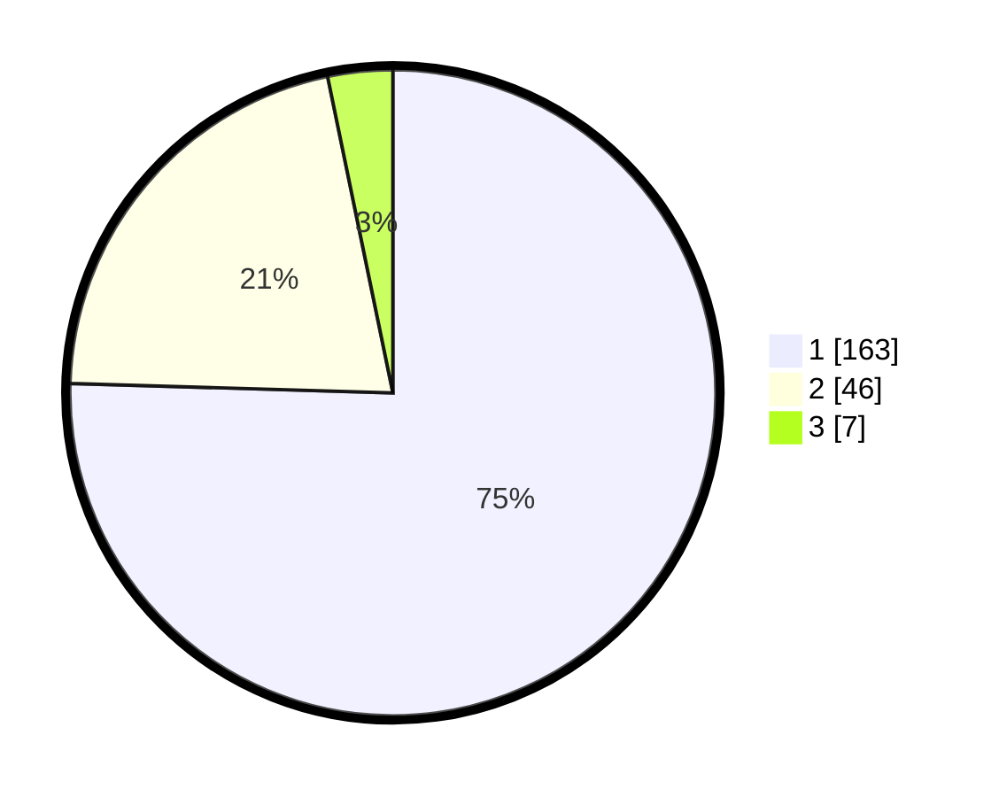

# Hasil

## Grafik

## Tabel

| No. | Nama Paslon    | Suara | Suara (raw) | Persentase |
|:--- |:-------------- | -----:| -----------:| ----------:|
| 1   | ANIES MUHAIMIN | 163   | [163][p-1]  | 75,46      |
| 2   | PRABOWO GIBRAN | 46    | [46][p-2]   | 21,30      |
| 3   | GANJAR MAHFUD  | 7     | [7][p-3]    | 3,24       |

[p-1]: https://github.com/gigit-pemilu/pemilu-2024/blob/main/pilpres/hitung-suara/sub/13-sumatera-barat/sub/71-kota-padang/sub/06-lubuk-begalung/sub/1001-cangkeh-nan-xx/sub/010-tps/sub/paslon-1.txt
[p-2]: https://github.com/gigit-pemilu/pemilu-2024/blob/main/pilpres/hitung-suara/sub/13-sumatera-barat/sub/71-kota-padang/sub/06-lubuk-begalung/sub/1001-cangkeh-nan-xx/sub/010-tps/sub/paslon-2.txt
[p-3]: https://github.com/gigit-pemilu/pemilu-2024/blob/main/pilpres/hitung-suara/sub/13-sumatera-barat/sub/71-kota-padang/sub/06-lubuk-begalung/sub/1001-cangkeh-nan-xx/sub/010-tps/sub/paslon-3.txt

## Foto C Plano

https://sirekap-obj-formc.kpu.go.id/1fb1/pemilu/ppwp/13/71/06/10/01/1371061001010-20240215-044509--cf6c41a9-4c2f-4d63-b7f4-a2faa6982346.jpg

https://sirekap-obj-formc.kpu.go.id/1fb1/pemilu/ppwp/13/71/06/10/01/1371061001010-20240215-044625--8ff3a311-5fcf-4a13-8470-36e045d1d03f.jpg

https://sirekap-obj-formc.kpu.go.id/1fb1/pemilu/ppwp/13/71/06/10/01/1371061001010-20240215-101501--cbf68be4-de8a-444d-a1ad-dbaee177ca26.jpg

## Metadata

| Key        | Value               |
| ---------- | ------------------- |
| Time Stamp | 2024-02-15 20:00:44 |

