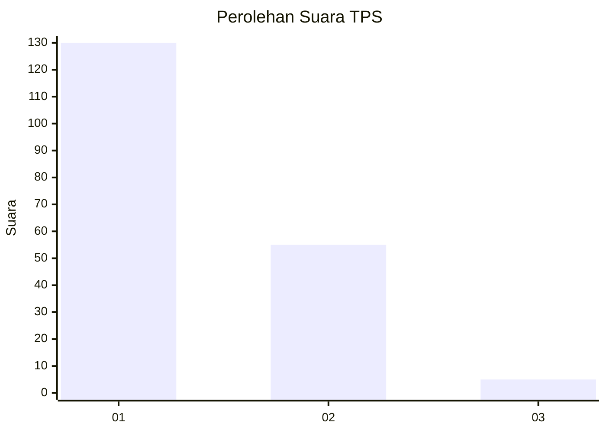
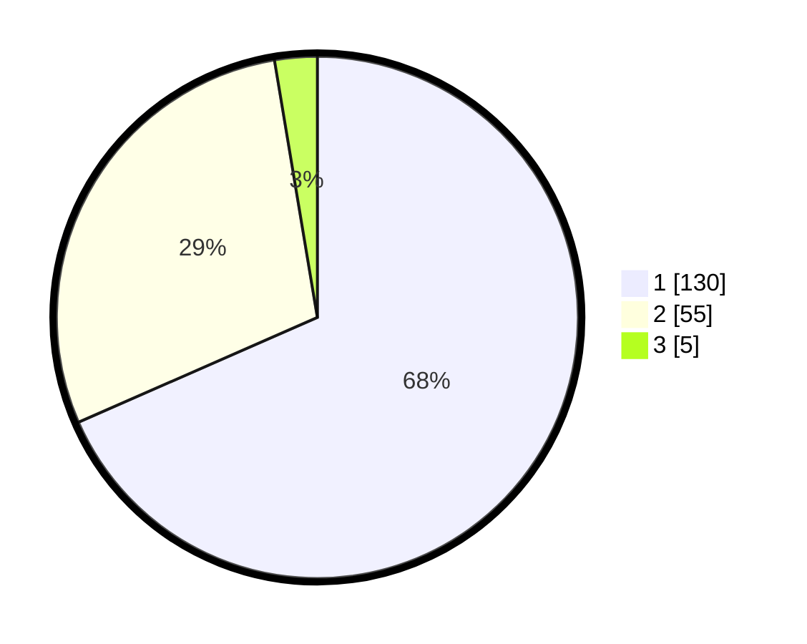

# Hasil

## Grafik

## Tabel

| No. | Nama Paslon    | Suara | Suara (raw) | Persentase |
|:--- |:-------------- | -----:| -----------:| ----------:|
| 1   | ANIES MUHAIMIN | 130   | [130][p-1]  | 68,42      |
| 2   | PRABOWO GIBRAN | 55    | [55][p-2]   | 28,95      |
| 3   | GANJAR MAHFUD  | 5     | [5][p-3]    | 2,63       |

[p-1]: https://github.com/gigit-pemilu/pemilu-2024-13-sumatera-barat/blob/main/pilpres/hitung-suara/sub/13-sumatera-barat/sub/71-kota-padang/sub/06-lubuk-begalung/sub/1003-tanah-sirah-piai-nan-xx/sub/004-tps/sub/paslon-1.txt
[p-2]: https://github.com/gigit-pemilu/pemilu-2024-13-sumatera-barat/blob/main/pilpres/hitung-suara/sub/13-sumatera-barat/sub/71-kota-padang/sub/06-lubuk-begalung/sub/1003-tanah-sirah-piai-nan-xx/sub/004-tps/sub/paslon-2.txt
[p-3]: https://github.com/gigit-pemilu/pemilu-2024-13-sumatera-barat/blob/main/pilpres/hitung-suara/sub/13-sumatera-barat/sub/71-kota-padang/sub/06-lubuk-begalung/sub/1003-tanah-sirah-piai-nan-xx/sub/004-tps/sub/paslon-3.txt

## Foto C Plano

https://sirekap-obj-formc.kpu.go.id/6cee/pemilu/ppwp/13/71/06/10/03/1371061003004-20240215-124637--a9d05f95-a7df-43b5-850a-d0a7be8b5ee3.jpg

https://sirekap-obj-formc.kpu.go.id/6cee/pemilu/ppwp/13/71/06/10/03/1371061003004-20240215-134112--901c2e9f-6e6e-496e-8b54-bfe9219c8443.jpg

https://sirekap-obj-formc.kpu.go.id/6cee/pemilu/ppwp/13/71/06/10/03/1371061003004-20240221-171939--7e0c923a-b1a4-4251-9d96-c1efcc764099.jpg

## Metadata

| Key        | Value               |
| ---------- | ------------------- |
| Time Stamp | 2024-02-25 14:00:00 |

