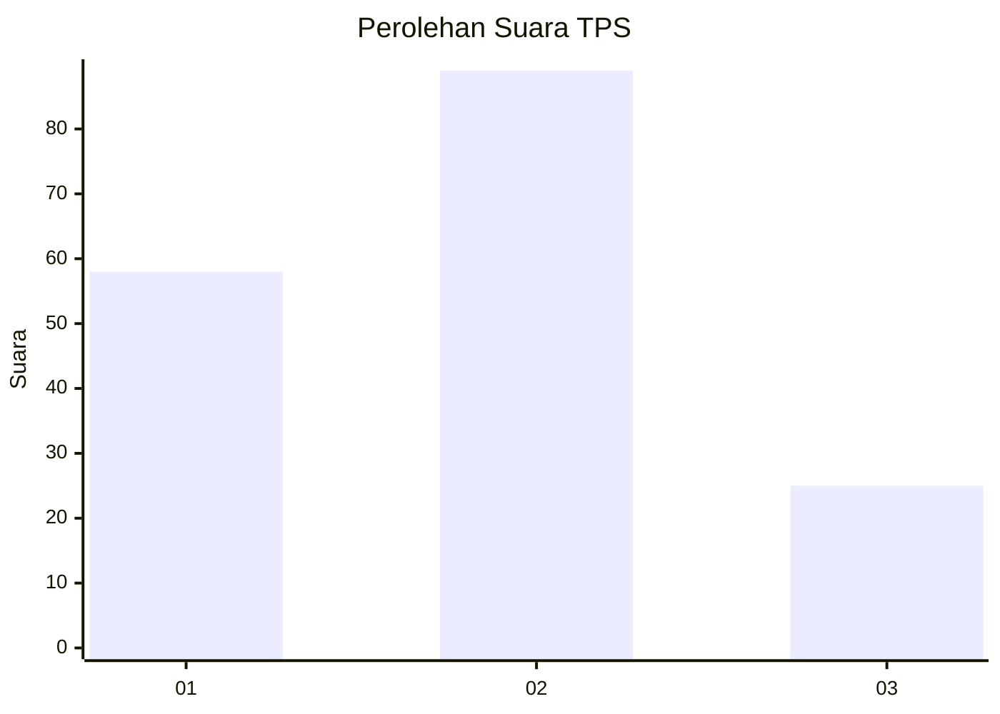
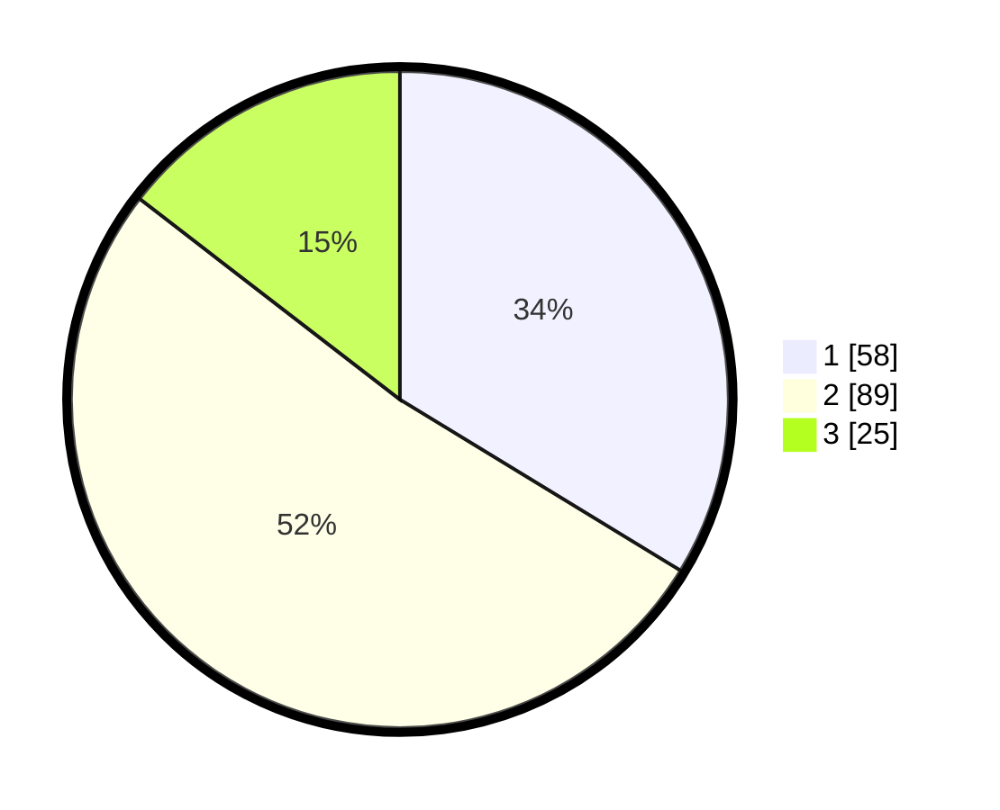

# Hasil

## Grafik

## Tabel

| No. | Nama Paslon    | Suara | Suara (raw) | Persentase |
|:--- |:-------------- | -----:| -----------:| ----------:|
| 1   | ANIES MUHAIMIN | 58    | [58][p-1]   | 33,72      |
| 2   | PRABOWO GIBRAN | 89    | [89][p-2]   | 51,74      |
| 3   | GANJAR MAHFUD  | 25    | [25][p-3]   | 14,53      |

[p-1]: https://github.com/gigit-pemilu/pemilu-2024-13-sumatera-barat/blob/main/pilpres/hitung-suara/sub/13-sumatera-barat/sub/71-kota-padang/sub/06-lubuk-begalung/sub/1004-tanjung-saba-pitameh-nan-xx/sub/003-tps/sub/paslon-1.txt
[p-2]: https://github.com/gigit-pemilu/pemilu-2024-13-sumatera-barat/blob/main/pilpres/hitung-suara/sub/13-sumatera-barat/sub/71-kota-padang/sub/06-lubuk-begalung/sub/1004-tanjung-saba-pitameh-nan-xx/sub/003-tps/sub/paslon-2.txt
[p-3]: https://github.com/gigit-pemilu/pemilu-2024-13-sumatera-barat/blob/main/pilpres/hitung-suara/sub/13-sumatera-barat/sub/71-kota-padang/sub/06-lubuk-begalung/sub/1004-tanjung-saba-pitameh-nan-xx/sub/003-tps/sub/paslon-3.txt

## Foto C Plano

https://sirekap-obj-formc.kpu.go.id/7758/pemilu/ppwp/13/71/06/10/04/1371061004003-20240224-141707--f8e8cc10-7298-403e-b6de-9c62304bab4c.jpg

https://sirekap-obj-formc.kpu.go.id/7758/pemilu/ppwp/13/71/06/10/04/1371061004003-20240224-141811--a7c9f19a-55a8-4ec9-a746-50d5674f2cb4.jpg

https://sirekap-obj-formc.kpu.go.id/7758/pemilu/ppwp/13/71/06/10/04/1371061004003-20240224-141910--ea2dbbb6-0ccf-4f69-9057-59b4c5db980c.jpg

## Metadata

| Key        | Value               |
| ---------- | ------------------- |
| Time Stamp | 2024-02-28 19:00:00 |

