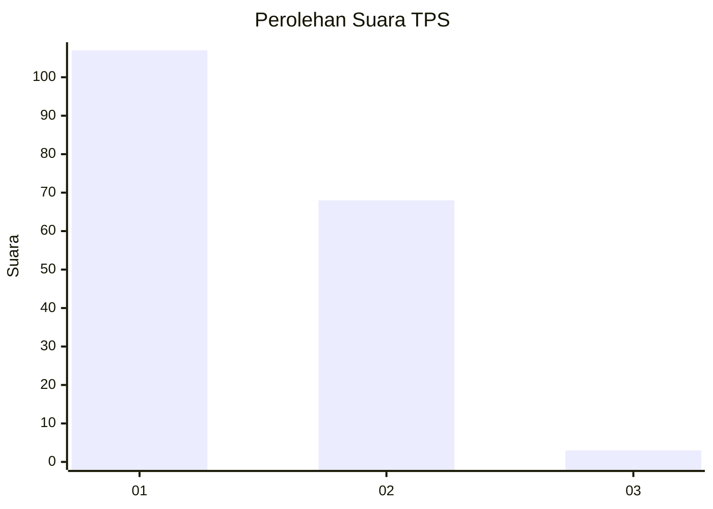
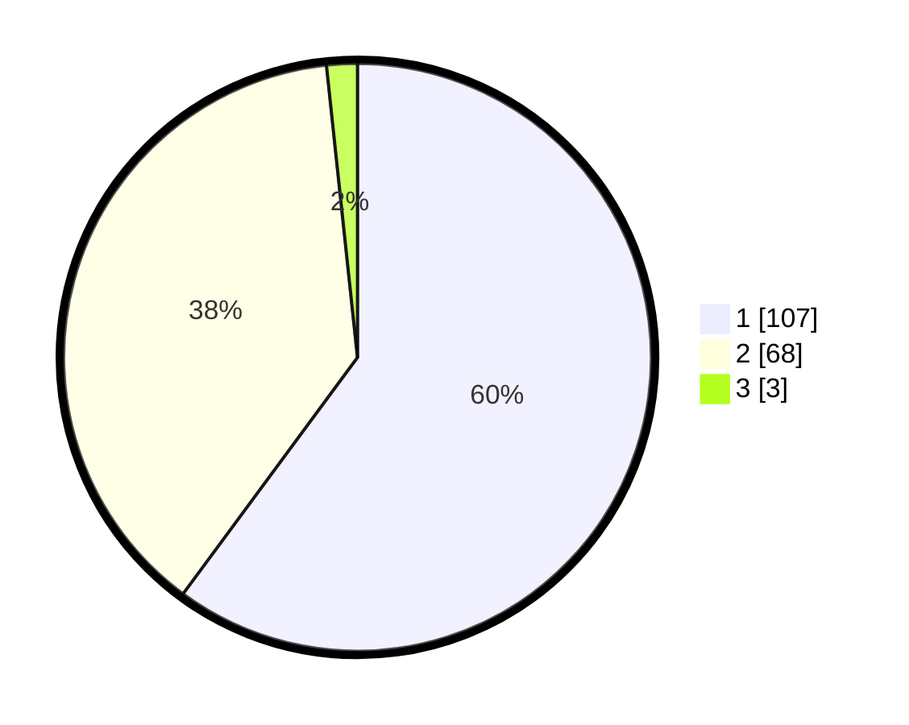

# Hasil

## Grafik

## Tabel

| No. | Nama Paslon    | Suara | Suara (raw) | Persentase |
|:--- |:-------------- | -----:| -----------:| ----------:|
| 1   | ANIES MUHAIMIN | 107   | [107][p-1]  | 60,11      |
| 2   | PRABOWO GIBRAN | 68    | [68][p-2]   | 38,20      |
| 3   | GANJAR MAHFUD  | 3     | [3][p-3]    | 1,69       |

[p-1]: https://github.com/gigit-pemilu/pemilu-2024-13-sumatera-barat/blob/main/pilpres/hitung-suara/sub/13-sumatera-barat/sub/71-kota-padang/sub/06-lubuk-begalung/sub/1004-tanjung-saba-pitameh-nan-xx/sub/005-tps/sub/paslon-1.txt
[p-2]: https://github.com/gigit-pemilu/pemilu-2024-13-sumatera-barat/blob/main/pilpres/hitung-suara/sub/13-sumatera-barat/sub/71-kota-padang/sub/06-lubuk-begalung/sub/1004-tanjung-saba-pitameh-nan-xx/sub/005-tps/sub/paslon-2.txt
[p-3]: https://github.com/gigit-pemilu/pemilu-2024-13-sumatera-barat/blob/main/pilpres/hitung-suara/sub/13-sumatera-barat/sub/71-kota-padang/sub/06-lubuk-begalung/sub/1004-tanjung-saba-pitameh-nan-xx/sub/005-tps/sub/paslon-3.txt

## Foto C Plano

https://sirekap-obj-formc.kpu.go.id/f2ed/pemilu/ppwp/13/71/06/10/04/1371061004005-20240224-144916--970760a5-201e-42ec-9ee5-9ccb84c31bb8.jpg

https://sirekap-obj-formc.kpu.go.id/f2ed/pemilu/ppwp/13/71/06/10/04/1371061004005-20240224-144948--1f9de5b0-2c1e-4b7d-bc37-d02d9510eaaa.jpg

https://sirekap-obj-formc.kpu.go.id/f2ed/pemilu/ppwp/13/71/06/10/04/1371061004005-20240224-145015--cea8532d-5cb2-46fb-b16b-07a4d3aa2226.jpg

## Metadata

| Key        | Value               |
| ---------- | ------------------- |
| Time Stamp | 2024-02-28 19:00:00 |

