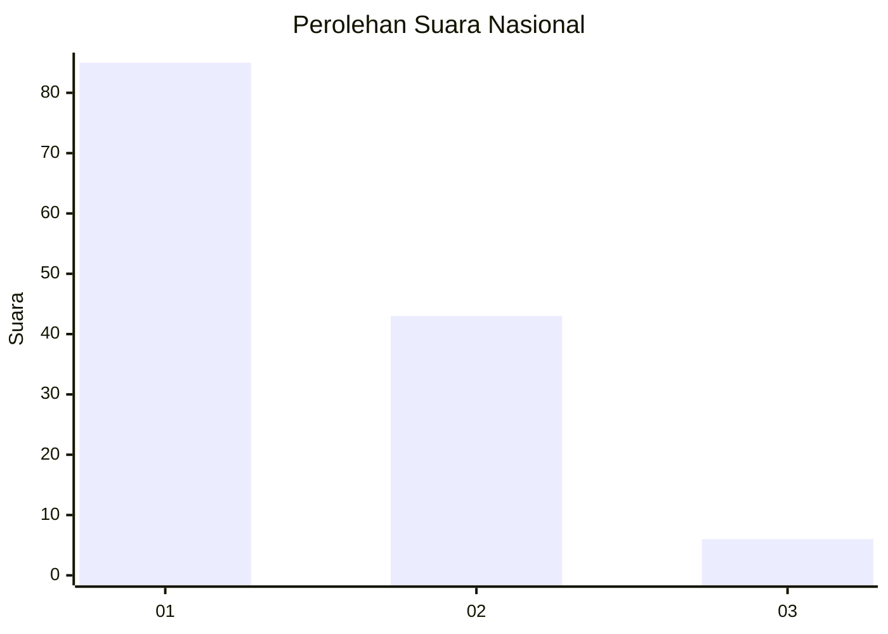
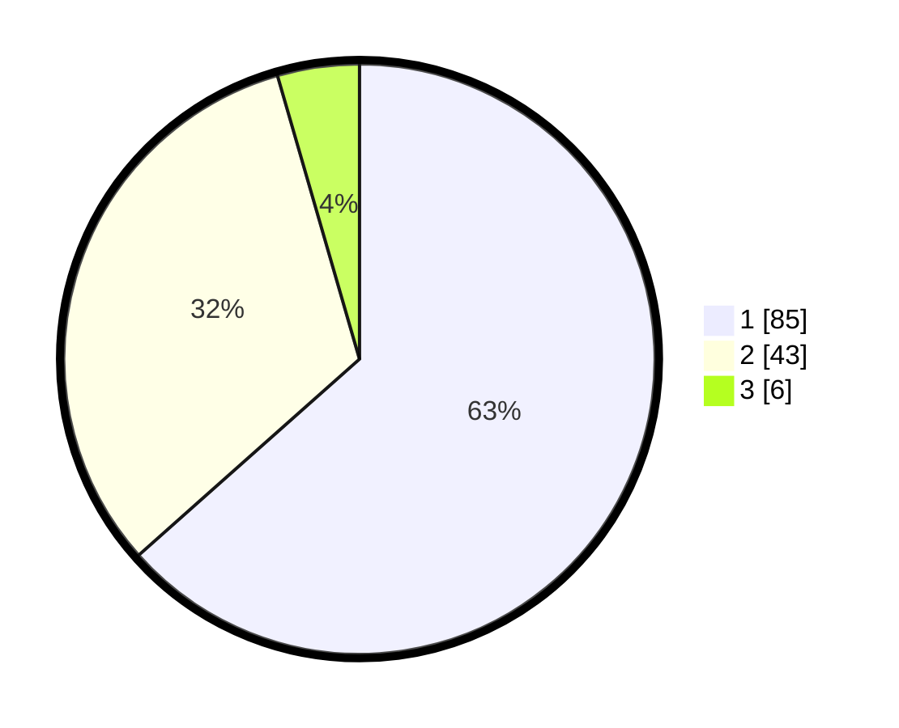

# Hasil

## Grafik

## Tabel

| No. | Nama Paslon    | Suara | Suara (raw) | Persentase |
|:--- |:-------------- | -----:| -----------:| ----------:|
| 1   | ANIES MUHAIMIN | 85    | [85][p-1]   | 63,43      |
| 2   | PRABOWO GIBRAN | 43    | [43][p-2]   | 32,09      |
| 3   | GANJAR MAHFUD  | 6     | [6][p-3]    | 4,48       |

[p-1]: https://github.com/gigit-pemilu/pemilu-2024/blob/main/pilpres/hitung-suara/sub/13-sumatera-barat/sub/71-kota-padang/sub/06-lubuk-begalung/sub/1008-koto-baru-nan-xx/sub/003-tps/sub/paslon-1.txt
[p-2]: https://github.com/gigit-pemilu/pemilu-2024/blob/main/pilpres/hitung-suara/sub/13-sumatera-barat/sub/71-kota-padang/sub/06-lubuk-begalung/sub/1008-koto-baru-nan-xx/sub/003-tps/sub/paslon-2.txt
[p-3]: https://github.com/gigit-pemilu/pemilu-2024/blob/main/pilpres/hitung-suara/sub/13-sumatera-barat/sub/71-kota-padang/sub/06-lubuk-begalung/sub/1008-koto-baru-nan-xx/sub/003-tps/sub/paslon-3.txt

## Foto C Plano

https://sirekap-obj-formc.kpu.go.id/faea/pemilu/ppwp/13/71/06/10/08/1371061008003-20240215-032425--f09eae36-e64b-4257-89de-d6b72ce87469.jpg

https://sirekap-obj-formc.kpu.go.id/faea/pemilu/ppwp/13/71/06/10/08/1371061008003-20240215-021021--814115f1-240b-447a-94d7-1f7541f1716a.jpg

https://sirekap-obj-formc.kpu.go.id/faea/pemilu/ppwp/13/71/06/10/08/1371061008003-20240215-021418--3152ea6f-3cf5-4e81-ab73-c40b0bec5f56.jpg

## Metadata

| Key        | Value               |
| ---------- | ------------------- |
| Time Stamp | 2024-02-15 12:00:28 |

