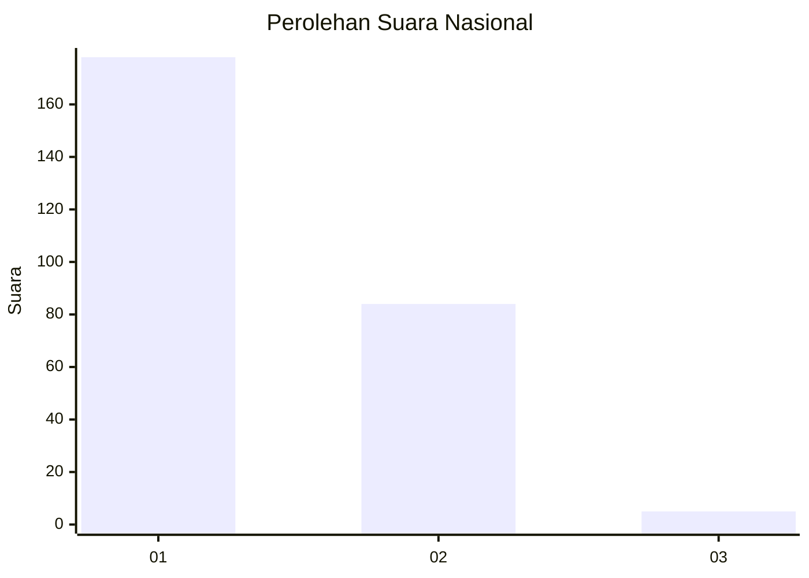
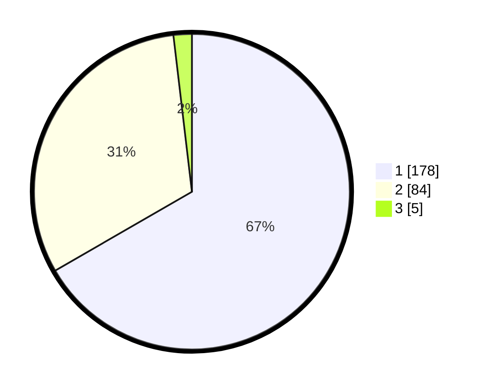

# Hasil

## Grafik

## Tabel

| No. | Nama Paslon    | Suara | Suara (raw) | Persentase |
|:--- |:-------------- | -----:| -----------:| ----------:|
| 1   | ANIES MUHAIMIN | 178   | [178][p-1]  | 66,67      |
| 2   | PRABOWO GIBRAN | 84    | [84][p-2]   | 31,46      |
| 3   | GANJAR MAHFUD  | 5     | [5][p-3]    | 1,87       |

[p-1]: https://github.com/gigit-pemilu/pemilu-2024/blob/main/pilpres/hitung-suara/sub/13-sumatera-barat/sub/71-kota-padang/sub/06-lubuk-begalung/sub/1012-pegambiran-ampalu-nan-xx/sub/005-tps/sub/paslon-1.txt
[p-2]: https://github.com/gigit-pemilu/pemilu-2024/blob/main/pilpres/hitung-suara/sub/13-sumatera-barat/sub/71-kota-padang/sub/06-lubuk-begalung/sub/1012-pegambiran-ampalu-nan-xx/sub/005-tps/sub/paslon-2.txt
[p-3]: https://github.com/gigit-pemilu/pemilu-2024/blob/main/pilpres/hitung-suara/sub/13-sumatera-barat/sub/71-kota-padang/sub/06-lubuk-begalung/sub/1012-pegambiran-ampalu-nan-xx/sub/005-tps/sub/paslon-3.txt

## Foto C Plano

https://sirekap-obj-formc.kpu.go.id/dc4b/pemilu/ppwp/13/71/06/10/12/1371061012005-20240215-093732--66bf95df-cfeb-4cd0-95bb-d746f7614bea.jpg

https://sirekap-obj-formc.kpu.go.id/dc4b/pemilu/ppwp/13/71/06/10/12/1371061012005-20240215-093946--47bdf5b1-e16c-48fb-99d7-f6e4aacc0c1d.jpg

https://sirekap-obj-formc.kpu.go.id/dc4b/pemilu/ppwp/13/71/06/10/12/1371061012005-20240215-094237--ef2cd63a-02ef-43f4-acaa-72ceb1d14916.jpg

## Metadata

| Key        | Value               |
| ---------- | ------------------- |
| Time Stamp | 2024-02-16 01:30:27 |

