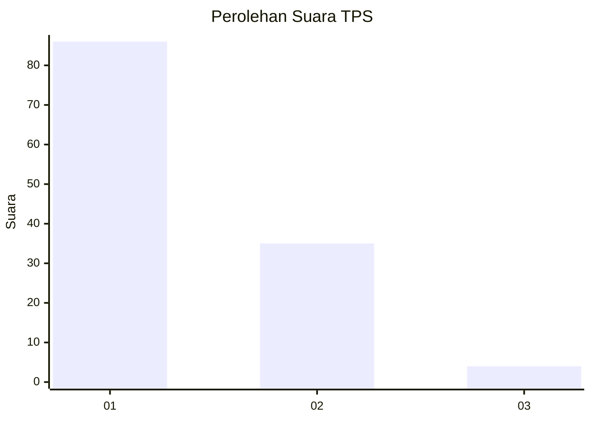
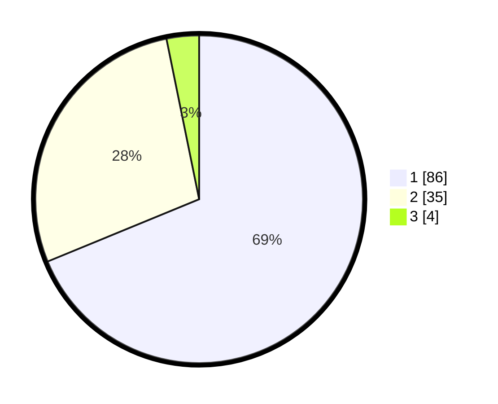

# Hasil

## Grafik

## Tabel

| No. | Nama Paslon    | Suara | Suara (raw) | Persentase |
|:--- |:-------------- | -----:| -----------:| ----------:|
| 1   | ANIES MUHAIMIN | 86    | [86][p-1]   | 68,80      |
| 2   | PRABOWO GIBRAN | 35    | [35][p-2]   | 28,00      |
| 3   | GANJAR MAHFUD  | 4     | [4][p-3]    | 3,20       |

[p-1]: https://github.com/gigit-pemilu/pemilu-2024-13-sumatera-barat/blob/main/pilpres/hitung-suara/sub/13-sumatera-barat/sub/71-kota-padang/sub/07-lubuk-kilangan/sub/1001-indarung/sub/005-tps/sub/paslon-1.txt
[p-2]: https://github.com/gigit-pemilu/pemilu-2024-13-sumatera-barat/blob/main/pilpres/hitung-suara/sub/13-sumatera-barat/sub/71-kota-padang/sub/07-lubuk-kilangan/sub/1001-indarung/sub/005-tps/sub/paslon-2.txt
[p-3]: https://github.com/gigit-pemilu/pemilu-2024-13-sumatera-barat/blob/main/pilpres/hitung-suara/sub/13-sumatera-barat/sub/71-kota-padang/sub/07-lubuk-kilangan/sub/1001-indarung/sub/005-tps/sub/paslon-3.txt

## Foto C Plano

https://sirekap-obj-formc.kpu.go.id/7854/pemilu/ppwp/13/71/07/10/01/1371071001005-20240215-071042--f7aeb8b4-434c-4b1b-8f6d-b589ff0fbadd.jpg

https://sirekap-obj-formc.kpu.go.id/7854/pemilu/ppwp/13/71/07/10/01/1371071001005-20240215-071115--01b1b808-cf16-4319-8ae8-6cc1c3252f58.jpg

https://sirekap-obj-formc.kpu.go.id/7854/pemilu/ppwp/13/71/07/10/01/1371071001005-20240215-071214--98b4d4dc-9b8a-43b7-aa36-7101cdf45757.jpg

## Metadata

| Key        | Value               |
| ---------- | ------------------- |
| Time Stamp | 2024-02-15 21:30:27 |

