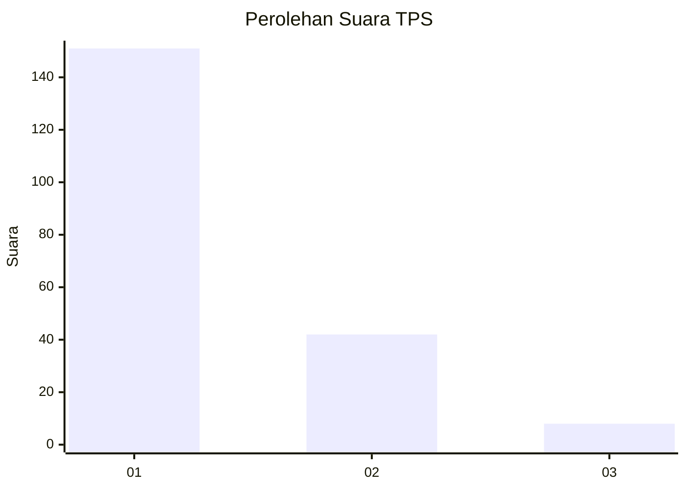
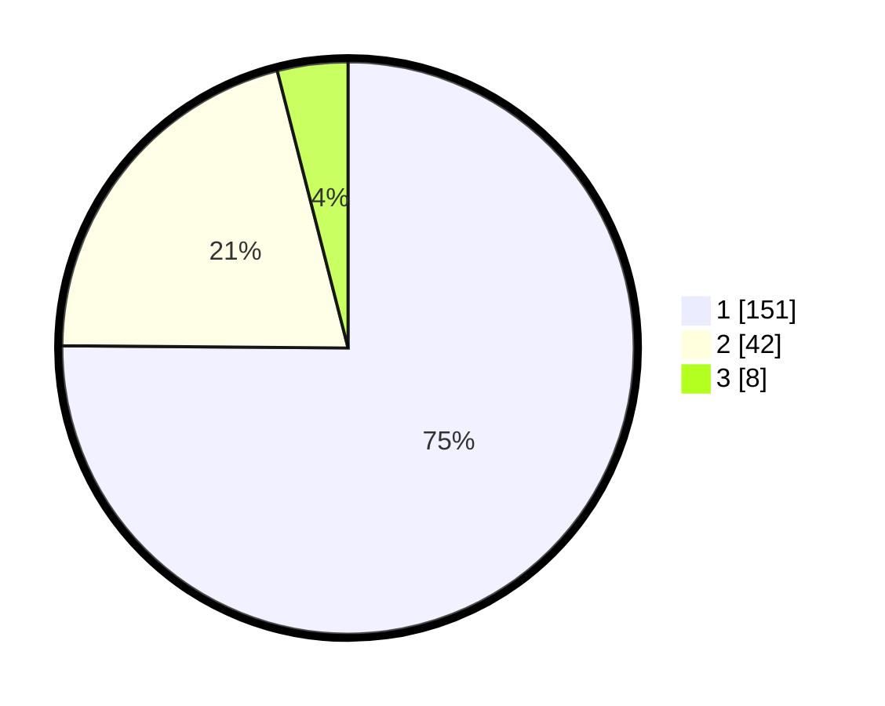

# Hasil

## Grafik

## Tabel

| No. | Nama Paslon    | Suara | Suara (raw) | Persentase |
|:--- |:-------------- | -----:| -----------:| ----------:|
| 1   | ANIES MUHAIMIN | 151   | [151][p-1]  | 75,12      |
| 2   | PRABOWO GIBRAN | 42    | [42][p-2]   | 20,90      |
| 3   | GANJAR MAHFUD  | 8     | [8][p-3]    | 3,98       |

[p-1]: https://github.com/gigit-pemilu/pemilu-2024-13-sumatera-barat/blob/main/pilpres/hitung-suara/sub/13-sumatera-barat/sub/71-kota-padang/sub/07-lubuk-kilangan/sub/1002-padang-besi/sub/021-tps/sub/paslon-1.txt
[p-2]: https://github.com/gigit-pemilu/pemilu-2024-13-sumatera-barat/blob/main/pilpres/hitung-suara/sub/13-sumatera-barat/sub/71-kota-padang/sub/07-lubuk-kilangan/sub/1002-padang-besi/sub/021-tps/sub/paslon-2.txt
[p-3]: https://github.com/gigit-pemilu/pemilu-2024-13-sumatera-barat/blob/main/pilpres/hitung-suara/sub/13-sumatera-barat/sub/71-kota-padang/sub/07-lubuk-kilangan/sub/1002-padang-besi/sub/021-tps/sub/paslon-3.txt

## Foto C Plano

https://sirekap-obj-formc.kpu.go.id/7fcc/pemilu/ppwp/13/71/07/10/02/1371071002021-20240215-071059--c96fbefe-1cf4-4cb2-b640-87350aa62d12.jpg

https://sirekap-obj-formc.kpu.go.id/7fcc/pemilu/ppwp/13/71/07/10/02/1371071002021-20240215-071215--ecbc27d0-729b-4298-a9be-7bcb70dad453.jpg

https://sirekap-obj-formc.kpu.go.id/7fcc/pemilu/ppwp/13/71/07/10/02/1371071002021-20240215-184344--869b871e-a641-49a3-8898-151f7fe0916c.jpg

## Metadata

| Key        | Value               |
| ---------- | ------------------- |
| Time Stamp | 2024-02-15 19:00:26 |

