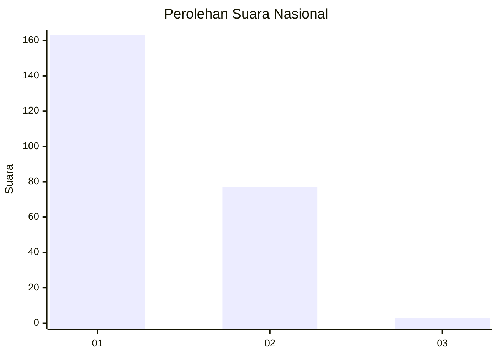
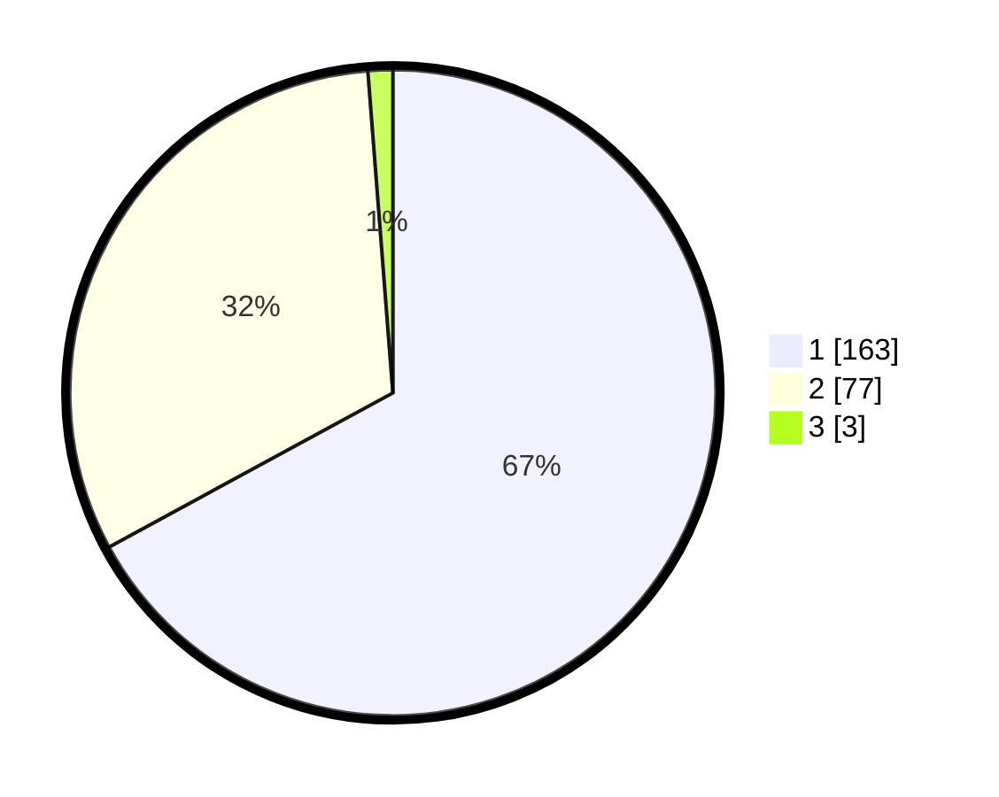

# Hasil

## Grafik

## Tabel

| No. | Nama Paslon    | Suara | Suara (raw) | Persentase |
|:--- |:-------------- | -----:| -----------:| ----------:|
| 1   | ANIES MUHAIMIN | 163   | [163][p-1]  | 67,08      |
| 2   | PRABOWO GIBRAN | 77    | [77][p-2]   | 31,69      |
| 3   | GANJAR MAHFUD  | 3     | [3][p-3]    | 1,23       |

[p-1]: https://github.com/gigit-pemilu/pemilu-2024/blob/main/pilpres/hitung-suara/sub/13-sumatera-barat/sub/71-kota-padang/sub/08-pauh/sub/1001-limau-manis/sub/005-tps/sub/paslon-1.txt
[p-2]: https://github.com/gigit-pemilu/pemilu-2024/blob/main/pilpres/hitung-suara/sub/13-sumatera-barat/sub/71-kota-padang/sub/08-pauh/sub/1001-limau-manis/sub/005-tps/sub/paslon-2.txt
[p-3]: https://github.com/gigit-pemilu/pemilu-2024/blob/main/pilpres/hitung-suara/sub/13-sumatera-barat/sub/71-kota-padang/sub/08-pauh/sub/1001-limau-manis/sub/005-tps/sub/paslon-3.txt

## Foto C Plano

https://sirekap-obj-formc.kpu.go.id/a724/pemilu/ppwp/13/71/08/10/01/1371081001005-20240214-225001--c002a62f-e210-49c6-856c-272cd9cf242a.jpg

https://sirekap-obj-formc.kpu.go.id/a724/pemilu/ppwp/13/71/08/10/01/1371081001005-20240214-225005--020f4b4d-80d6-4364-ae0b-09386bebc66f.jpg

https://sirekap-obj-formc.kpu.go.id/a724/pemilu/ppwp/13/71/08/10/01/1371081001005-20240214-225010--b5af1e49-dfb7-4d69-a18b-3e10036dc48c.jpg

## Metadata

| Key        | Value               |
| ---------- | ------------------- |
| Time Stamp | 2024-02-15 21:30:27 |

