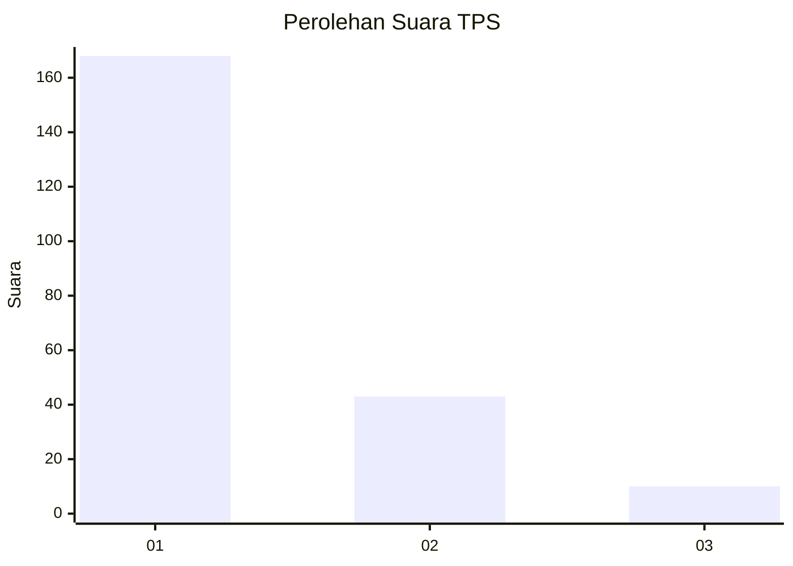
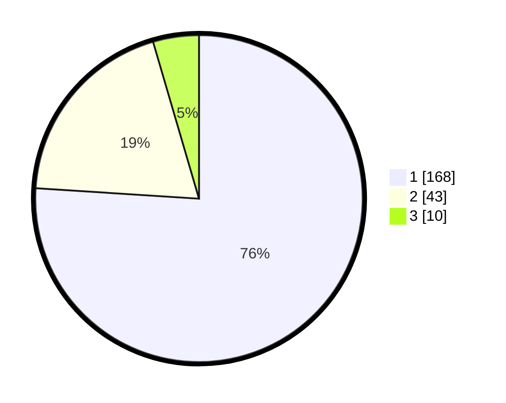

# Hasil

## Grafik

## Tabel

| No. | Nama Paslon    | Suara | Suara (raw) | Persentase |
|:--- |:-------------- | -----:| -----------:| ----------:|
| 1   | ANIES MUHAIMIN | 168   | [168][p-1]  | 76,02      |
| 2   | PRABOWO GIBRAN | 43    | [43][p-2]   | 19,46      |
| 3   | GANJAR MAHFUD  | 10    | [10][p-3]   | 4,52       |

[p-1]: https://github.com/gigit-pemilu/pemilu-2024-13-sumatera-barat/blob/main/pilpres/hitung-suara/sub/13-sumatera-barat/sub/71-kota-padang/sub/08-pauh/sub/1007-binuang-kampung-dalam/sub/004-tps/sub/paslon-1.txt
[p-2]: https://github.com/gigit-pemilu/pemilu-2024-13-sumatera-barat/blob/main/pilpres/hitung-suara/sub/13-sumatera-barat/sub/71-kota-padang/sub/08-pauh/sub/1007-binuang-kampung-dalam/sub/004-tps/sub/paslon-2.txt
[p-3]: https://github.com/gigit-pemilu/pemilu-2024-13-sumatera-barat/blob/main/pilpres/hitung-suara/sub/13-sumatera-barat/sub/71-kota-padang/sub/08-pauh/sub/1007-binuang-kampung-dalam/sub/004-tps/sub/paslon-3.txt

## Foto C Plano

https://sirekap-obj-formc.kpu.go.id/fdb0/pemilu/ppwp/13/71/08/10/07/1371081007004-20240215-023518--b2014d1e-2e49-4a9f-a8a8-a1fa9a96f3ce.jpg

https://sirekap-obj-formc.kpu.go.id/fdb0/pemilu/ppwp/13/71/08/10/07/1371081007004-20240215-023808--fe8802d8-b8ba-4e0f-b71e-70bffbe33f35.jpg

https://sirekap-obj-formc.kpu.go.id/fdb0/pemilu/ppwp/13/71/08/10/07/1371081007004-20240215-024028--6ae3f177-ce41-42bb-84aa-879902a0b7bb.jpg

## Metadata

| Key        | Value               |
| ---------- | ------------------- |
| Time Stamp | 2024-02-15 22:00:27 |

