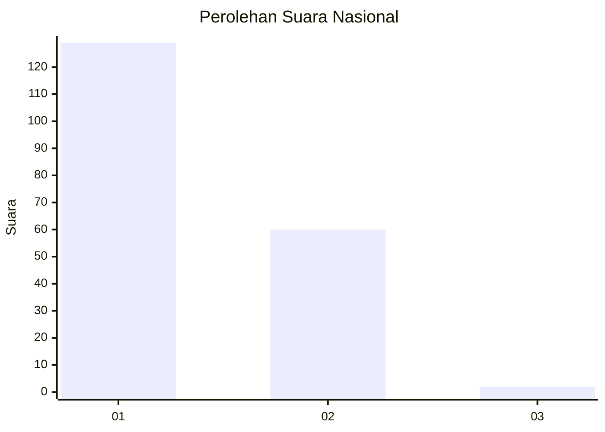
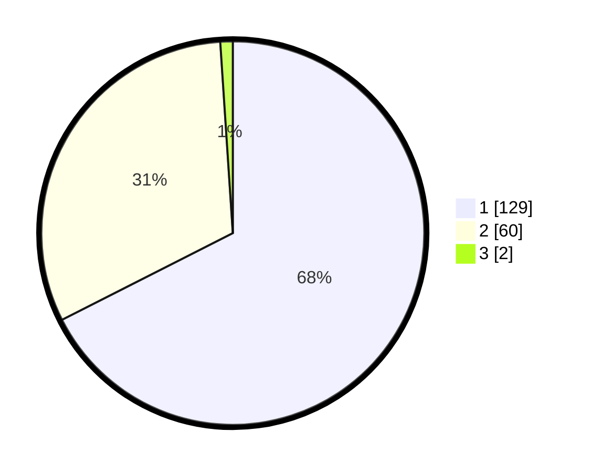

# Hasil

## Grafik

## Tabel

| No. | Nama Paslon    | Suara | Suara (raw) | Persentase |
|:--- |:-------------- | -----:| -----------:| ----------:|
| 1   | ANIES MUHAIMIN | 129   | [129][p-1]  | 67,54      |
| 2   | PRABOWO GIBRAN | 60    | [60][p-2]   | 31,41      |
| 3   | GANJAR MAHFUD  | 2     | [2][p-3]    | 1,05       |

[p-1]: https://github.com/gigit-pemilu/pemilu-2024/blob/main/pilpres/hitung-suara/sub/13-sumatera-barat/sub/71-kota-padang/sub/08-pauh/sub/1007-binuang-kampung-dalam/sub/005-tps/sub/paslon-1.txt
[p-2]: https://github.com/gigit-pemilu/pemilu-2024/blob/main/pilpres/hitung-suara/sub/13-sumatera-barat/sub/71-kota-padang/sub/08-pauh/sub/1007-binuang-kampung-dalam/sub/005-tps/sub/paslon-2.txt
[p-3]: https://github.com/gigit-pemilu/pemilu-2024/blob/main/pilpres/hitung-suara/sub/13-sumatera-barat/sub/71-kota-padang/sub/08-pauh/sub/1007-binuang-kampung-dalam/sub/005-tps/sub/paslon-3.txt

## Foto C Plano

https://sirekap-obj-formc.kpu.go.id/4b89/pemilu/ppwp/13/71/08/10/07/1371081007005-20240214-201903--4fa6c6d5-2dd6-4fce-94ef-f5dd36d3dc2f.jpg

https://sirekap-obj-formc.kpu.go.id/4b89/pemilu/ppwp/13/71/08/10/07/1371081007005-20240214-202114--550a9526-a95b-4939-bc61-60a5b8dfb1ce.jpg

https://sirekap-obj-formc.kpu.go.id/4b89/pemilu/ppwp/13/71/08/10/07/1371081007005-20240214-210424--53f6419f-7cbd-45f5-b65c-73e8eab82afe.jpg

## Metadata

| Key        | Value               |
| ---------- | ------------------- |
| Time Stamp | 2024-02-15 22:00:27 |

