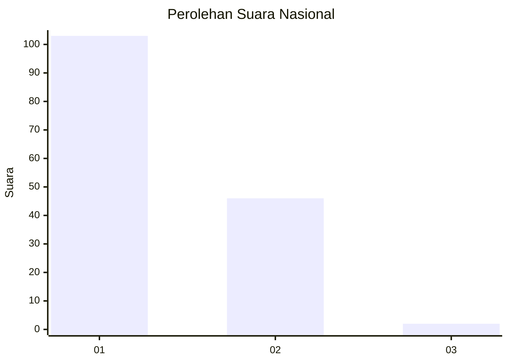
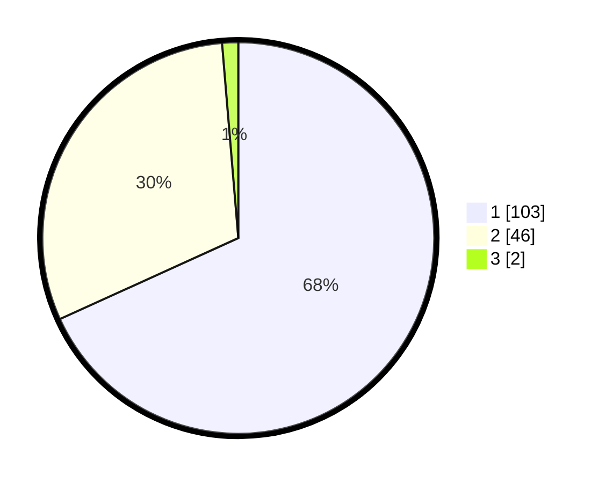

# Hasil

## Grafik

## Tabel

| No. | Nama Paslon    | Suara | Suara (raw) | Persentase |
|:--- |:-------------- | -----:| -----------:| ----------:|
| 1   | ANIES MUHAIMIN | 103   | [103][p-1]  | 68,21      |
| 2   | PRABOWO GIBRAN | 46    | [46][p-2]   | 30,46      |
| 3   | GANJAR MAHFUD  | 2     | [2][p-3]    | 1,32       |

[p-1]: https://github.com/gigit-pemilu/pemilu-2024/blob/main/pilpres/hitung-suara/sub/13-sumatera-barat/sub/71-kota-padang/sub/09-kuranji/sub/1001-pasar-ambacang/sub/003-tps/sub/paslon-1.txt
[p-2]: https://github.com/gigit-pemilu/pemilu-2024/blob/main/pilpres/hitung-suara/sub/13-sumatera-barat/sub/71-kota-padang/sub/09-kuranji/sub/1001-pasar-ambacang/sub/003-tps/sub/paslon-2.txt
[p-3]: https://github.com/gigit-pemilu/pemilu-2024/blob/main/pilpres/hitung-suara/sub/13-sumatera-barat/sub/71-kota-padang/sub/09-kuranji/sub/1001-pasar-ambacang/sub/003-tps/sub/paslon-3.txt

## Foto C Plano

https://sirekap-obj-formc.kpu.go.id/2400/pemilu/ppwp/13/71/09/10/01/1371091001003-20240215-014845--69ad6817-ddbc-4ca7-8225-b618dc182675.jpg

https://sirekap-obj-formc.kpu.go.id/2400/pemilu/ppwp/13/71/09/10/01/1371091001003-20240215-014915--3a1d2be7-4d2f-4ff5-82b0-7ee11b773a68.jpg

https://sirekap-obj-formc.kpu.go.id/2400/pemilu/ppwp/13/71/09/10/01/1371091001003-20240215-015026--c50a22e5-d7b0-4e58-8aa9-1c9ec4ba3000.jpg

## Metadata

| Key        | Value               |
| ---------- | ------------------- |
| Time Stamp | 2024-02-15 23:29:50 |

