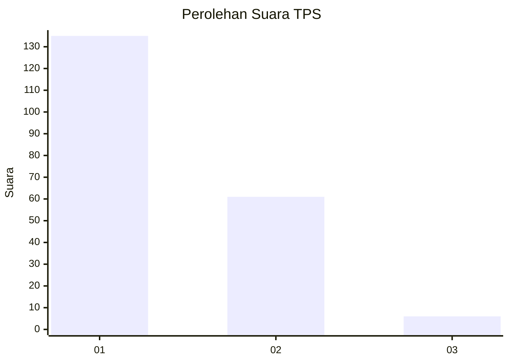
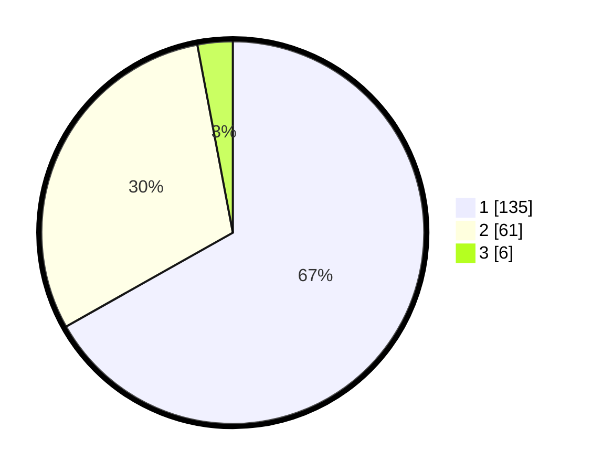

# Hasil

## Grafik

## Tabel

| No. | Nama Paslon    | Suara | Suara (raw) | Persentase |
|:--- |:-------------- | -----:| -----------:| ----------:|
| 1   | ANIES MUHAIMIN | 135   | [135][p-1]  | 66,83      |
| 2   | PRABOWO GIBRAN | 61    | [61][p-2]   | 30,20      |
| 3   | GANJAR MAHFUD  | 6     | [6][p-3]    | 2,97       |

[p-1]: https://github.com/gigit-pemilu/pemilu-2024-13-sumatera-barat/blob/main/pilpres/hitung-suara/sub/13-sumatera-barat/sub/71-kota-padang/sub/09-kuranji/sub/1001-pasar-ambacang/sub/007-tps/sub/paslon-1.txt
[p-2]: https://github.com/gigit-pemilu/pemilu-2024-13-sumatera-barat/blob/main/pilpres/hitung-suara/sub/13-sumatera-barat/sub/71-kota-padang/sub/09-kuranji/sub/1001-pasar-ambacang/sub/007-tps/sub/paslon-2.txt
[p-3]: https://github.com/gigit-pemilu/pemilu-2024-13-sumatera-barat/blob/main/pilpres/hitung-suara/sub/13-sumatera-barat/sub/71-kota-padang/sub/09-kuranji/sub/1001-pasar-ambacang/sub/007-tps/sub/paslon-3.txt

## Foto C Plano

https://sirekap-obj-formc.kpu.go.id/faed/pemilu/ppwp/13/71/09/10/01/1371091001007-20240215-115718--a53af38b-8013-4b08-a76f-9d9d32827714.jpg

https://sirekap-obj-formc.kpu.go.id/faed/pemilu/ppwp/13/71/09/10/01/1371091001007-20240215-115752--ad74d51a-774e-49d4-85eb-c22bc744821a.jpg

https://sirekap-obj-formc.kpu.go.id/faed/pemilu/ppwp/13/71/09/10/01/1371091001007-20240215-115832--b8ad6c33-109d-43eb-ae70-592f6745ed6a.jpg

## Metadata

| Key        | Value               |
| ---------- | ------------------- |
| Time Stamp | 2024-02-15 23:29:50 |

