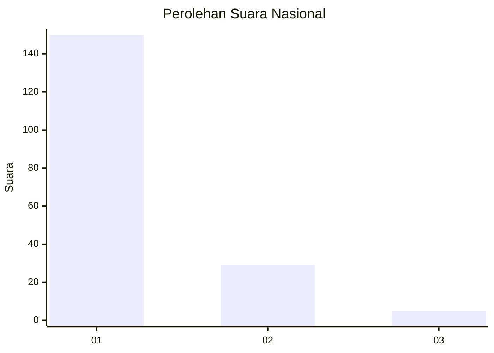
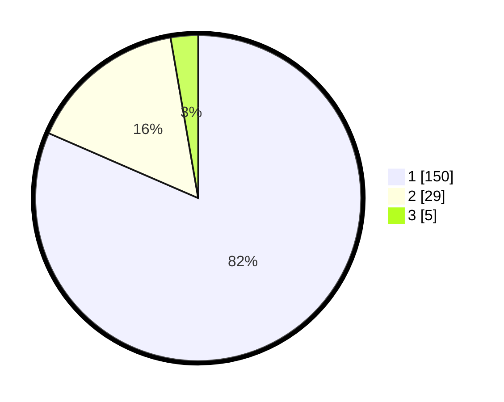

# Hasil

## Grafik

## Tabel

| No. | Nama Paslon    | Suara | Suara (raw) | Persentase |
|:--- |:-------------- | -----:| -----------:| ----------:|
| 1   | ANIES MUHAIMIN | 150   | [150][p-1]  | 81,52      |
| 2   | PRABOWO GIBRAN | 29    | [29][p-2]   | 15,76      |
| 3   | GANJAR MAHFUD  | 5     | [5][p-3]    | 2,72       |

[p-1]: https://github.com/gigit-pemilu/pemilu-2024/blob/main/pilpres/hitung-suara/sub/13-sumatera-barat/sub/71-kota-padang/sub/09-kuranji/sub/1001-pasar-ambacang/sub/037-tps/sub/paslon-1.txt
[p-2]: https://github.com/gigit-pemilu/pemilu-2024/blob/main/pilpres/hitung-suara/sub/13-sumatera-barat/sub/71-kota-padang/sub/09-kuranji/sub/1001-pasar-ambacang/sub/037-tps/sub/paslon-2.txt
[p-3]: https://github.com/gigit-pemilu/pemilu-2024/blob/main/pilpres/hitung-suara/sub/13-sumatera-barat/sub/71-kota-padang/sub/09-kuranji/sub/1001-pasar-ambacang/sub/037-tps/sub/paslon-3.txt

## Foto C Plano

https://sirekap-obj-formc.kpu.go.id/a5d7/pemilu/ppwp/13/71/09/10/01/1371091001037-20240214-215031--89fa35da-cb2f-4cf0-b04d-91c4461dd862.jpg

https://sirekap-obj-formc.kpu.go.id/a5d7/pemilu/ppwp/13/71/09/10/01/1371091001037-20240214-215316--b3332d0f-a40a-47cf-a8aa-b07b4f687f6b.jpg

https://sirekap-obj-formc.kpu.go.id/a5d7/pemilu/ppwp/13/71/09/10/01/1371091001037-20240214-215456--c30bb4c5-4d64-41cb-9ad0-e1ccaaf065c0.jpg

## Metadata

| Key        | Value               |
| ---------- | ------------------- |
| Time Stamp | 2024-02-15 12:00:28 |

