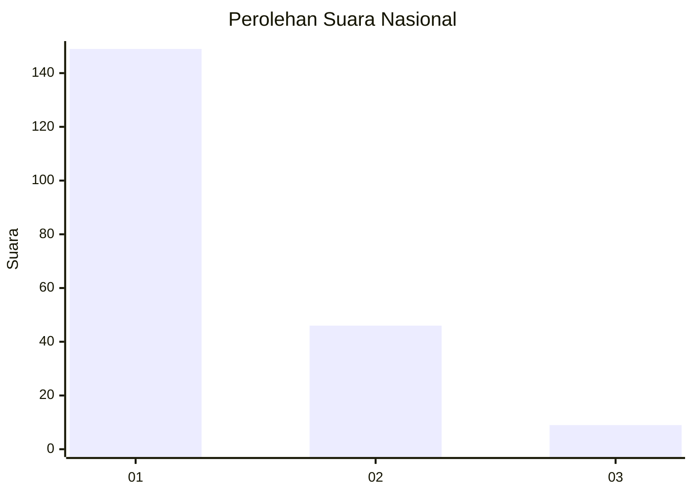
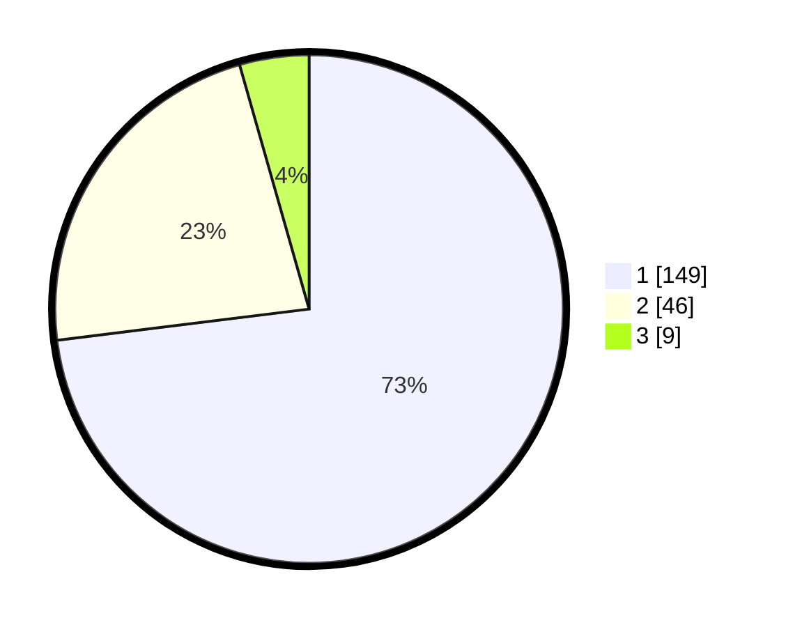

# Hasil

## Grafik

## Tabel

| No. | Nama Paslon    | Suara | Suara (raw) | Persentase |
|:--- |:-------------- | -----:| -----------:| ----------:|
| 1   | ANIES MUHAIMIN | 149   | [149][p-1]  | 73,04      |
| 2   | PRABOWO GIBRAN | 46    | [46][p-2]   | 22,55      |
| 3   | GANJAR MAHFUD  | 9     | [9][p-3]    | 4,41       |

[p-1]: https://github.com/gigit-pemilu/pemilu-2024/blob/main/pilpres/hitung-suara/sub/13-sumatera-barat/sub/71-kota-padang/sub/09-kuranji/sub/1001-pasar-ambacang/sub/039-tps/sub/paslon-1.txt
[p-2]: https://github.com/gigit-pemilu/pemilu-2024/blob/main/pilpres/hitung-suara/sub/13-sumatera-barat/sub/71-kota-padang/sub/09-kuranji/sub/1001-pasar-ambacang/sub/039-tps/sub/paslon-2.txt
[p-3]: https://github.com/gigit-pemilu/pemilu-2024/blob/main/pilpres/hitung-suara/sub/13-sumatera-barat/sub/71-kota-padang/sub/09-kuranji/sub/1001-pasar-ambacang/sub/039-tps/sub/paslon-3.txt

## Foto C Plano

https://sirekap-obj-formc.kpu.go.id/189b/pemilu/ppwp/13/71/09/10/01/1371091001039-20240215-144559--a91b13e5-6ab2-4a11-94eb-a15d62389f7b.jpg

https://sirekap-obj-formc.kpu.go.id/189b/pemilu/ppwp/13/71/09/10/01/1371091001039-20240215-144733--0bd5e2b0-decb-41a3-923f-b6a189f4cc3b.jpg

https://sirekap-obj-formc.kpu.go.id/189b/pemilu/ppwp/13/71/09/10/01/1371091001039-20240215-144917--42ecb7d2-341f-4ace-93ea-04192d72a92a.jpg

## Metadata

| Key        | Value               |
| ---------- | ------------------- |
| Time Stamp | 2024-02-15 23:29:50 |

