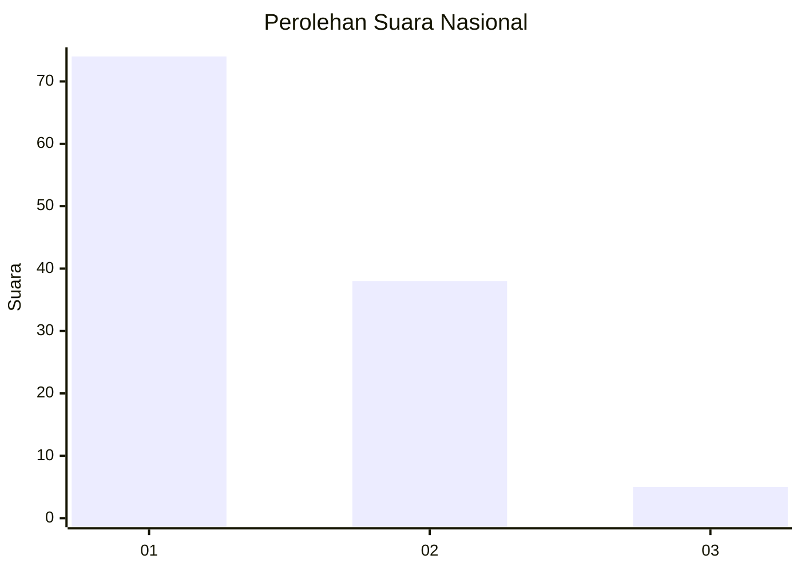
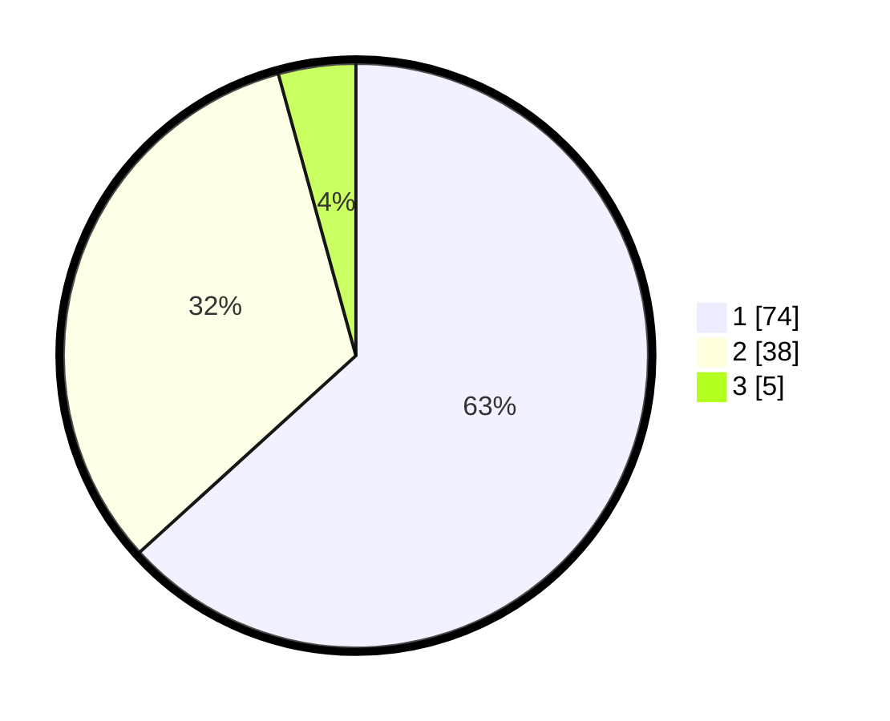

# Hasil

## Grafik

## Tabel

| No. | Nama Paslon    | Suara | Suara (raw) | Persentase |
|:--- |:-------------- | -----:| -----------:| ----------:|
| 1   | ANIES MUHAIMIN | 74    | [74][p-1]   | 63,25      |
| 2   | PRABOWO GIBRAN | 38    | [38][p-2]   | 32,48      |
| 3   | GANJAR MAHFUD  | 5     | [5][p-3]    | 4,27       |

[p-1]: https://github.com/gigit-pemilu/pemilu-2024/blob/main/pilpres/hitung-suara/sub/13-sumatera-barat/sub/71-kota-padang/sub/09-kuranji/sub/1002-anduring/sub/024-tps/sub/paslon-1.txt
[p-2]: https://github.com/gigit-pemilu/pemilu-2024/blob/main/pilpres/hitung-suara/sub/13-sumatera-barat/sub/71-kota-padang/sub/09-kuranji/sub/1002-anduring/sub/024-tps/sub/paslon-2.txt
[p-3]: https://github.com/gigit-pemilu/pemilu-2024/blob/main/pilpres/hitung-suara/sub/13-sumatera-barat/sub/71-kota-padang/sub/09-kuranji/sub/1002-anduring/sub/024-tps/sub/paslon-3.txt

## Foto C Plano

https://sirekap-obj-formc.kpu.go.id/6bdb/pemilu/ppwp/13/71/09/10/02/1371091002024-20240215-113607--f5c9227c-85f5-4293-99af-b143afd5ce07.jpg

https://sirekap-obj-formc.kpu.go.id/6bdb/pemilu/ppwp/13/71/09/10/02/1371091002024-20240215-114805--78d24f73-8f78-449c-88db-16ea5fd16875.jpg

https://sirekap-obj-formc.kpu.go.id/6bdb/pemilu/ppwp/13/71/09/10/02/1371091002024-20240215-115747--dcdc5f72-da8a-42de-ab44-a1c6bf27342c.jpg

## Metadata

| Key        | Value               |
| ---------- | ------------------- |
| Time Stamp | 2024-02-16 01:00:27 |

