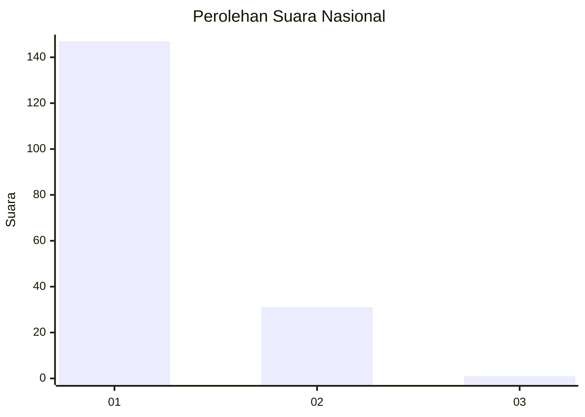
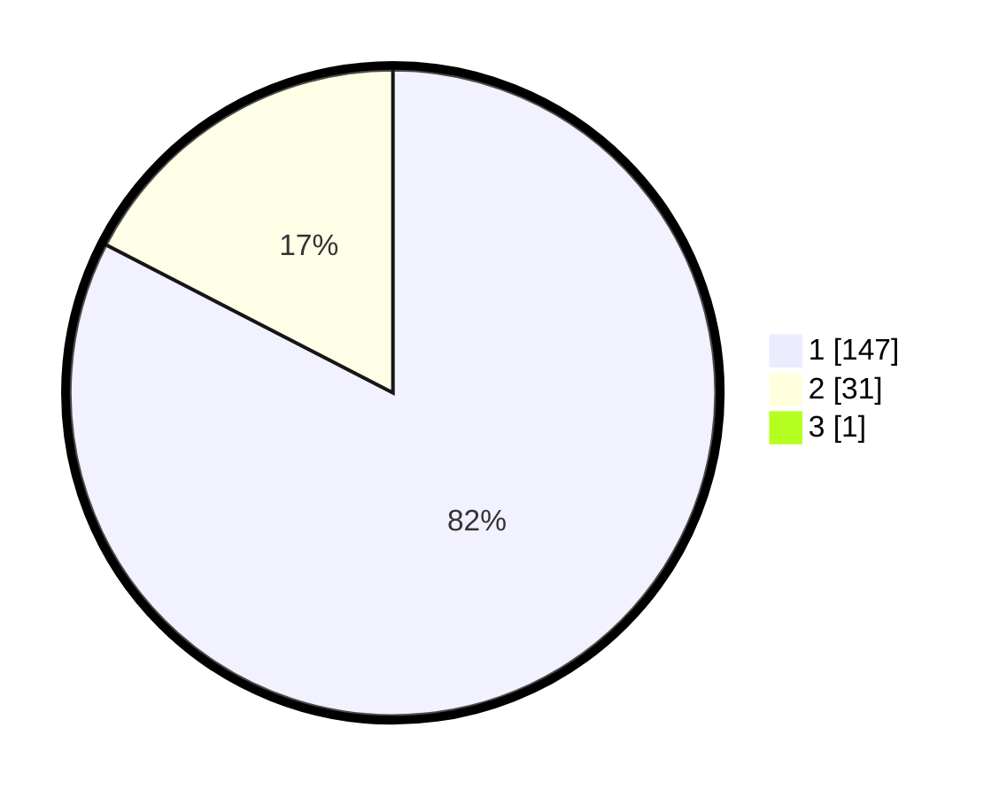

# Hasil

## Grafik

## Tabel

| No. | Nama Paslon    | Suara | Suara (raw) | Persentase |
|:--- |:-------------- | -----:| -----------:| ----------:|
| 1   | ANIES MUHAIMIN | 147   | [147][p-1]  | 82,12      |
| 2   | PRABOWO GIBRAN | 31    | [31][p-2]   | 17,32      |
| 3   | GANJAR MAHFUD  | 1     | [1][p-3]    | 0,56       |

[p-1]: https://github.com/gigit-pemilu/pemilu-2024/blob/main/pilpres/hitung-suara/sub/13-sumatera-barat/sub/71-kota-padang/sub/09-kuranji/sub/1003-lubuk-lintah/sub/003-tps/sub/paslon-1.txt
[p-2]: https://github.com/gigit-pemilu/pemilu-2024/blob/main/pilpres/hitung-suara/sub/13-sumatera-barat/sub/71-kota-padang/sub/09-kuranji/sub/1003-lubuk-lintah/sub/003-tps/sub/paslon-2.txt
[p-3]: https://github.com/gigit-pemilu/pemilu-2024/blob/main/pilpres/hitung-suara/sub/13-sumatera-barat/sub/71-kota-padang/sub/09-kuranji/sub/1003-lubuk-lintah/sub/003-tps/sub/paslon-3.txt

## Foto C Plano

https://sirekap-obj-formc.kpu.go.id/affc/pemilu/ppwp/13/71/09/10/03/1371091003003-20240215-035509--2967cece-8f6e-46bf-8371-b8a516b27797.jpg

https://sirekap-obj-formc.kpu.go.id/affc/pemilu/ppwp/13/71/09/10/03/1371091003003-20240216-133437--3414d4c0-294d-4370-b23d-5db9a52bb255.jpg

https://sirekap-obj-formc.kpu.go.id/affc/pemilu/ppwp/13/71/09/10/03/1371091003003-20240216-133437--7da3d984-6b33-4c3f-b8cd-47b58b4798db.jpg

## Metadata

| Key        | Value               |
| ---------- | ------------------- |
| Time Stamp | 2024-02-16 14:30:33 |

