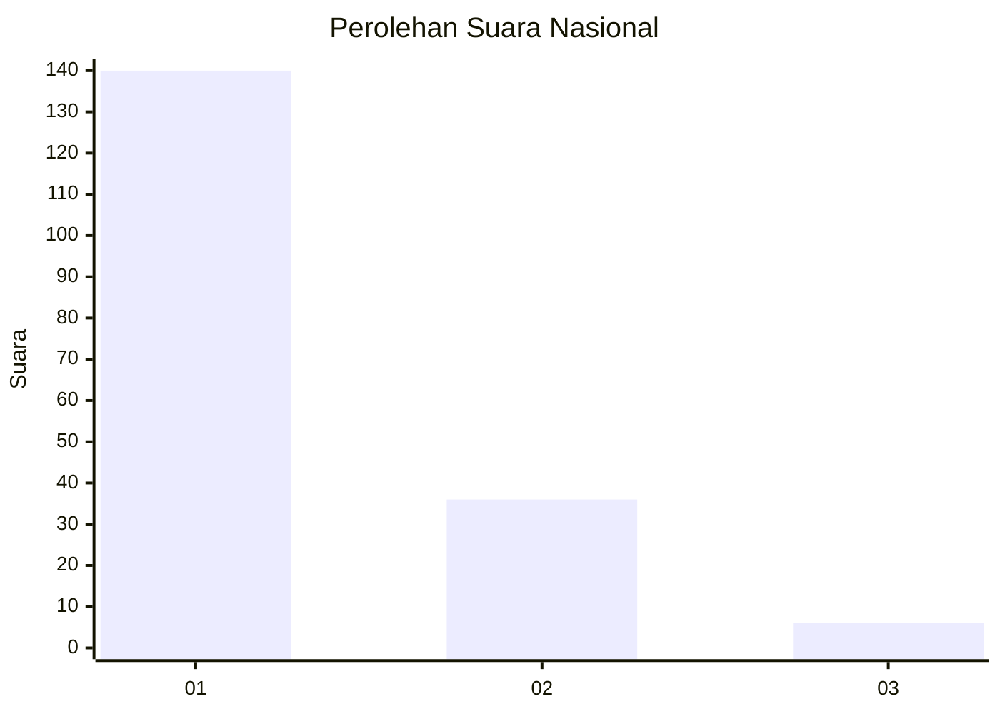
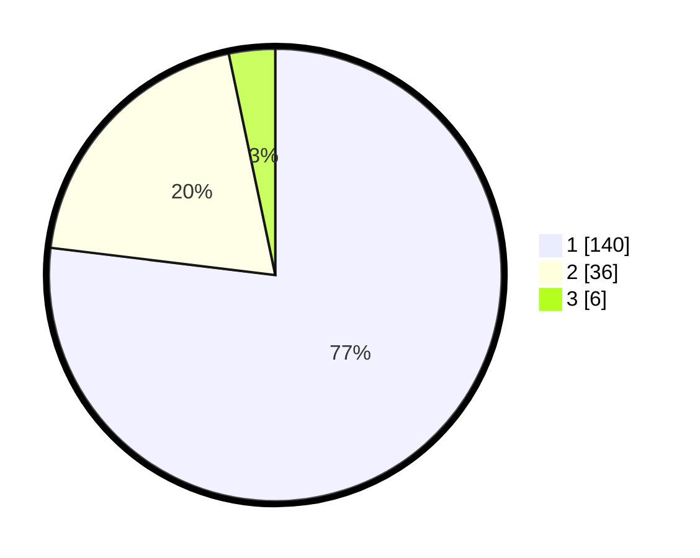

# Hasil

## Grafik

## Tabel

| No. | Nama Paslon    | Suara | Suara (raw) | Persentase |
|:--- |:-------------- | -----:| -----------:| ----------:|
| 1   | ANIES MUHAIMIN | 140   | [140][p-1]  | 76,92      |
| 2   | PRABOWO GIBRAN | 36    | [36][p-2]   | 19,78      |
| 3   | GANJAR MAHFUD  | 6     | [6][p-3]    | 3,30       |

[p-1]: https://github.com/gigit-pemilu/pemilu-2024/blob/main/pilpres/hitung-suara/sub/13-sumatera-barat/sub/71-kota-padang/sub/09-kuranji/sub/1003-lubuk-lintah/sub/013-tps/sub/paslon-1.txt
[p-2]: https://github.com/gigit-pemilu/pemilu-2024/blob/main/pilpres/hitung-suara/sub/13-sumatera-barat/sub/71-kota-padang/sub/09-kuranji/sub/1003-lubuk-lintah/sub/013-tps/sub/paslon-2.txt
[p-3]: https://github.com/gigit-pemilu/pemilu-2024/blob/main/pilpres/hitung-suara/sub/13-sumatera-barat/sub/71-kota-padang/sub/09-kuranji/sub/1003-lubuk-lintah/sub/013-tps/sub/paslon-3.txt

## Foto C Plano

https://sirekap-obj-formc.kpu.go.id/5db3/pemilu/ppwp/13/71/09/10/03/1371091003013-20240215-041326--2ac3a268-7b44-4ef6-a735-7711e3124eab.jpg

https://sirekap-obj-formc.kpu.go.id/5db3/pemilu/ppwp/13/71/09/10/03/1371091003013-20240215-041542--d48531e8-0183-414e-8443-9e41baa9fcf1.jpg

https://sirekap-obj-formc.kpu.go.id/5db3/pemilu/ppwp/13/71/09/10/03/1371091003013-20240215-041641--9bdadbe8-93c0-4c41-b408-6ee0fa22ef85.jpg

## Metadata

| Key        | Value               |
| ---------- | ------------------- |
| Time Stamp | 2024-02-16 00:00:26 |

