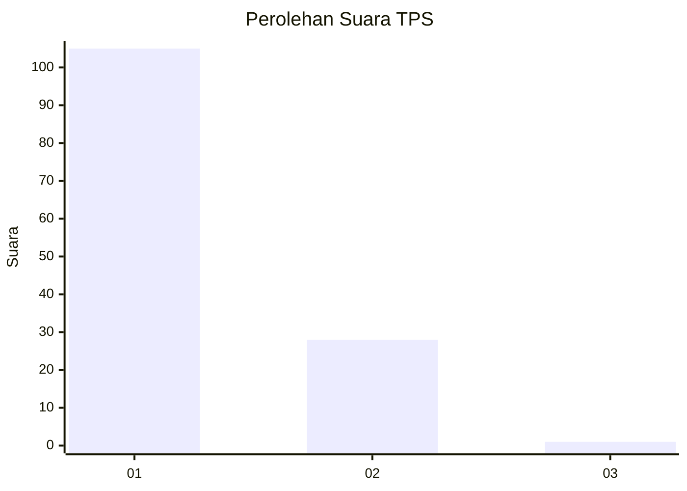
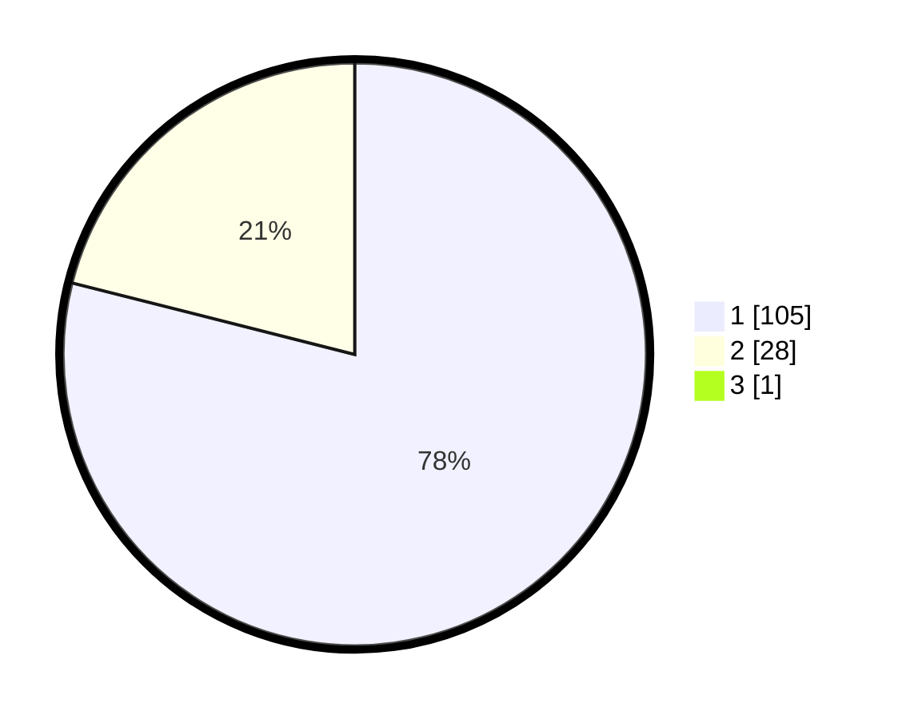

# Hasil

## Grafik

## Tabel

| No. | Nama Paslon    | Suara | Suara (raw) | Persentase |
|:--- |:-------------- | -----:| -----------:| ----------:|
| 1   | ANIES MUHAIMIN | 105   | [105][p-1]  | 78,36      |
| 2   | PRABOWO GIBRAN | 28    | [28][p-2]   | 20,90      |
| 3   | GANJAR MAHFUD  | 1     | [1][p-3]    | 0,75       |

[p-1]: https://github.com/gigit-pemilu/pemilu-2024-13-sumatera-barat/blob/main/pilpres/hitung-suara/sub/13-sumatera-barat/sub/71-kota-padang/sub/09-kuranji/sub/1006-korong-gadang/sub/035-tps/sub/paslon-1.txt
[p-2]: https://github.com/gigit-pemilu/pemilu-2024-13-sumatera-barat/blob/main/pilpres/hitung-suara/sub/13-sumatera-barat/sub/71-kota-padang/sub/09-kuranji/sub/1006-korong-gadang/sub/035-tps/sub/paslon-2.txt
[p-3]: https://github.com/gigit-pemilu/pemilu-2024-13-sumatera-barat/blob/main/pilpres/hitung-suara/sub/13-sumatera-barat/sub/71-kota-padang/sub/09-kuranji/sub/1006-korong-gadang/sub/035-tps/sub/paslon-3.txt

## Foto C Plano

https://sirekap-obj-formc.kpu.go.id/3b1e/pemilu/ppwp/13/71/09/10/06/1371091006035-20240215-000049--9596017e-38c0-40f7-ab87-baaa0882f6a6.jpg

https://sirekap-obj-formc.kpu.go.id/3b1e/pemilu/ppwp/13/71/09/10/06/1371091006035-20240215-000428--aded9b34-016f-44dd-889b-b3199497bab4.jpg

https://sirekap-obj-formc.kpu.go.id/3b1e/pemilu/ppwp/13/71/09/10/06/1371091006035-20240215-000539--8fe1e57e-6d49-44f2-8ac5-a7ffe446d2ca.jpg

## Metadata

| Key        | Value               |
| ---------- | ------------------- |
| Time Stamp | 2024-02-16 01:00:27 |

