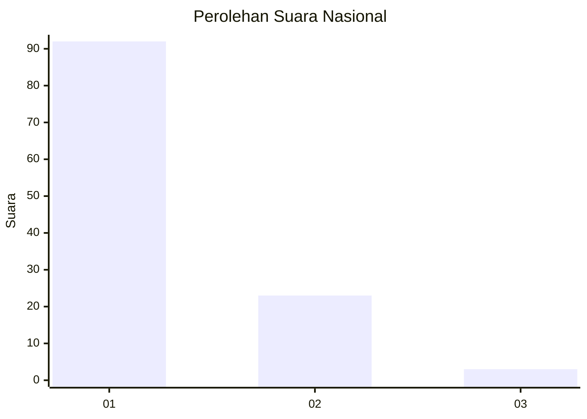
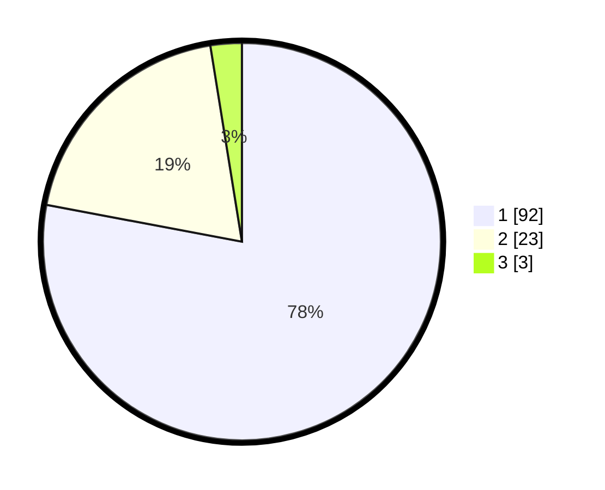

# Hasil

## Grafik

## Tabel

| No. | Nama Paslon    | Suara | Suara (raw) | Persentase |
|:--- |:-------------- | -----:| -----------:| ----------:|
| 1   | ANIES MUHAIMIN | 92    | [92][p-1]   | 77,97      |
| 2   | PRABOWO GIBRAN | 23    | [23][p-2]   | 19,49      |
| 3   | GANJAR MAHFUD  | 3     | [3][p-3]    | 2,54       |

[p-1]: https://github.com/gigit-pemilu/pemilu-2024/blob/main/pilpres/hitung-suara/sub/13-sumatera-barat/sub/71-kota-padang/sub/09-kuranji/sub/1006-korong-gadang/sub/049-tps/sub/paslon-1.txt
[p-2]: https://github.com/gigit-pemilu/pemilu-2024/blob/main/pilpres/hitung-suara/sub/13-sumatera-barat/sub/71-kota-padang/sub/09-kuranji/sub/1006-korong-gadang/sub/049-tps/sub/paslon-2.txt
[p-3]: https://github.com/gigit-pemilu/pemilu-2024/blob/main/pilpres/hitung-suara/sub/13-sumatera-barat/sub/71-kota-padang/sub/09-kuranji/sub/1006-korong-gadang/sub/049-tps/sub/paslon-3.txt

## Foto C Plano

https://sirekap-obj-formc.kpu.go.id/c509/pemilu/ppwp/13/71/09/10/06/1371091006049-20240215-030137--30a0d2d8-1131-4397-b2e3-a5e6eb234760.jpg

https://sirekap-obj-formc.kpu.go.id/c509/pemilu/ppwp/13/71/09/10/06/1371091006049-20240215-012722--e959d91d-665c-4a0e-b482-437d07f71151.jpg

https://sirekap-obj-formc.kpu.go.id/c509/pemilu/ppwp/13/71/09/10/06/1371091006049-20240215-012815--1797ffc8-1efd-4e4b-ab28-4cb2fcff1397.jpg

## Metadata

| Key        | Value               |
| ---------- | ------------------- |
| Time Stamp | 2024-02-16 00:30:27 |

