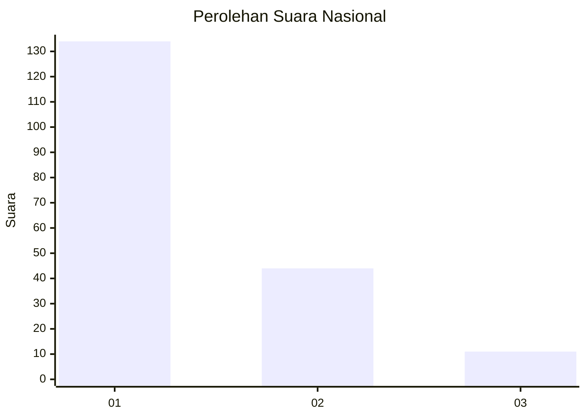
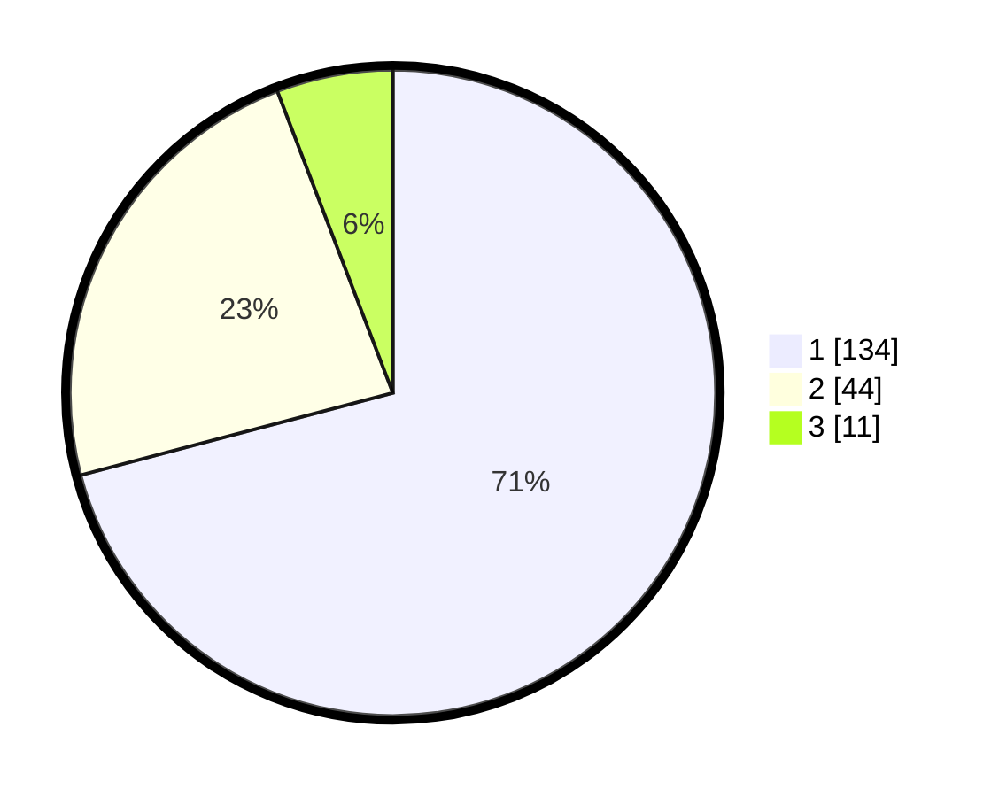

# Hasil

## Grafik

## Tabel

| No. | Nama Paslon    | Suara | Suara (raw) | Persentase |
|:--- |:-------------- | -----:| -----------:| ----------:|
| 1   | ANIES MUHAIMIN | 134   | [134][p-1]  | 70,90      |
| 2   | PRABOWO GIBRAN | 44    | [44][p-2]   | 23,28      |
| 3   | GANJAR MAHFUD  | 11    | [11][p-3]   | 5,82       |

[p-1]: https://github.com/gigit-pemilu/pemilu-2024/blob/main/pilpres/hitung-suara/sub/13-sumatera-barat/sub/71-kota-padang/sub/09-kuranji/sub/1007-kuranji/sub/048-tps/sub/paslon-1.txt
[p-2]: https://github.com/gigit-pemilu/pemilu-2024/blob/main/pilpres/hitung-suara/sub/13-sumatera-barat/sub/71-kota-padang/sub/09-kuranji/sub/1007-kuranji/sub/048-tps/sub/paslon-2.txt
[p-3]: https://github.com/gigit-pemilu/pemilu-2024/blob/main/pilpres/hitung-suara/sub/13-sumatera-barat/sub/71-kota-padang/sub/09-kuranji/sub/1007-kuranji/sub/048-tps/sub/paslon-3.txt

## Foto C Plano

https://sirekap-obj-formc.kpu.go.id/4074/pemilu/ppwp/13/71/09/10/07/1371091007048-20240215-062014--36e26c2e-f5ae-468e-8cac-b3eed4dd97a9.jpg

https://sirekap-obj-formc.kpu.go.id/4074/pemilu/ppwp/13/71/09/10/07/1371091007048-20240215-061625--87acf620-c2f3-44a8-b1c3-230a85ca0612.jpg

https://sirekap-obj-formc.kpu.go.id/4074/pemilu/ppwp/13/71/09/10/07/1371091007048-20240215-061829--022578aa-d0b9-4243-accf-6de330e1c59e.jpg

## Metadata

| Key        | Value               |
| ---------- | ------------------- |
| Time Stamp | 2024-02-16 01:00:27 |

