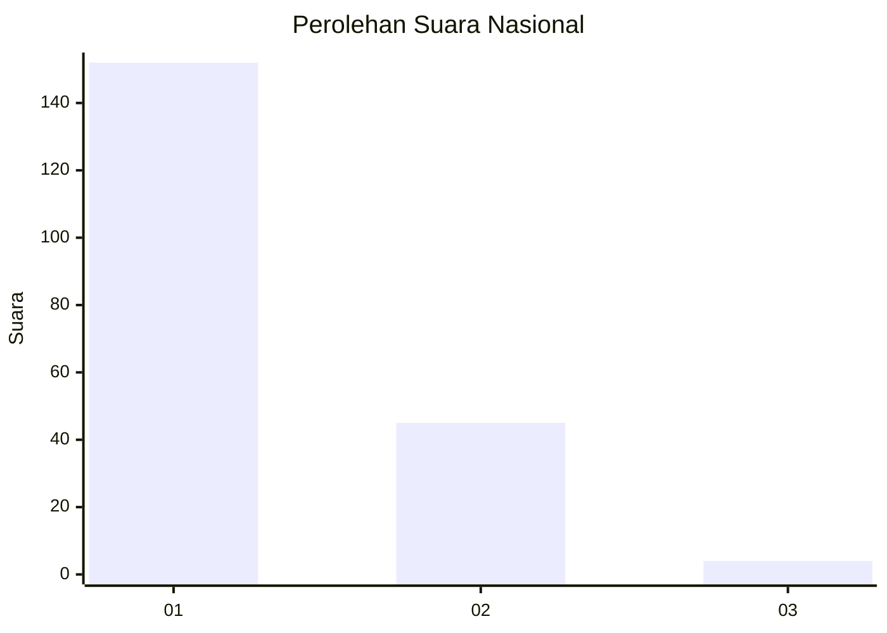
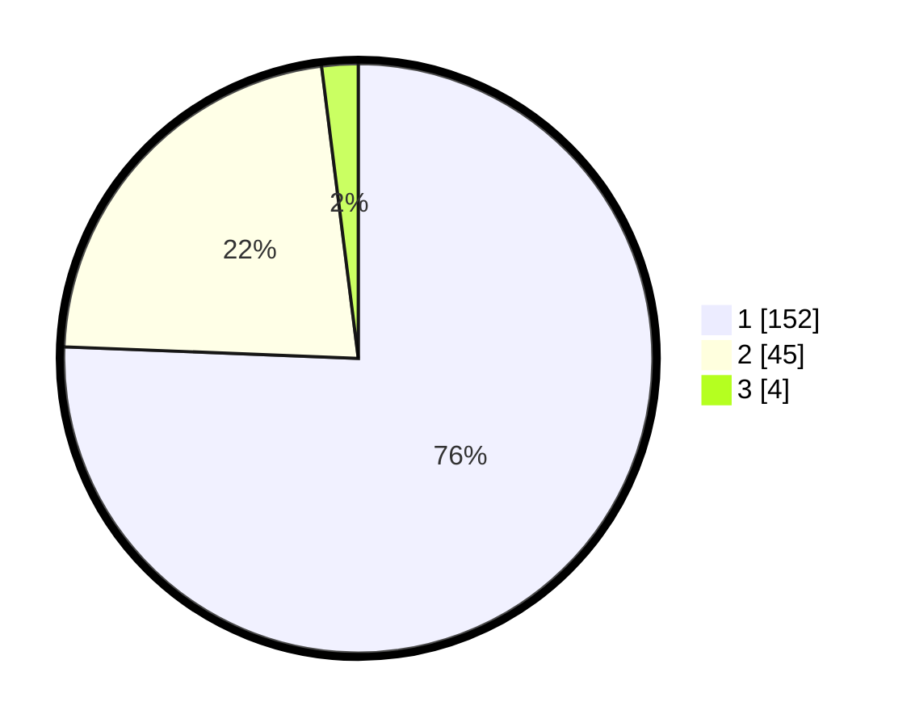

# Hasil

## Grafik

## Tabel

| No. | Nama Paslon    | Suara | Suara (raw) | Persentase |
|:--- |:-------------- | -----:| -----------:| ----------:|
| 1   | ANIES MUHAIMIN | 152   | [152][p-1]  | 75,62      |
| 2   | PRABOWO GIBRAN | 45    | [45][p-2]   | 22,39      |
| 3   | GANJAR MAHFUD  | 4     | [4][p-3]    | 1,99       |

[p-1]: https://github.com/gigit-pemilu/pemilu-2024/blob/main/pilpres/hitung-suara/sub/13-sumatera-barat/sub/71-kota-padang/sub/09-kuranji/sub/1007-kuranji/sub/080-tps/sub/paslon-1.txt
[p-2]: https://github.com/gigit-pemilu/pemilu-2024/blob/main/pilpres/hitung-suara/sub/13-sumatera-barat/sub/71-kota-padang/sub/09-kuranji/sub/1007-kuranji/sub/080-tps/sub/paslon-2.txt
[p-3]: https://github.com/gigit-pemilu/pemilu-2024/blob/main/pilpres/hitung-suara/sub/13-sumatera-barat/sub/71-kota-padang/sub/09-kuranji/sub/1007-kuranji/sub/080-tps/sub/paslon-3.txt

## Foto C Plano

https://sirekap-obj-formc.kpu.go.id/d5f2/pemilu/ppwp/13/71/09/10/07/1371091007080-20240215-063649--7ca76172-2eaf-4228-9eee-479a0dcbee0f.jpg

https://sirekap-obj-formc.kpu.go.id/d5f2/pemilu/ppwp/13/71/09/10/07/1371091007080-20240215-063807--ad5bbb71-c42c-45ae-911e-81e2d0d54ca8.jpg

https://sirekap-obj-formc.kpu.go.id/d5f2/pemilu/ppwp/13/71/09/10/07/1371091007080-20240215-063930--5119c094-1ee3-4d8c-b839-b6346c6c2048.jpg

## Metadata

| Key        | Value               |
| ---------- | ------------------- |
| Time Stamp | 2024-02-16 01:00:27 |

