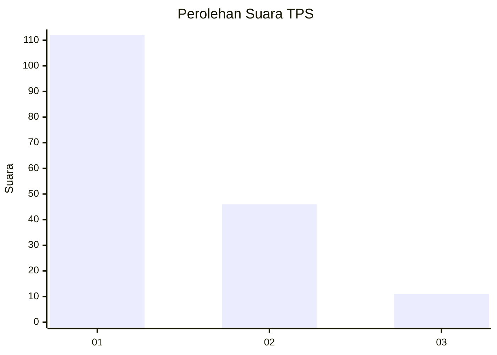
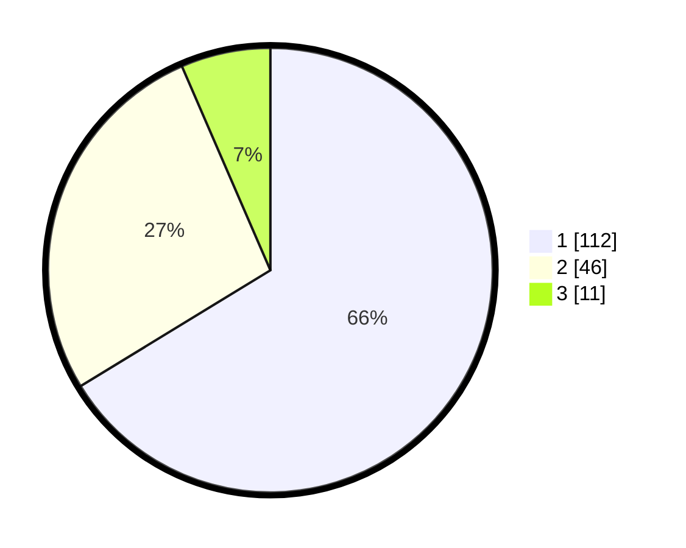

# Hasil

## Grafik

## Tabel

| No. | Nama Paslon    | Suara | Suara (raw) | Persentase |
|:--- |:-------------- | -----:| -----------:| ----------:|
| 1   | ANIES MUHAIMIN | 112   | [112][p-1]  | 66,27      |
| 2   | PRABOWO GIBRAN | 46    | [46][p-2]   | 27,22      |
| 3   | GANJAR MAHFUD  | 11    | [11][p-3]   | 6,51       |

[p-1]: https://github.com/gigit-pemilu/pemilu-2024-13-sumatera-barat/blob/main/pilpres/hitung-suara/sub/13-sumatera-barat/sub/71-kota-padang/sub/09-kuranji/sub/1007-kuranji/sub/086-tps/sub/paslon-1.txt
[p-2]: https://github.com/gigit-pemilu/pemilu-2024-13-sumatera-barat/blob/main/pilpres/hitung-suara/sub/13-sumatera-barat/sub/71-kota-padang/sub/09-kuranji/sub/1007-kuranji/sub/086-tps/sub/paslon-2.txt
[p-3]: https://github.com/gigit-pemilu/pemilu-2024-13-sumatera-barat/blob/main/pilpres/hitung-suara/sub/13-sumatera-barat/sub/71-kota-padang/sub/09-kuranji/sub/1007-kuranji/sub/086-tps/sub/paslon-3.txt

## Foto C Plano

https://sirekap-obj-formc.kpu.go.id/b557/pemilu/ppwp/13/71/09/10/07/1371091007086-20240215-052045--66ec0ce3-6898-4663-a3d2-a69744524caf.jpg

https://sirekap-obj-formc.kpu.go.id/b557/pemilu/ppwp/13/71/09/10/07/1371091007086-20240215-052455--c8f20dae-2adf-42d5-9eb1-1b364bfce00e.jpg

https://sirekap-obj-formc.kpu.go.id/b557/pemilu/ppwp/13/71/09/10/07/1371091007086-20240215-052859--1f3d87e5-fc63-47ee-8576-2e63c1f8cae6.jpg

## Metadata

| Key        | Value               |
| ---------- | ------------------- |
| Time Stamp | 2024-02-16 01:00:27 |

