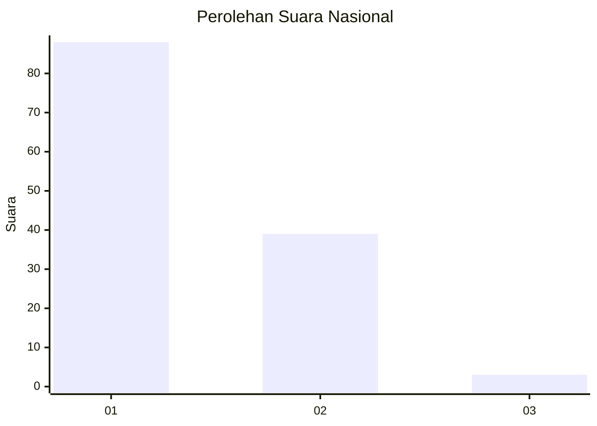
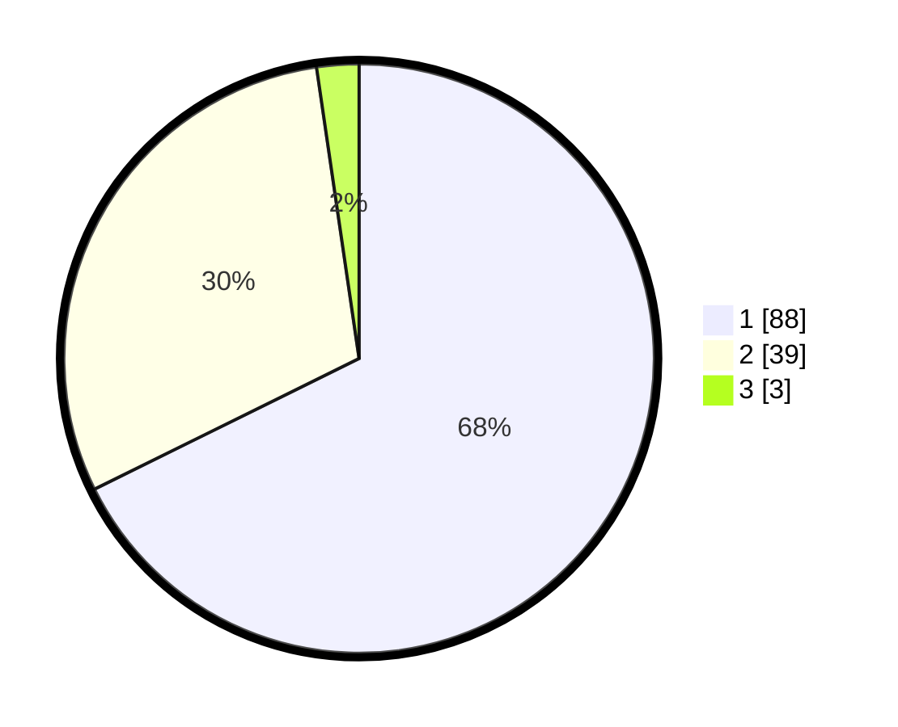

# Hasil

## Grafik

## Tabel

| No. | Nama Paslon    | Suara | Suara (raw) | Persentase |
|:--- |:-------------- | -----:| -----------:| ----------:|
| 1   | ANIES MUHAIMIN | 88    | [88][p-1]   | 67,69      |
| 2   | PRABOWO GIBRAN | 39    | [39][p-2]   | 30,00      |
| 3   | GANJAR MAHFUD  | 3     | [3][p-3]    | 2,31       |

[p-1]: https://github.com/gigit-pemilu/pemilu-2024/blob/main/pilpres/hitung-suara/sub/13-sumatera-barat/sub/71-kota-padang/sub/09-kuranji/sub/1008-gunung-sarik/sub/011-tps/sub/paslon-1.txt
[p-2]: https://github.com/gigit-pemilu/pemilu-2024/blob/main/pilpres/hitung-suara/sub/13-sumatera-barat/sub/71-kota-padang/sub/09-kuranji/sub/1008-gunung-sarik/sub/011-tps/sub/paslon-2.txt
[p-3]: https://github.com/gigit-pemilu/pemilu-2024/blob/main/pilpres/hitung-suara/sub/13-sumatera-barat/sub/71-kota-padang/sub/09-kuranji/sub/1008-gunung-sarik/sub/011-tps/sub/paslon-3.txt

## Foto C Plano

https://sirekap-obj-formc.kpu.go.id/f676/pemilu/ppwp/13/71/09/10/08/1371091008011-20240219-103422--80fdac33-4d54-40db-82f6-02a63bb78142.jpg

https://sirekap-obj-formc.kpu.go.id/f676/pemilu/ppwp/13/71/09/10/08/1371091008011-20240219-103459--6edba0d2-72d7-4a47-91cf-0df53c584a61.jpg

https://sirekap-obj-formc.kpu.go.id/f676/pemilu/ppwp/13/71/09/10/08/1371091008011-20240219-103535--4b9f2252-a4e0-49fb-beb0-b0dc1b99ed2b.jpg

## Metadata

| Key        | Value               |
| ---------- | ------------------- |
| Time Stamp | 2024-02-25 11:00:00 |

