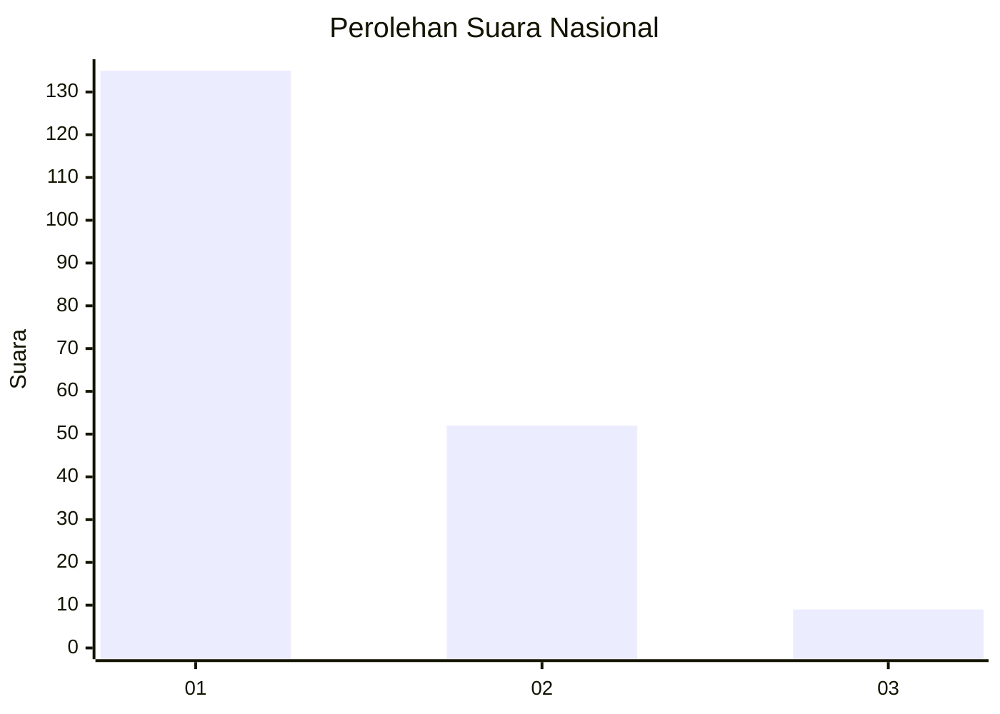
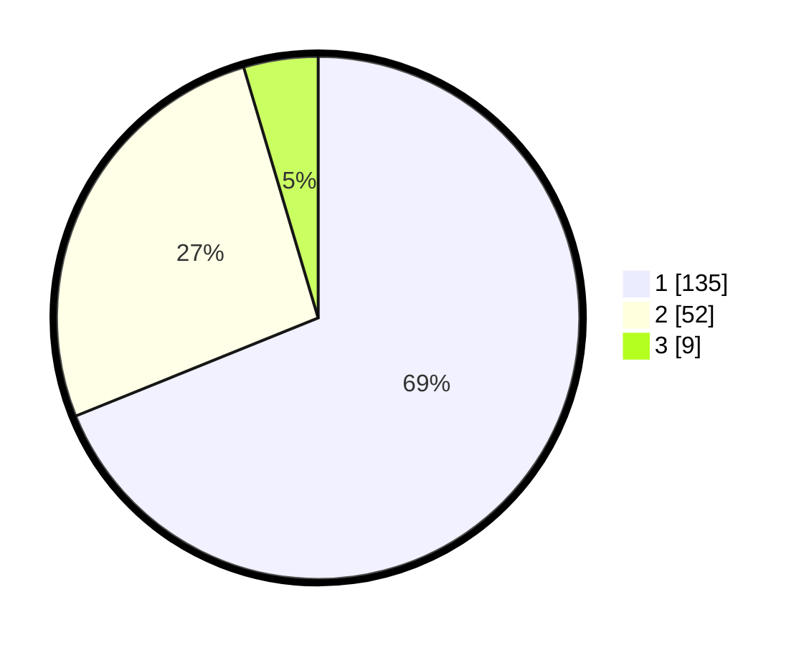

# Hasil

## Grafik

## Tabel

| No. | Nama Paslon    | Suara | Suara (raw) | Persentase |
|:--- |:-------------- | -----:| -----------:| ----------:|
| 1   | ANIES MUHAIMIN | 135   | [135][p-1]  | 68,88      |
| 2   | PRABOWO GIBRAN | 52    | [52][p-2]   | 26,53      |
| 3   | GANJAR MAHFUD  | 9     | [9][p-3]    | 4,59       |

[p-1]: https://github.com/gigit-pemilu/pemilu-2024/blob/main/pilpres/hitung-suara/sub/13-sumatera-barat/sub/71-kota-padang/sub/09-kuranji/sub/1008-gunung-sarik/sub/039-tps/sub/paslon-1.txt
[p-2]: https://github.com/gigit-pemilu/pemilu-2024/blob/main/pilpres/hitung-suara/sub/13-sumatera-barat/sub/71-kota-padang/sub/09-kuranji/sub/1008-gunung-sarik/sub/039-tps/sub/paslon-2.txt
[p-3]: https://github.com/gigit-pemilu/pemilu-2024/blob/main/pilpres/hitung-suara/sub/13-sumatera-barat/sub/71-kota-padang/sub/09-kuranji/sub/1008-gunung-sarik/sub/039-tps/sub/paslon-3.txt

## Foto C Plano

https://sirekap-obj-formc.kpu.go.id/e4ec/pemilu/ppwp/13/71/09/10/08/1371091008039-20240215-015607--bf4e76ff-59db-46f8-8912-700dcc937f33.jpg

https://sirekap-obj-formc.kpu.go.id/e4ec/pemilu/ppwp/13/71/09/10/08/1371091008039-20240214-193603--709be73f-b412-4756-a3ea-e34cd1d8794a.jpg

https://sirekap-obj-formc.kpu.go.id/e4ec/pemilu/ppwp/13/71/09/10/08/1371091008039-20240214-194751--c64755ad-b354-4d6c-95d5-346ddfbc5a50.jpg

## Metadata

| Key        | Value               |
| ---------- | ------------------- |
| Time Stamp | 2024-02-16 01:30:27 |

