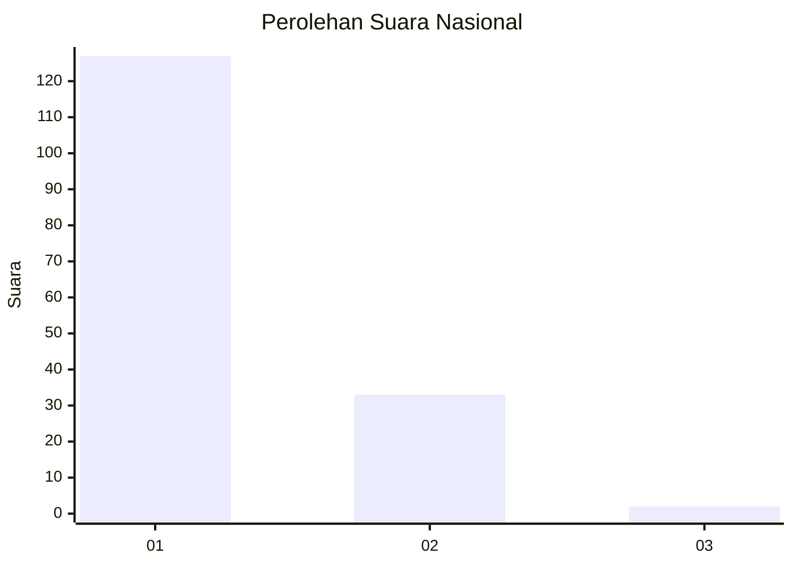
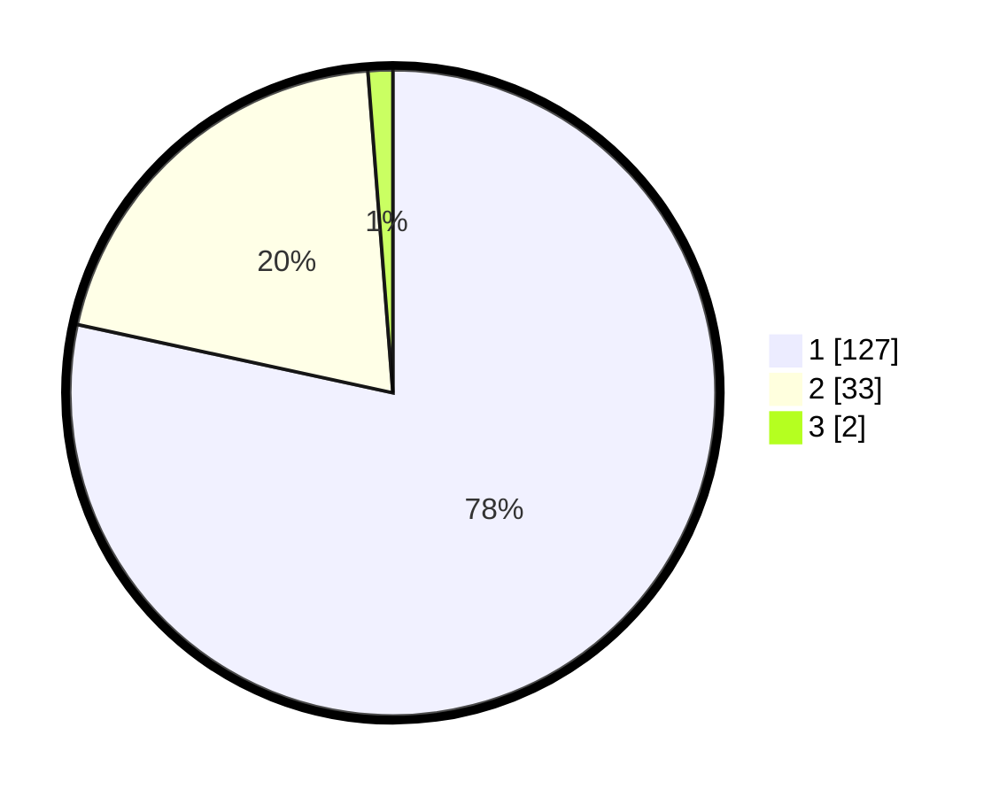

# Hasil

## Grafik

## Tabel

| No. | Nama Paslon    | Suara | Suara (raw) | Persentase |
|:--- |:-------------- | -----:| -----------:| ----------:|
| 1   | ANIES MUHAIMIN | 127   | [127][p-1]  | 78,40      |
| 2   | PRABOWO GIBRAN | 33    | [33][p-2]   | 20,37      |
| 3   | GANJAR MAHFUD  | 2     | [2][p-3]    | 1,23       |

[p-1]: https://github.com/gigit-pemilu/pemilu-2024/blob/main/pilpres/hitung-suara/sub/13-sumatera-barat/sub/71-kota-padang/sub/09-kuranji/sub/1009-sungai-sapih/sub/004-tps/sub/paslon-1.txt
[p-2]: https://github.com/gigit-pemilu/pemilu-2024/blob/main/pilpres/hitung-suara/sub/13-sumatera-barat/sub/71-kota-padang/sub/09-kuranji/sub/1009-sungai-sapih/sub/004-tps/sub/paslon-2.txt
[p-3]: https://github.com/gigit-pemilu/pemilu-2024/blob/main/pilpres/hitung-suara/sub/13-sumatera-barat/sub/71-kota-padang/sub/09-kuranji/sub/1009-sungai-sapih/sub/004-tps/sub/paslon-3.txt

## Foto C Plano

https://sirekap-obj-formc.kpu.go.id/9fdd/pemilu/ppwp/13/71/09/10/09/1371091009004-20240215-013445--294b1a71-4629-4044-a517-897813511f03.jpg

https://sirekap-obj-formc.kpu.go.id/9fdd/pemilu/ppwp/13/71/09/10/09/1371091009004-20240215-013621--7ec1a415-b0c0-46fe-8a9f-e056f4c362a8.jpg

https://sirekap-obj-formc.kpu.go.id/9fdd/pemilu/ppwp/13/71/09/10/09/1371091009004-20240215-013749--a77b2031-0335-437e-8ca3-4c7e0c4d37b1.jpg

## Metadata

| Key        | Value               |
| ---------- | ------------------- |
| Time Stamp | 2024-02-16 01:00:27 |

