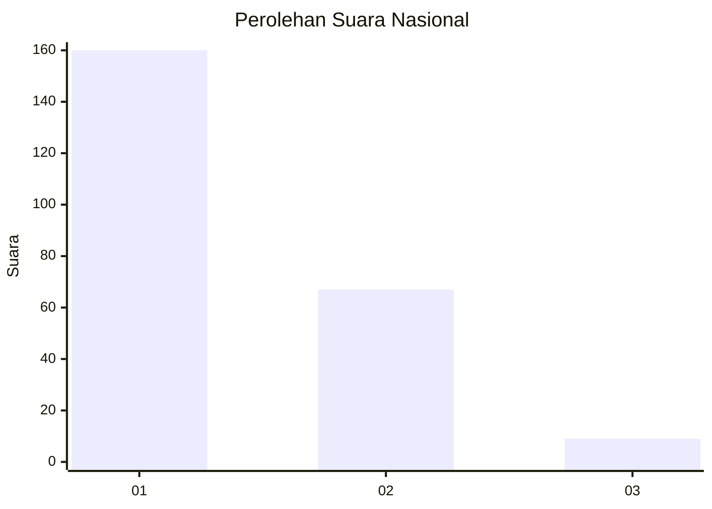
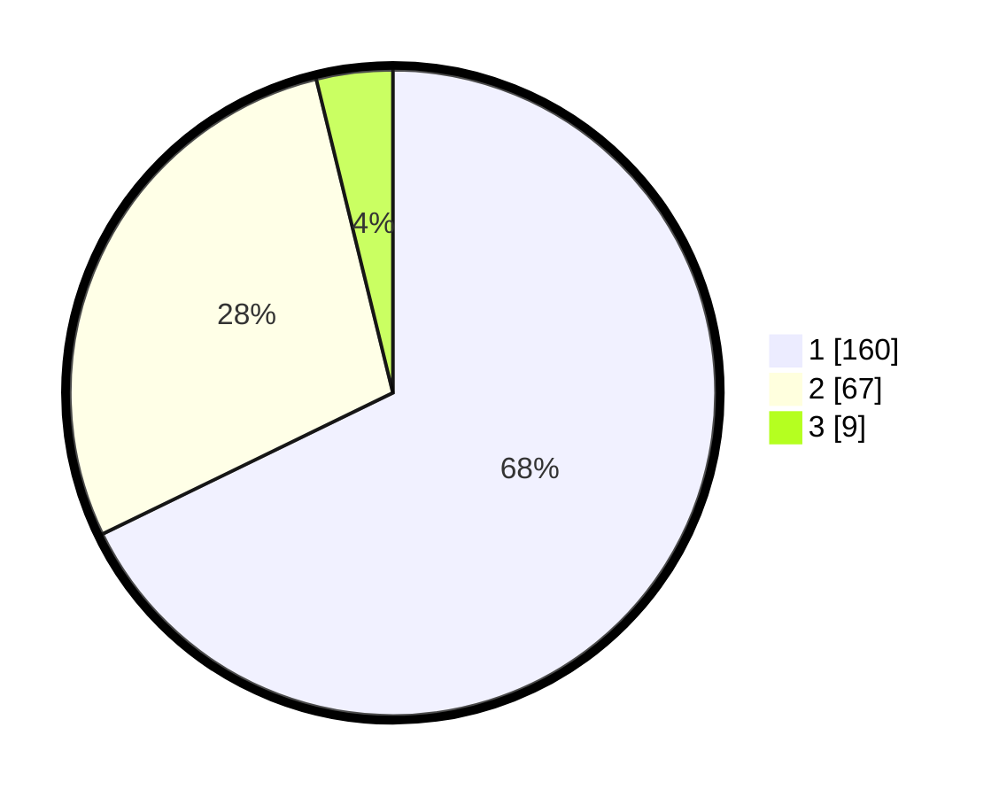

# Hasil

## Grafik

## Tabel

| No. | Nama Paslon    | Suara | Suara (raw) | Persentase |
|:--- |:-------------- | -----:| -----------:| ----------:|
| 1   | ANIES MUHAIMIN | 160   | [160][p-1]  | 67,80      |
| 2   | PRABOWO GIBRAN | 67    | [67][p-2]   | 28,39      |
| 3   | GANJAR MAHFUD  | 9     | [9][p-3]    | 3,81       |

[p-1]: https://github.com/gigit-pemilu/pemilu-2024/blob/main/pilpres/hitung-suara/sub/13-sumatera-barat/sub/71-kota-padang/sub/09-kuranji/sub/1009-sungai-sapih/sub/029-tps/sub/paslon-1.txt
[p-2]: https://github.com/gigit-pemilu/pemilu-2024/blob/main/pilpres/hitung-suara/sub/13-sumatera-barat/sub/71-kota-padang/sub/09-kuranji/sub/1009-sungai-sapih/sub/029-tps/sub/paslon-2.txt
[p-3]: https://github.com/gigit-pemilu/pemilu-2024/blob/main/pilpres/hitung-suara/sub/13-sumatera-barat/sub/71-kota-padang/sub/09-kuranji/sub/1009-sungai-sapih/sub/029-tps/sub/paslon-3.txt

## Foto C Plano

https://sirekap-obj-formc.kpu.go.id/d51e/pemilu/ppwp/13/71/09/10/09/1371091009029-20240215-064601--f033f70c-654e-44a2-9a50-81b053f77869.jpg

https://sirekap-obj-formc.kpu.go.id/d51e/pemilu/ppwp/13/71/09/10/09/1371091009029-20240215-064606--6be9b88d-7dec-464f-a433-efbd3a3cf8c3.jpg

https://sirekap-obj-formc.kpu.go.id/d51e/pemilu/ppwp/13/71/09/10/09/1371091009029-20240215-064612--6dbca663-3985-4665-b293-c9dfa369c188.jpg

## Metadata

| Key        | Value               |
| ---------- | ------------------- |
| Time Stamp | 2024-02-16 01:30:27 |

