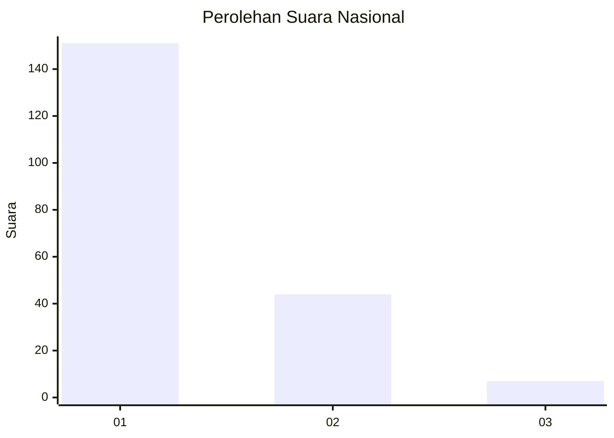
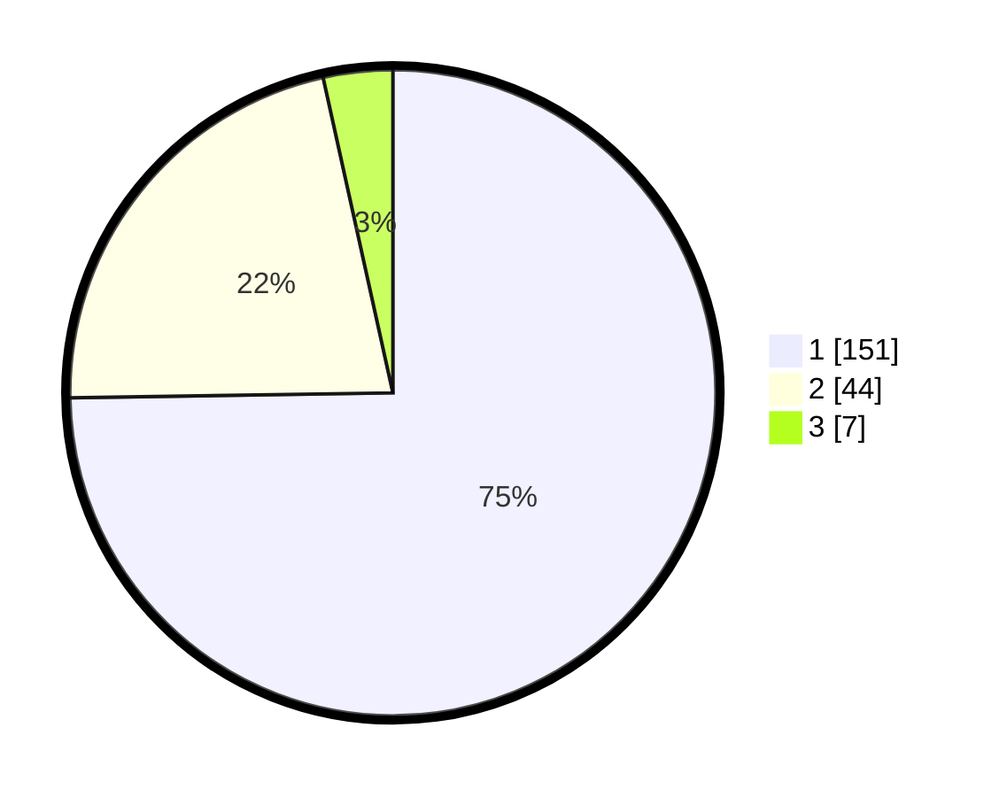

# Hasil

## Grafik

## Tabel

| No. | Nama Paslon    | Suara | Suara (raw) | Persentase |
|:--- |:-------------- | -----:| -----------:| ----------:|
| 1   | ANIES MUHAIMIN | 151   | [151][p-1]  | 74,75      |
| 2   | PRABOWO GIBRAN | 44    | [44][p-2]   | 21,78      |
| 3   | GANJAR MAHFUD  | 7     | [7][p-3]    | 3,47       |

[p-1]: https://github.com/gigit-pemilu/pemilu-2024/blob/main/pilpres/hitung-suara/sub/13-sumatera-barat/sub/71-kota-padang/sub/09-kuranji/sub/1009-sungai-sapih/sub/039-tps/sub/paslon-1.txt
[p-2]: https://github.com/gigit-pemilu/pemilu-2024/blob/main/pilpres/hitung-suara/sub/13-sumatera-barat/sub/71-kota-padang/sub/09-kuranji/sub/1009-sungai-sapih/sub/039-tps/sub/paslon-2.txt
[p-3]: https://github.com/gigit-pemilu/pemilu-2024/blob/main/pilpres/hitung-suara/sub/13-sumatera-barat/sub/71-kota-padang/sub/09-kuranji/sub/1009-sungai-sapih/sub/039-tps/sub/paslon-3.txt

## Foto C Plano

https://sirekap-obj-formc.kpu.go.id/b7b3/pemilu/ppwp/13/71/09/10/09/1371091009039-20240215-064302--b3e00167-204c-4520-b14e-5771b8416f8b.jpg

https://sirekap-obj-formc.kpu.go.id/b7b3/pemilu/ppwp/13/71/09/10/09/1371091009039-20240215-064431--e5735ea7-0cd0-453b-b9e1-21721ab27612.jpg

https://sirekap-obj-formc.kpu.go.id/b7b3/pemilu/ppwp/13/71/09/10/09/1371091009039-20240215-020525--8c78ce29-641f-4797-9ac0-214670cfa6f0.jpg

## Metadata

| Key        | Value               |
| ---------- | ------------------- |
| Time Stamp | 2024-02-16 01:30:27 |

