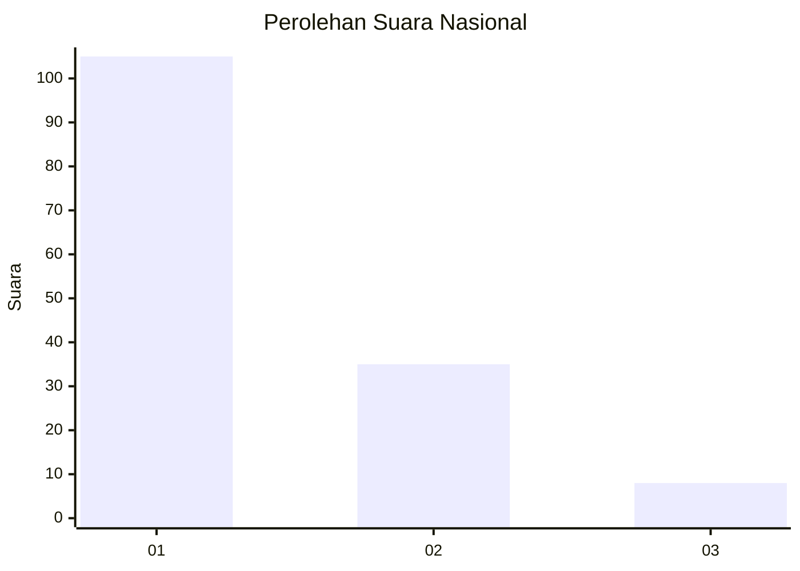
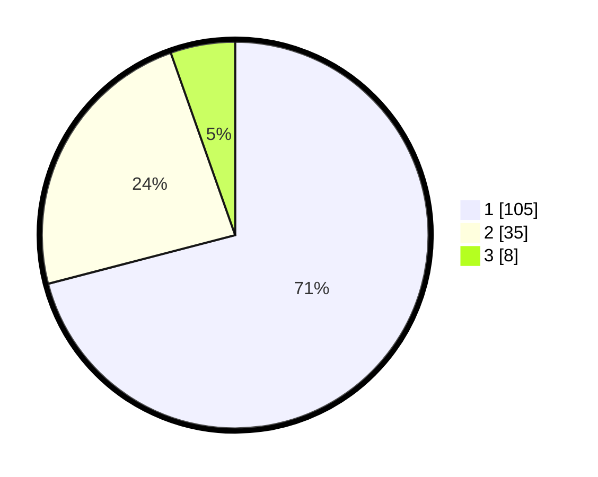

# Hasil

## Grafik

## Tabel

| No. | Nama Paslon    | Suara | Suara (raw) | Persentase |
|:--- |:-------------- | -----:| -----------:| ----------:|
| 1   | ANIES MUHAIMIN | 105   | [105][p-1]  | 70,95      |
| 2   | PRABOWO GIBRAN | 35    | [35][p-2]   | 23,65      |
| 3   | GANJAR MAHFUD  | 8     | [8][p-3]    | 5,41       |

[p-1]: https://github.com/gigit-pemilu/pemilu-2024/blob/main/pilpres/hitung-suara/sub/13-sumatera-barat/sub/71-kota-padang/sub/10-nanggalo/sub/1001-surau-gadang/sub/013-tps/sub/paslon-1.txt
[p-2]: https://github.com/gigit-pemilu/pemilu-2024/blob/main/pilpres/hitung-suara/sub/13-sumatera-barat/sub/71-kota-padang/sub/10-nanggalo/sub/1001-surau-gadang/sub/013-tps/sub/paslon-2.txt
[p-3]: https://github.com/gigit-pemilu/pemilu-2024/blob/main/pilpres/hitung-suara/sub/13-sumatera-barat/sub/71-kota-padang/sub/10-nanggalo/sub/1001-surau-gadang/sub/013-tps/sub/paslon-3.txt

## Foto C Plano

https://sirekap-obj-formc.kpu.go.id/7595/pemilu/ppwp/13/71/10/10/01/1371101001013-20240215-052220--197a7739-c3f5-438b-9473-a321f0c1a592.jpg

https://sirekap-obj-formc.kpu.go.id/7595/pemilu/ppwp/13/71/10/10/01/1371101001013-20240215-101402--5f0a69ef-ae63-4052-941e-fc4530a3e38d.jpg

https://sirekap-obj-formc.kpu.go.id/7595/pemilu/ppwp/13/71/10/10/01/1371101001013-20240215-101408--f9c7bf3a-517a-420b-8710-a3354805c4a1.jpg

## Metadata

| Key        | Value               |
| ---------- | ------------------- |
| Time Stamp | 2024-02-15 18:30:25 |

