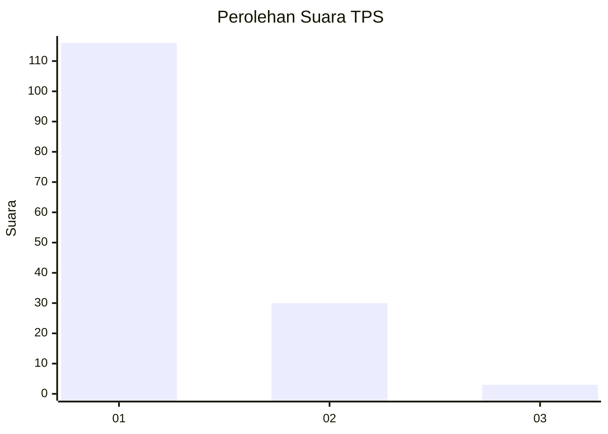
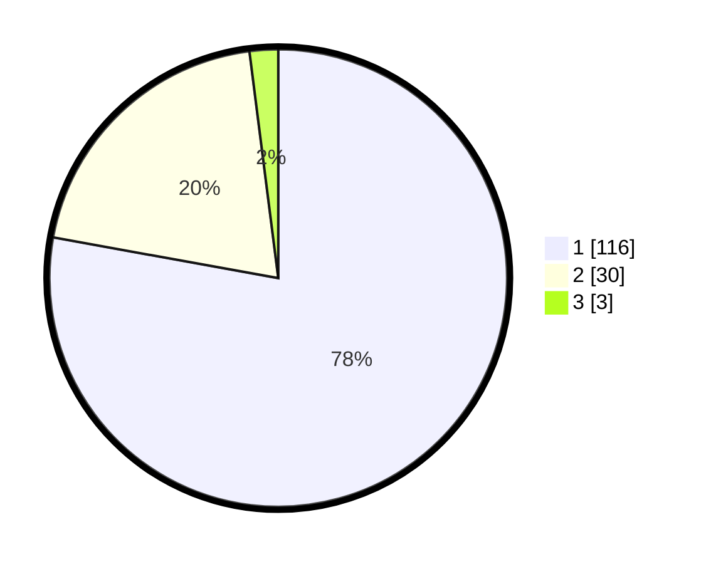

# Hasil

## Grafik

## Tabel

| No. | Nama Paslon    | Suara | Suara (raw) | Persentase |
|:--- |:-------------- | -----:| -----------:| ----------:|
| 1   | ANIES MUHAIMIN | 116   | [116][p-1]  | 77,85      |
| 2   | PRABOWO GIBRAN | 30    | [30][p-2]   | 20,13      |
| 3   | GANJAR MAHFUD  | 3     | [3][p-3]    | 2,01       |

[p-1]: https://github.com/gigit-pemilu/pemilu-2024-13-sumatera-barat/blob/main/pilpres/hitung-suara/sub/13-sumatera-barat/sub/71-kota-padang/sub/10-nanggalo/sub/1001-surau-gadang/sub/034-tps/sub/paslon-1.txt
[p-2]: https://github.com/gigit-pemilu/pemilu-2024-13-sumatera-barat/blob/main/pilpres/hitung-suara/sub/13-sumatera-barat/sub/71-kota-padang/sub/10-nanggalo/sub/1001-surau-gadang/sub/034-tps/sub/paslon-2.txt
[p-3]: https://github.com/gigit-pemilu/pemilu-2024-13-sumatera-barat/blob/main/pilpres/hitung-suara/sub/13-sumatera-barat/sub/71-kota-padang/sub/10-nanggalo/sub/1001-surau-gadang/sub/034-tps/sub/paslon-3.txt

## Foto C Plano

https://sirekap-obj-formc.kpu.go.id/42c2/pemilu/ppwp/13/71/10/10/01/1371101001034-20240214-223728--a0395ab4-53f5-491f-957e-01001acbedbe.jpg

https://sirekap-obj-formc.kpu.go.id/42c2/pemilu/ppwp/13/71/10/10/01/1371101001034-20240214-223736--c30bd8a9-9b2c-44d1-810a-59dce02d16e7.jpg

https://sirekap-obj-formc.kpu.go.id/42c2/pemilu/ppwp/13/71/10/10/01/1371101001034-20240215-021139--92dfd424-3222-4be3-b275-32cea9756840.jpg

## Metadata

| Key        | Value               |
| ---------- | ------------------- |
| Time Stamp | 2024-02-16 00:30:27 |

