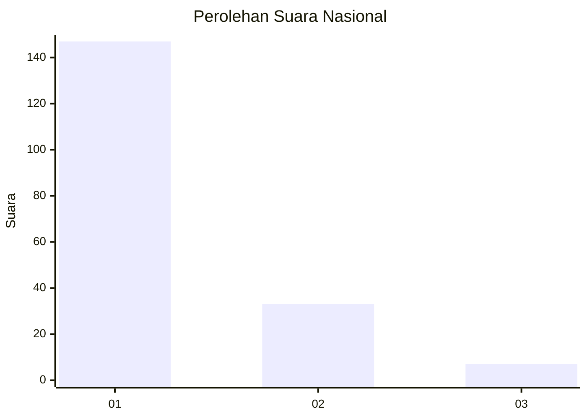
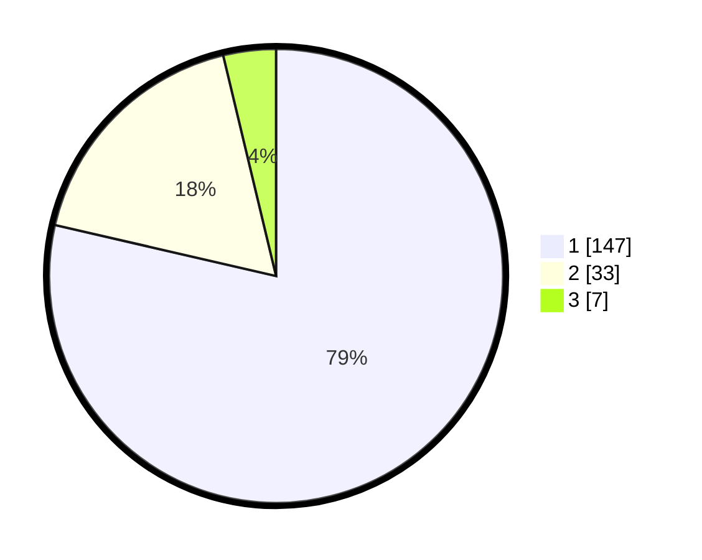

# Hasil

## Grafik

## Tabel

| No. | Nama Paslon    | Suara | Suara (raw) | Persentase |
|:--- |:-------------- | -----:| -----------:| ----------:|
| 1   | ANIES MUHAIMIN | 147   | [147][p-1]  | 78,61      |
| 2   | PRABOWO GIBRAN | 33    | [33][p-2]   | 17,65      |
| 3   | GANJAR MAHFUD  | 7     | [7][p-3]    | 3,74       |

[p-1]: https://github.com/gigit-pemilu/pemilu-2024/blob/main/pilpres/hitung-suara/sub/13-sumatera-barat/sub/71-kota-padang/sub/10-nanggalo/sub/1001-surau-gadang/sub/042-tps/sub/paslon-1.txt
[p-2]: https://github.com/gigit-pemilu/pemilu-2024/blob/main/pilpres/hitung-suara/sub/13-sumatera-barat/sub/71-kota-padang/sub/10-nanggalo/sub/1001-surau-gadang/sub/042-tps/sub/paslon-2.txt
[p-3]: https://github.com/gigit-pemilu/pemilu-2024/blob/main/pilpres/hitung-suara/sub/13-sumatera-barat/sub/71-kota-padang/sub/10-nanggalo/sub/1001-surau-gadang/sub/042-tps/sub/paslon-3.txt

## Foto C Plano

https://sirekap-obj-formc.kpu.go.id/62a0/pemilu/ppwp/13/71/10/10/01/1371101001042-20240215-050727--1ddd50a8-485d-4e1c-bbc8-eaad7d1b1bd3.jpg

https://sirekap-obj-formc.kpu.go.id/62a0/pemilu/ppwp/13/71/10/10/01/1371101001042-20240214-223539--44b07ae2-e943-4955-a51a-37bf38ea509f.jpg

https://sirekap-obj-formc.kpu.go.id/62a0/pemilu/ppwp/13/71/10/10/01/1371101001042-20240215-020403--c5a004ad-80aa-4dd8-a700-d62d0a66015c.jpg

## Metadata

| Key        | Value               |
| ---------- | ------------------- |
| Time Stamp | 2024-02-16 00:30:27 |

