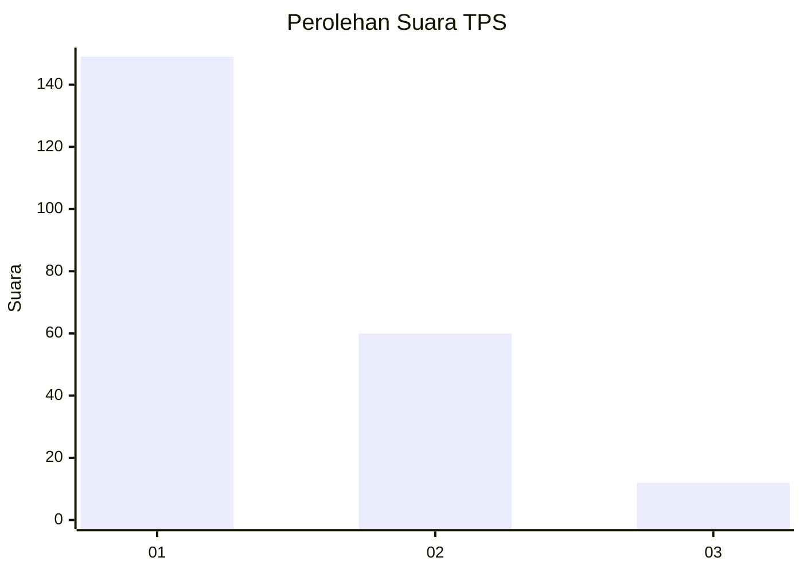
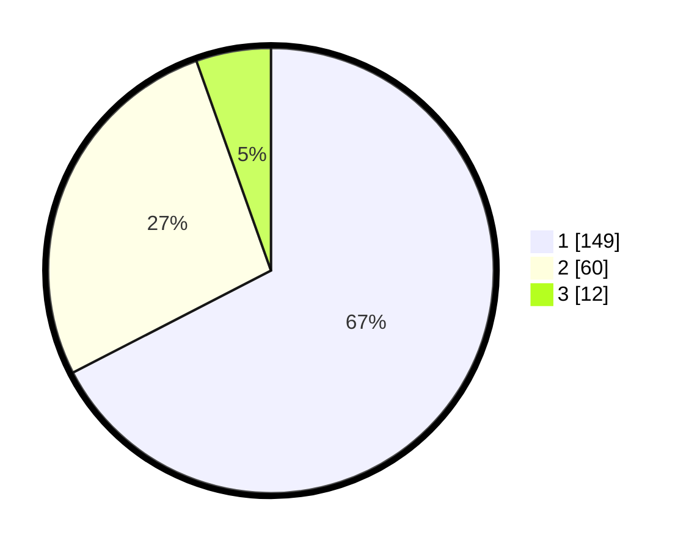

# Hasil

## Grafik

## Tabel

| No. | Nama Paslon    | Suara | Suara (raw) | Persentase |
|:--- |:-------------- | -----:| -----------:| ----------:|
| 1   | ANIES MUHAIMIN | 149   | [149][p-1]  | 67,42      |
| 2   | PRABOWO GIBRAN | 60    | [60][p-2]   | 27,15      |
| 3   | GANJAR MAHFUD  | 12    | [12][p-3]   | 5,43       |

[p-1]: https://github.com/gigit-pemilu/pemilu-2024-13-sumatera-barat/blob/main/pilpres/hitung-suara/sub/13-sumatera-barat/sub/71-kota-padang/sub/11-koto-tangah/sub/1001-balai-gadang/sub/001-tps/sub/paslon-1.txt
[p-2]: https://github.com/gigit-pemilu/pemilu-2024-13-sumatera-barat/blob/main/pilpres/hitung-suara/sub/13-sumatera-barat/sub/71-kota-padang/sub/11-koto-tangah/sub/1001-balai-gadang/sub/001-tps/sub/paslon-2.txt
[p-3]: https://github.com/gigit-pemilu/pemilu-2024-13-sumatera-barat/blob/main/pilpres/hitung-suara/sub/13-sumatera-barat/sub/71-kota-padang/sub/11-koto-tangah/sub/1001-balai-gadang/sub/001-tps/sub/paslon-3.txt

## Foto C Plano

https://sirekap-obj-formc.kpu.go.id/9777/pemilu/ppwp/13/71/11/10/01/1371111001001-20240216-112616--b3a26b1e-f8ac-4c79-ab9e-d101ad4c7c66.jpg

https://sirekap-obj-formc.kpu.go.id/9777/pemilu/ppwp/13/71/11/10/01/1371111001001-20240216-121444--be0be773-d6d8-4ab4-94da-62309630cc39.jpg

https://sirekap-obj-formc.kpu.go.id/9777/pemilu/ppwp/13/71/11/10/01/1371111001001-20240216-112442--65f421b8-4685-4454-8a96-76dcae2827ae.jpg

## Metadata

| Key        | Value               |
| ---------- | ------------------- |
| Time Stamp | 2024-02-17 12:00:00 |

