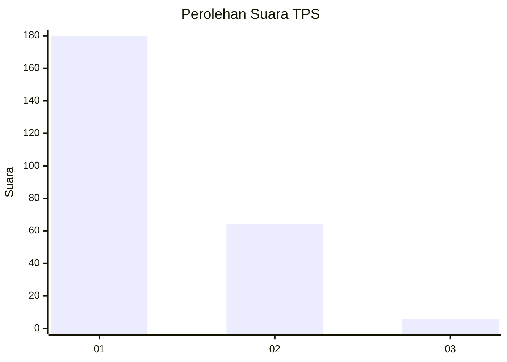
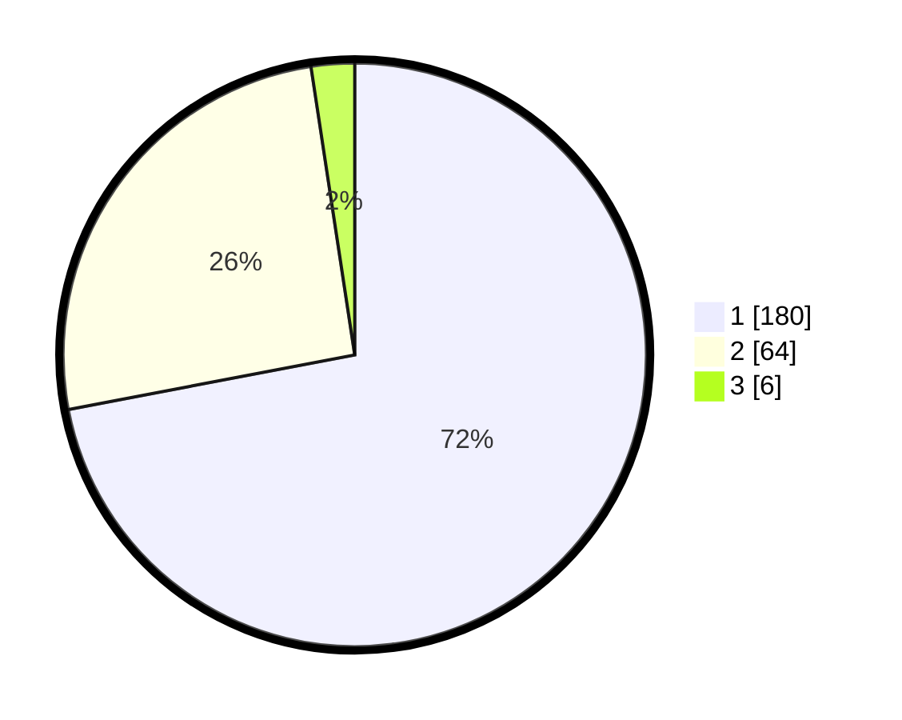

# Hasil

## Grafik

## Tabel

| No. | Nama Paslon    | Suara | Suara (raw) | Persentase |
|:--- |:-------------- | -----:| -----------:| ----------:|
| 1   | ANIES MUHAIMIN | 180   | [180][p-1]  | 72,00      |
| 2   | PRABOWO GIBRAN | 64    | [64][p-2]   | 25,60      |
| 3   | GANJAR MAHFUD  | 6     | [6][p-3]    | 2,40       |

[p-1]: https://github.com/gigit-pemilu/pemilu-2024-13-sumatera-barat/blob/main/pilpres/hitung-suara/sub/13-sumatera-barat/sub/71-kota-padang/sub/11-koto-tangah/sub/1001-balai-gadang/sub/002-tps/sub/paslon-1.txt
[p-2]: https://github.com/gigit-pemilu/pemilu-2024-13-sumatera-barat/blob/main/pilpres/hitung-suara/sub/13-sumatera-barat/sub/71-kota-padang/sub/11-koto-tangah/sub/1001-balai-gadang/sub/002-tps/sub/paslon-2.txt
[p-3]: https://github.com/gigit-pemilu/pemilu-2024-13-sumatera-barat/blob/main/pilpres/hitung-suara/sub/13-sumatera-barat/sub/71-kota-padang/sub/11-koto-tangah/sub/1001-balai-gadang/sub/002-tps/sub/paslon-3.txt

## Foto C Plano

https://sirekap-obj-formc.kpu.go.id/451d/pemilu/ppwp/13/71/11/10/01/1371111001002-20240214-235906--54452a85-2889-4d0a-b298-c2f20b677c74.jpg

https://sirekap-obj-formc.kpu.go.id/451d/pemilu/ppwp/13/71/11/10/01/1371111001002-20240215-000922--f016d95b-e8eb-4d74-88d8-14a4e881fd0a.jpg

https://sirekap-obj-formc.kpu.go.id/451d/pemilu/ppwp/13/71/11/10/01/1371111001002-20240215-001123--bdc15eb8-acef-4e71-85ae-dac7bba5d6f3.jpg

## Metadata

| Key        | Value               |
| ---------- | ------------------- |
| Time Stamp | 2024-02-15 20:30:46 |

