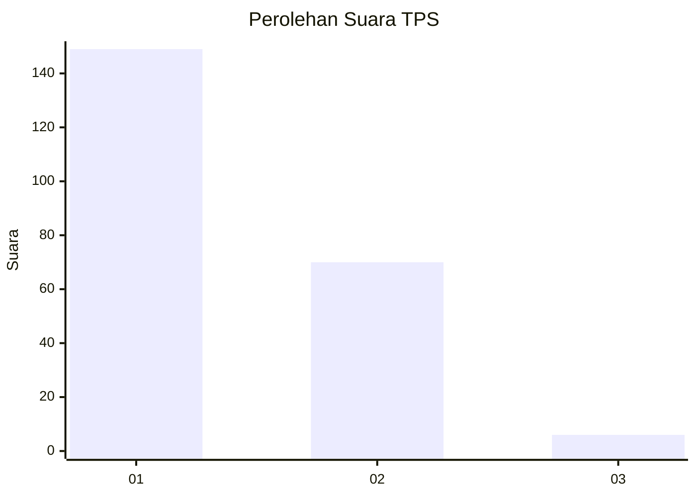
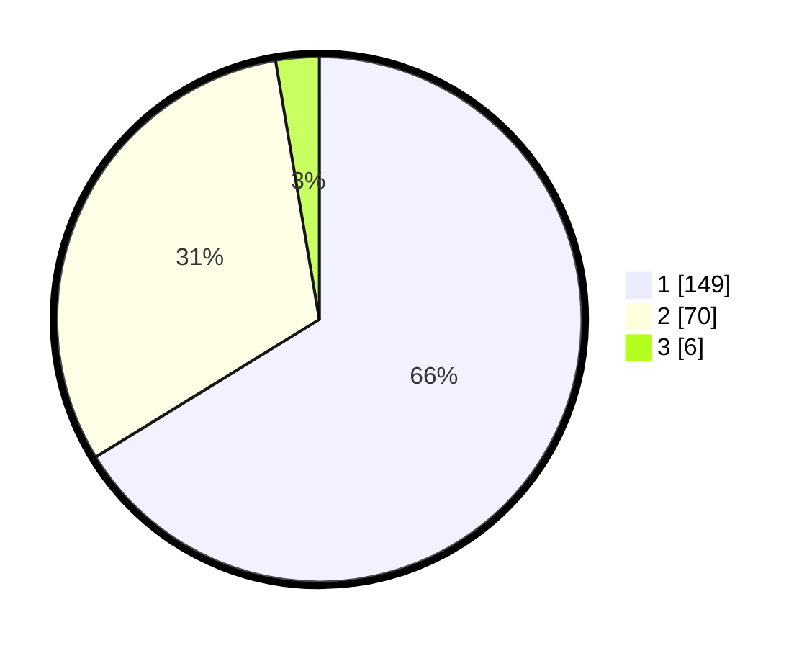

# Hasil

## Grafik

## Tabel

| No. | Nama Paslon    | Suara | Suara (raw) | Persentase |
|:--- |:-------------- | -----:| -----------:| ----------:|
| 1   | ANIES MUHAIMIN | 149   | [149][p-1]  | 66,22      |
| 2   | PRABOWO GIBRAN | 70    | [70][p-2]   | 31,11      |
| 3   | GANJAR MAHFUD  | 6     | [6][p-3]    | 2,67       |

[p-1]: https://github.com/gigit-pemilu/pemilu-2024-13-sumatera-barat/blob/main/pilpres/hitung-suara/sub/13-sumatera-barat/sub/71-kota-padang/sub/11-koto-tangah/sub/1001-balai-gadang/sub/004-tps/sub/paslon-1.txt
[p-2]: https://github.com/gigit-pemilu/pemilu-2024-13-sumatera-barat/blob/main/pilpres/hitung-suara/sub/13-sumatera-barat/sub/71-kota-padang/sub/11-koto-tangah/sub/1001-balai-gadang/sub/004-tps/sub/paslon-2.txt
[p-3]: https://github.com/gigit-pemilu/pemilu-2024-13-sumatera-barat/blob/main/pilpres/hitung-suara/sub/13-sumatera-barat/sub/71-kota-padang/sub/11-koto-tangah/sub/1001-balai-gadang/sub/004-tps/sub/paslon-3.txt

## Foto C Plano

https://sirekap-obj-formc.kpu.go.id/ec0e/pemilu/ppwp/13/71/11/10/01/1371111001004-20240215-035334--024a5b06-1bc6-4573-b3d6-c235ae311143.jpg

https://sirekap-obj-formc.kpu.go.id/ec0e/pemilu/ppwp/13/71/11/10/01/1371111001004-20240215-035738--0d3f9912-468e-4ec2-b0ae-60bd2197d826.jpg

https://sirekap-obj-formc.kpu.go.id/ec0e/pemilu/ppwp/13/71/11/10/01/1371111001004-20240215-035825--bd854f87-3c0b-4c1f-bdc5-090acaaa9199.jpg

## Metadata

| Key        | Value               |
| ---------- | ------------------- |
| Time Stamp | 2024-02-15 20:30:46 |

