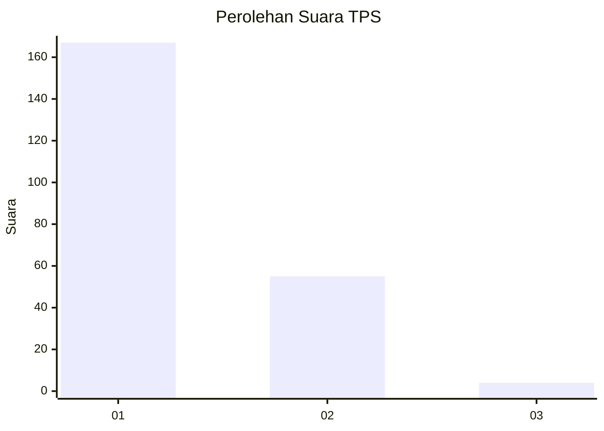
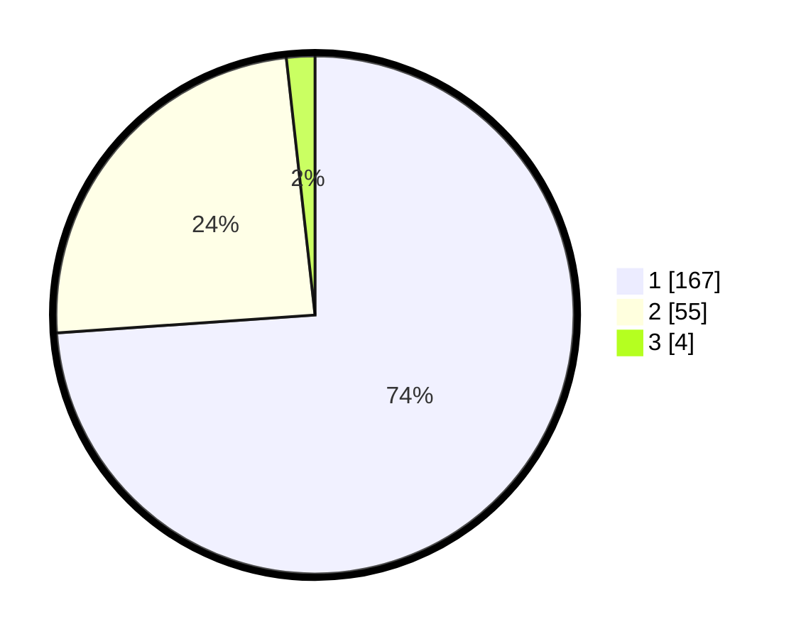

# Hasil

## Grafik

## Tabel

| No. | Nama Paslon    | Suara | Suara (raw) | Persentase |
|:--- |:-------------- | -----:| -----------:| ----------:|
| 1   | ANIES MUHAIMIN | 167   | [167][p-1]  | 73,89      |
| 2   | PRABOWO GIBRAN | 55    | [55][p-2]   | 24,34      |
| 3   | GANJAR MAHFUD  | 4     | [4][p-3]    | 1,77       |

[p-1]: https://github.com/gigit-pemilu/pemilu-2024-13-sumatera-barat/blob/main/pilpres/hitung-suara/sub/13-sumatera-barat/sub/71-kota-padang/sub/11-koto-tangah/sub/1001-balai-gadang/sub/006-tps/sub/paslon-1.txt
[p-2]: https://github.com/gigit-pemilu/pemilu-2024-13-sumatera-barat/blob/main/pilpres/hitung-suara/sub/13-sumatera-barat/sub/71-kota-padang/sub/11-koto-tangah/sub/1001-balai-gadang/sub/006-tps/sub/paslon-2.txt
[p-3]: https://github.com/gigit-pemilu/pemilu-2024-13-sumatera-barat/blob/main/pilpres/hitung-suara/sub/13-sumatera-barat/sub/71-kota-padang/sub/11-koto-tangah/sub/1001-balai-gadang/sub/006-tps/sub/paslon-3.txt

## Foto C Plano

https://sirekap-obj-formc.kpu.go.id/6a36/pemilu/ppwp/13/71/11/10/01/1371111001006-20240215-043638--67e1ca32-a1b2-4b91-bef2-59d80677d9a3.jpg

https://sirekap-obj-formc.kpu.go.id/6a36/pemilu/ppwp/13/71/11/10/01/1371111001006-20240215-043813--950d001b-377e-42ef-83a3-bd36e7352588.jpg

https://sirekap-obj-formc.kpu.go.id/6a36/pemilu/ppwp/13/71/11/10/01/1371111001006-20240215-043941--c28626fe-7165-451f-990a-62bc88774ad8.jpg

## Metadata

| Key        | Value               |
| ---------- | ------------------- |
| Time Stamp | 2024-02-15 20:30:46 |

