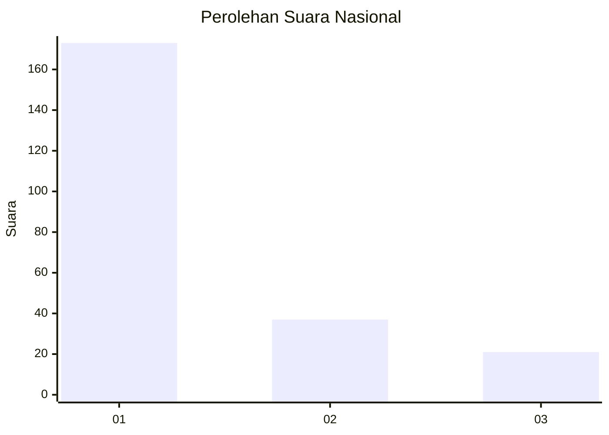
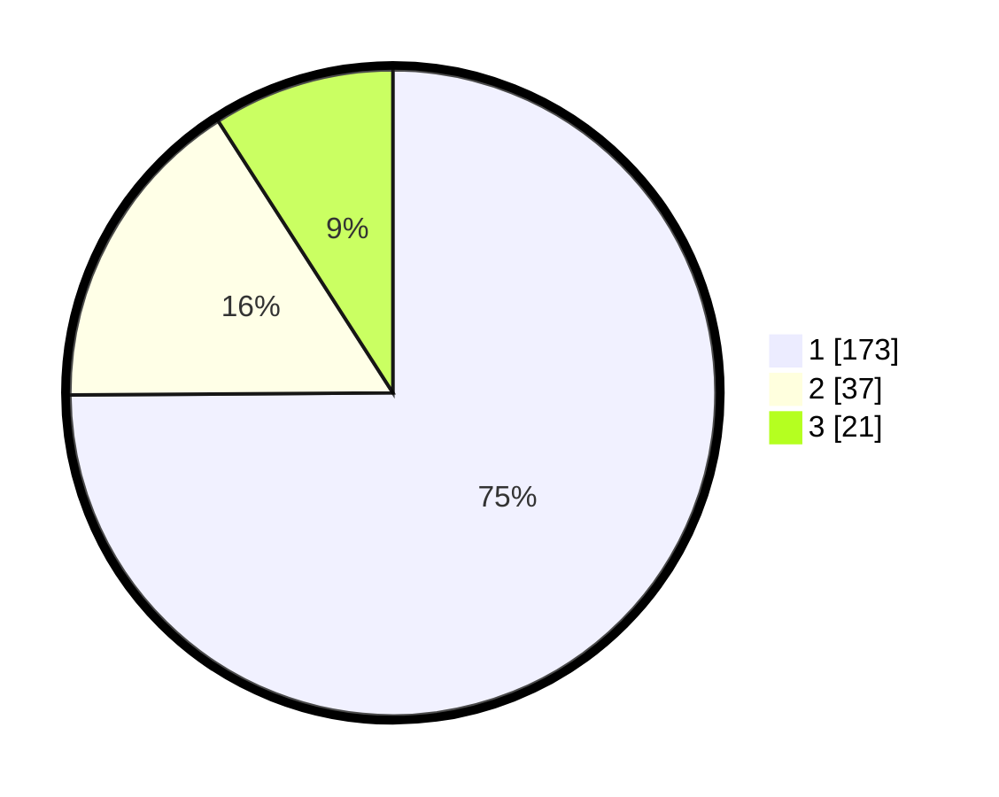

# Hasil

## Grafik

## Tabel

| No. | Nama Paslon    | Suara | Suara (raw) | Persentase |
|:--- |:-------------- | -----:| -----------:| ----------:|
| 1   | ANIES MUHAIMIN | 173   | [173][p-1]  | 74,89      |
| 2   | PRABOWO GIBRAN | 37    | [37][p-2]   | 16,02      |
| 3   | GANJAR MAHFUD  | 21    | [21][p-3]   | 9,09       |

[p-1]: https://github.com/gigit-pemilu/pemilu-2024/blob/main/pilpres/hitung-suara/sub/13-sumatera-barat/sub/71-kota-padang/sub/11-koto-tangah/sub/1001-balai-gadang/sub/007-tps/sub/paslon-1.txt
[p-2]: https://github.com/gigit-pemilu/pemilu-2024/blob/main/pilpres/hitung-suara/sub/13-sumatera-barat/sub/71-kota-padang/sub/11-koto-tangah/sub/1001-balai-gadang/sub/007-tps/sub/paslon-2.txt
[p-3]: https://github.com/gigit-pemilu/pemilu-2024/blob/main/pilpres/hitung-suara/sub/13-sumatera-barat/sub/71-kota-padang/sub/11-koto-tangah/sub/1001-balai-gadang/sub/007-tps/sub/paslon-3.txt

## Foto C Plano

https://sirekap-obj-formc.kpu.go.id/fb5d/pemilu/ppwp/13/71/11/10/01/1371111001007-20240215-012550--36b03939-29fd-4b66-a431-27dcd7b9680d.jpg

https://sirekap-obj-formc.kpu.go.id/fb5d/pemilu/ppwp/13/71/11/10/01/1371111001007-20240215-013805--cf691410-ba58-4b84-818a-e963c01043c5.jpg

https://sirekap-obj-formc.kpu.go.id/fb5d/pemilu/ppwp/13/71/11/10/01/1371111001007-20240215-014504--7506f7be-4e51-4e66-b469-9c78c160af09.jpg

## Metadata

| Key        | Value               |
| ---------- | ------------------- |
| Time Stamp | 2024-02-16 00:30:27 |

