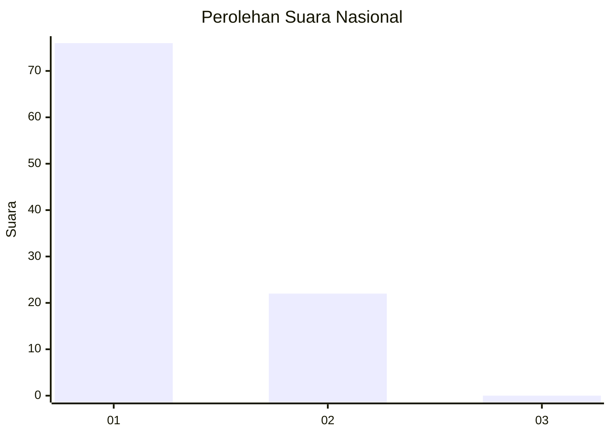
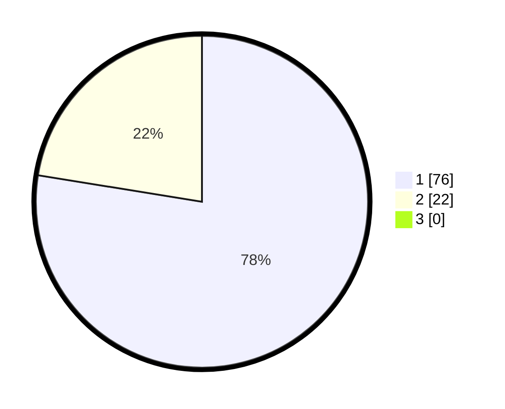

# Hasil

## Grafik

## Tabel

| No. | Nama Paslon    | Suara | Suara (raw) | Persentase |
|:--- |:-------------- | -----:| -----------:| ----------:|
| 1   | ANIES MUHAIMIN | 76    | [76][p-1]   | 77,55      |
| 2   | PRABOWO GIBRAN | 22    | [22][p-2]   | 22,45      |
| 3   | GANJAR MAHFUD  | 0     | [0][p-3]    | 0,00       |

[p-1]: https://github.com/gigit-pemilu/pemilu-2024/blob/main/pilpres/hitung-suara/sub/13-sumatera-barat/sub/71-kota-padang/sub/11-koto-tangah/sub/1002-lubuk-minturun/sub/021-tps/sub/paslon-1.txt
[p-2]: https://github.com/gigit-pemilu/pemilu-2024/blob/main/pilpres/hitung-suara/sub/13-sumatera-barat/sub/71-kota-padang/sub/11-koto-tangah/sub/1002-lubuk-minturun/sub/021-tps/sub/paslon-2.txt
[p-3]: https://github.com/gigit-pemilu/pemilu-2024/blob/main/pilpres/hitung-suara/sub/13-sumatera-barat/sub/71-kota-padang/sub/11-koto-tangah/sub/1002-lubuk-minturun/sub/021-tps/sub/paslon-3.txt

## Foto C Plano

https://sirekap-obj-formc.kpu.go.id/eaf5/pemilu/ppwp/13/71/11/10/02/1371111002021-20240216-212124--be7353d1-7118-427e-8ce5-df7707d0f1f4.jpg

https://sirekap-obj-formc.kpu.go.id/eaf5/pemilu/ppwp/13/71/11/10/02/1371111002021-20240215-085955--8bfc17d9-d4a9-4666-8e26-4af243f87568.jpg

https://sirekap-obj-formc.kpu.go.id/eaf5/pemilu/ppwp/13/71/11/10/02/1371111002021-20240215-090218--a97aa554-1d6a-48bc-85bb-c6b14a7edeaf.jpg

## Metadata

| Key        | Value               |
| ---------- | ------------------- |
| Time Stamp | 2024-02-16 22:01:00 |

