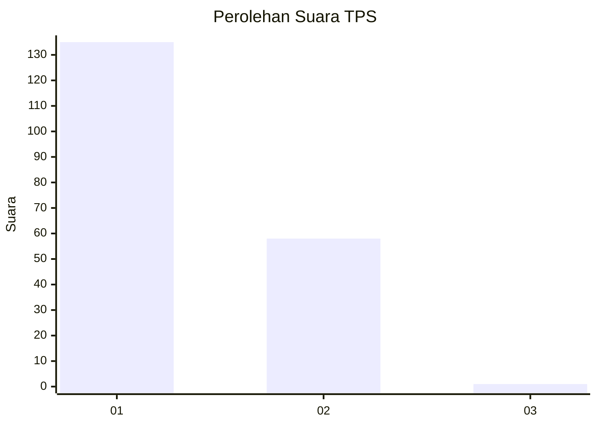
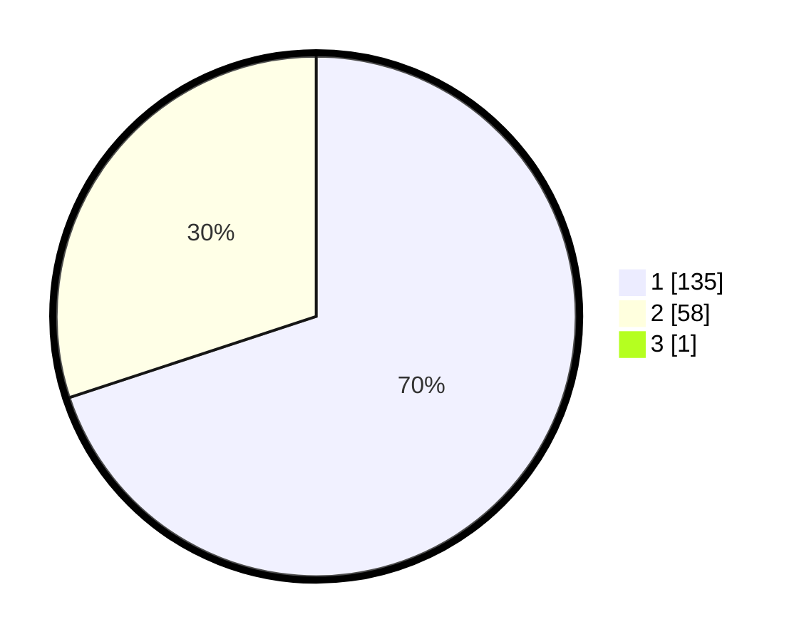

# Hasil

## Grafik

## Tabel

| No. | Nama Paslon    | Suara | Suara (raw) | Persentase |
|:--- |:-------------- | -----:| -----------:| ----------:|
| 1   | ANIES MUHAIMIN | 135   | [135][p-1]  | 69,59      |
| 2   | PRABOWO GIBRAN | 58    | [58][p-2]   | 29,90      |
| 3   | GANJAR MAHFUD  | 1     | [1][p-3]    | 0,52       |

[p-1]: https://github.com/gigit-pemilu/pemilu-2024-13-sumatera-barat/blob/main/pilpres/hitung-suara/sub/13-sumatera-barat/sub/71-kota-padang/sub/11-koto-tangah/sub/1005-koto-panjang-ikua-koto/sub/010-tps/sub/paslon-1.txt
[p-2]: https://github.com/gigit-pemilu/pemilu-2024-13-sumatera-barat/blob/main/pilpres/hitung-suara/sub/13-sumatera-barat/sub/71-kota-padang/sub/11-koto-tangah/sub/1005-koto-panjang-ikua-koto/sub/010-tps/sub/paslon-2.txt
[p-3]: https://github.com/gigit-pemilu/pemilu-2024-13-sumatera-barat/blob/main/pilpres/hitung-suara/sub/13-sumatera-barat/sub/71-kota-padang/sub/11-koto-tangah/sub/1005-koto-panjang-ikua-koto/sub/010-tps/sub/paslon-3.txt

## Foto C Plano

https://sirekap-obj-formc.kpu.go.id/9b5e/pemilu/ppwp/13/71/11/10/05/1371111005010-20240220-171057--9342cfef-f392-43d6-92ad-bee6e4366564.jpg

https://sirekap-obj-formc.kpu.go.id/9b5e/pemilu/ppwp/13/71/11/10/05/1371111005010-20240220-171830--51f3e983-b604-4676-8b6b-3d5a754b7f02.jpg

https://sirekap-obj-formc.kpu.go.id/9b5e/pemilu/ppwp/13/71/11/10/05/1371111005010-20240220-171133--8e815610-9e09-47ad-8fe4-dc022ab4fbf9.jpg

## Metadata

| Key        | Value               |
| ---------- | ------------------- |
| Time Stamp | 2024-02-24 22:31:28 |

## DATA PEMILIH TETAP

Jumlah pemilih dalam DPT: **229**.
 * L: **626**.
 * P: **653**.

## DATA PENGGUNA HAK PILIH

Jumlah pengguna hak pilih dalam DPT: **698**.
 * L: **75**.
 * P: **623**.

Jumlah pengguna hak pilih dalam DPTb: **5**.
 * L: **0**.
 * P: **806**.

Jumlah pengguna hak pilih dalam DPK: **4**.
 * L: **0**.
 * P: **803**.

Jumlah pengguna hak pilih: **203**.
 * L: **76**.
 * P: **627**.

## JUMLAH SUARA SAH DAN TIDAK SAH

JUMLAH SELURUH SUARA SAH: **198**.

JUMLAH SUARA TIDAK SAH: **5**.

JUMLAH SELURUH SUARA SAH DAN SUARA TIDAK SAH: **203**.

