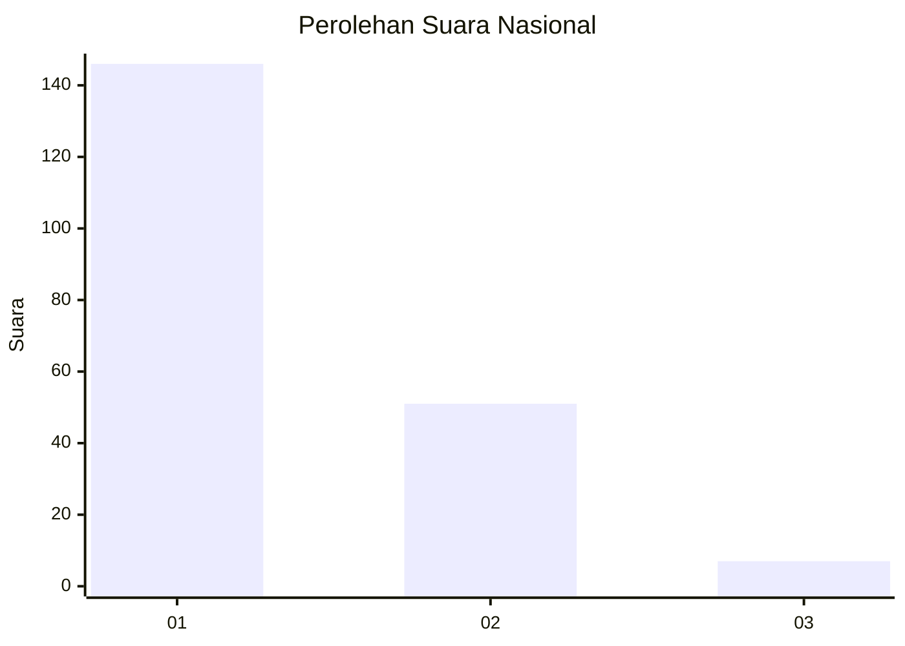
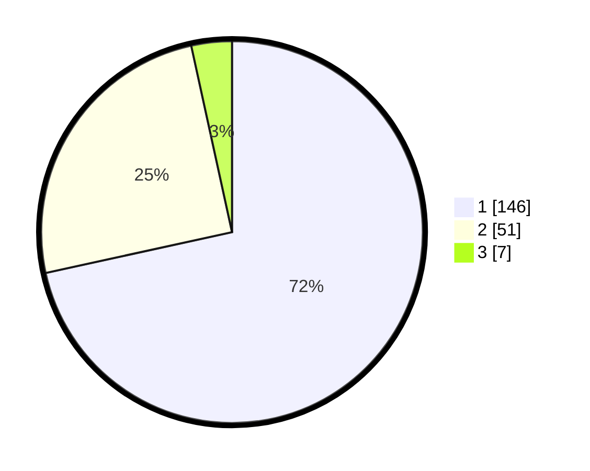

# Hasil

## Grafik

## Tabel

| No. | Nama Paslon    | Suara | Suara (raw) | Persentase |
|:--- |:-------------- | -----:| -----------:| ----------:|
| 1   | ANIES MUHAIMIN | 146   | [146][p-1]  | 71,57      |
| 2   | PRABOWO GIBRAN | 51    | [51][p-2]   | 25,00      |
| 3   | GANJAR MAHFUD  | 7     | [7][p-3]    | 3,43       |

[p-1]: https://github.com/gigit-pemilu/pemilu-2024/blob/main/pilpres/hitung-suara/sub/13-sumatera-barat/sub/71-kota-padang/sub/11-koto-tangah/sub/1006-koto-pulai/sub/002-tps/sub/paslon-1.txt
[p-2]: https://github.com/gigit-pemilu/pemilu-2024/blob/main/pilpres/hitung-suara/sub/13-sumatera-barat/sub/71-kota-padang/sub/11-koto-tangah/sub/1006-koto-pulai/sub/002-tps/sub/paslon-2.txt
[p-3]: https://github.com/gigit-pemilu/pemilu-2024/blob/main/pilpres/hitung-suara/sub/13-sumatera-barat/sub/71-kota-padang/sub/11-koto-tangah/sub/1006-koto-pulai/sub/002-tps/sub/paslon-3.txt

## Foto C Plano

https://sirekap-obj-formc.kpu.go.id/7dc2/pemilu/ppwp/13/71/11/10/06/1371111006002-20240214-222135--bd21fd96-b12a-4528-bd5a-03669b1d17d8.jpg

https://sirekap-obj-formc.kpu.go.id/7dc2/pemilu/ppwp/13/71/11/10/06/1371111006002-20240214-222256--4e4a5f78-3026-49e0-83e9-8a7d0fd77b96.jpg

https://sirekap-obj-formc.kpu.go.id/7dc2/pemilu/ppwp/13/71/11/10/06/1371111006002-20240214-222459--bea4a94b-5fbf-4727-9d63-4bce82ded39a.jpg

## Metadata

| Key        | Value               |
| ---------- | ------------------- |
| Time Stamp | 2024-02-15 12:00:28 |

